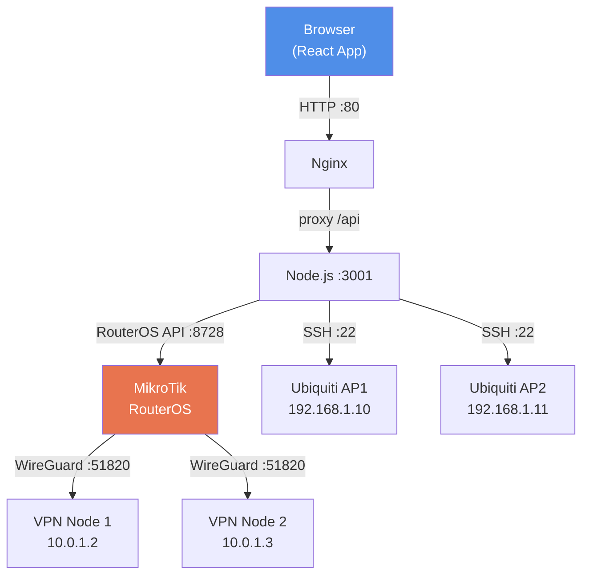
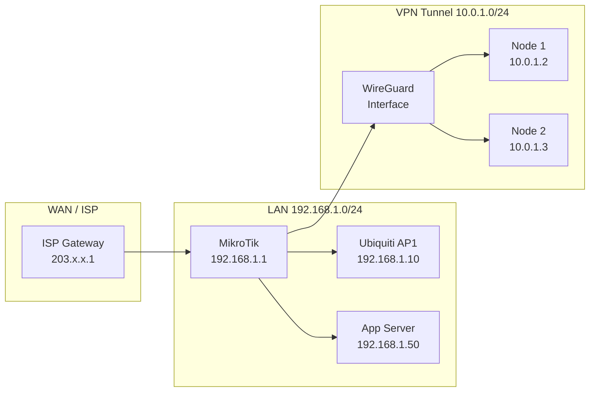
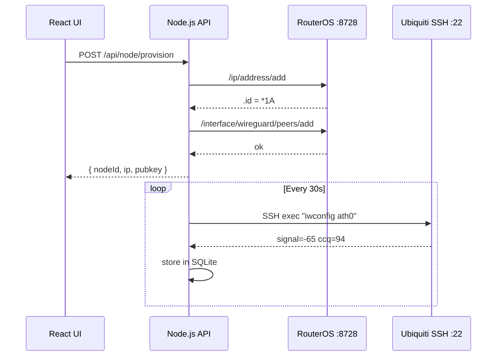

# Network Diagram Generator

Generate clear architecture diagrams for VPN/RouterOS/Ubiquiti networks. Choose the right format based on what the user needs: Mermaid for quick text-based diagrams embeddable in markdown, SVG/HTML for precise visual layouts.

## Context: This Project

- **VPN Router**: MikroTik RouterOS — manages WireGuard peers, IP assignments, firewall rules
- **Access Points**: Ubiquiti airOS devices — polled via SSH for signal, CCQ, TX/RX stats
- **Clients**: WireGuard VPN clients (nodes) provisioned by the app
- **Backend**: Node.js on the server, connects to RouterOS API (port 8728) and Ubiquiti SSH (port 22)
- **Frontend**: React app at `localhost:5173` (dev) or nginx-served (Docker)
- **Subnets**: typically `10.x.x.0/24` per VPN group

## Diagram Types

### 1. Mermaid — Network Topology
Best for: showing connections, traffic flow, service relationships.

### 2. Mermaid — Subnet/VLAN Layout
Best for: IP addressing, subnet boundaries, VLAN segmentation.

### 3. Mermaid — Provisioning Sequence
Best for: showing the order of operations (provisioning, polling, SSH).

### 4. HTML/SVG — Visual Map
When the user needs a spatial visual map (not a flowchart), generate a self-contained HTML file with inline SVG:
- Rectangles for devices, labeled with IP and role
- Lines/arrows for connections
- Color coding: MikroTik = `#e8744f`, Ubiquiti = `#0090d4`, VPN nodes = `#27ae60`, server = `#2c3e50`

## What to Read Before Generating

1. `server/api.routes.js` — which device endpoints exist
2. `server/ubiquiti.service.js` — how APs are stored/identified
3. `server/db.service.js` — what data is persisted (nodes, subnets)

Ask the user: "Mermaid (for README/docs) or HTML visual map (to open in browser)?"

## Output Rules

- Always label devices with their IP if known
- Show port numbers on connections (`:8728`, `:22`, `:51820`)
- Group related devices in subgraphs/subnets
- Max ~12 nodes per diagram before splitting
