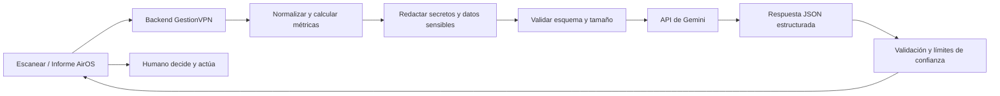

# Aplicaciones de Gemini sobre datos AirOS

**Proyecto:** MikroTikVPN Remote Manager (`GestionVPN-1.0`)
**Módulo:** Escanear → Ver informe AirOS
**Fecha:** 16 de julio de 2026
**Última actualización:** 17 de julio de 2026
**Estado:** documento de análisis; no autoriza implementación ni cambios en equipos

**Decisiones de alcance:** se utilizará el nivel gratuito de la API de Gemini; se implementarán todas las fases propuestas excepto el asistente consultivo conversacional.

## 1. Propósito

Este documento describe aplicaciones posibles de la API de Gemini usando la información AirOS que GestionVPN ya extrae de equipos Ubiquiti durante un escaneo.

Las propuestas cubren dos alcances:

- **Análisis individual:** estudiar un AP o CPE específico.
- **Análisis de red:** estudiar todos los equipos visibles después de un escaneo o filtrado.

El objetivo de Gemini será transformar datos técnicos en diagnósticos explicados, comparaciones, prioridades y recomendaciones. No sustituirá las mediciones, las reglas de validación ni el criterio del administrador.

## 2. Regla de gobierno: IA exclusivamente consultiva

> **Gemini no podrá realizar modificaciones. Todas las decisiones y acciones operativas serán tomadas y ejecutadas por el propietario o un operador humano autorizado.**

Esta regla debe cumplirse en el diseño técnico:

- Gemini no recibirá credenciales SSH, contraseñas, tokens, llaves privadas ni secretos WiFi.
- Gemini no tendrá acceso directo a RouterOS, AirOS, SSH, SFTP, bases de datos ni servicios internos.
- No se expondrán funciones de escritura, ejecución de comandos, reinicio, actualización o cambio de configuración.
- Las respuestas de IA se mostrarán como **observaciones** y **recomendaciones**, nunca como órdenes ejecutadas.
- Cada recomendación deberá incluir datos que la sustentan, nivel de confianza y comprobaciones manuales sugeridas.
- El usuario decidirá si ignora, investiga o aplica una recomendación fuera del flujo de IA.
- Incluso si se incorpora Gemini Function Calling en el futuro, sólo podrá invocar herramientas de **lectura** controladas por el backend.

La interfaz debería mostrar permanentemente una advertencia similar a:

> “Análisis asistido por IA. Gemini no modifica equipos ni configuraciones. Verifica los datos y toma la decisión antes de realizar cualquier acción.”

### 2.1 Acceso exclusivo por moderador

- La opción de Gemini estará disponible únicamente para usuarios con rol **Moderador (`OWNER`)**.
- Los miembros (`MEMBER`) no verán controles de IA y el backend rechazará cualquier intento directo.
- El Administrador de plataforma no consumirá análisis desde esta función; su responsabilidad será gobernar el acceso.
- El Administrador podrá activar o desactivar Gemini de forma independiente para cada moderador.
- El acceso estará **deshabilitado por defecto** para moderadores existentes y nuevos.
- Al deshabilitarlo, el cambio tendrá efecto inmediato y bloqueará nuevas solicitudes antes de reservar cuota o llamar a Gemini.
- La autorización del Administrador y el consentimiento del moderador son requisitos separados: estar habilitado no implica haber aceptado el tratamiento externo de datos.

## 3. Datos AirOS disponibles

GestionVPN ya normaliza información procedente de `mca-status`, `wstalist`, interfaces y fuentes auxiliares. La disponibilidad depende del modelo y firmware.

| Grupo | Ejemplos | Aplicación |
|---|---|---|
| Identidad | IP, MAC, hostname, modelo, familia M5/AC, firmware | Inventario, agrupación y compatibilidad |
| Sistema | uptime, fecha, CPU, RAM, temperatura, carga | Salud del equipo y posibles reinicios/saturación |
| Radio | modo AP/STA, SSID, frecuencia, canal, ancho, potencia, antena | Revisión de configuración RF |
| Calidad RF | señal, ruido, RSSI, SNR/CINR, CCQ, airMAX Quality/Capacity | Calidad y estabilidad del enlace |
| Rendimiento | TX/RX rate, throughput, airtime, latencia TX | Capacidad y congestión |
| Cadenas | RSSI por cadena, TX/RX NSS, chainmask | Desbalance, cableado o alineación |
| Errores | reintentos TX, beacons perdidos, errores RX/TX, RX crypts | Detección de degradación |
| Red | modo router/bridge, rutas, interfaces, IP, MTU, velocidad/dúplex | Coherencia de red y posibles cuellos de botella |
| Estaciones | clientes asociados, señal, ruido, CCQ, tasas, distancia | Análisis AP–CPE y priorización de abonados |
| Servicios | procesos y servicios reportados por el equipo | Inventario y revisión técnica |

Los bloques crudos (`routes`, `iwconfig`, `wstalist`, interfaces, memoria, etc.) pueden enriquecer un diagnóstico, pero antes deben pasar por normalización, límites de tamaño y eliminación de secretos.

## 4. Qué debe hacer Gemini y qué no

Gemini es útil cuando se necesita interpretar varias señales al mismo tiempo o explicar un hallazgo. No debe reemplazar reglas matemáticas o de seguridad.

### Adecuado para Gemini

- Resumir un estado técnico complejo.
- Relacionar señal, ruido, CCQ, capacidad, tasas y errores.
- Explicar causas posibles y cómo diferenciarlas.
- Comparar muchos equipos y priorizar investigación.
- Traducir datos técnicos a lenguaje para operador o cliente.
- Generar una lista de comprobaciones manuales.

### Debe seguir siendo determinista

- Calcular SNR: `señal - ruido`.
- Validar rangos, tipos, unidades y datos ausentes.
- Detectar umbrales críticos definidos por el negocio.
- Aplicar permisos, aislamiento por workspace y límites de uso.
- Redactar secretos y datos personales.
- Decidir si un equipo está accesible o autenticado.
- Ejecutar cualquier cambio, acción o comando.

El patrón recomendado es: **reglas calculan hechos → Gemini interpreta los hechos → el humano decide**.

## 5. Aplicaciones sobre un equipo

### 5.1 Resumen técnico inteligente

Convierte el informe AirOS extenso en una lectura breve:

- Estado general.
- Tres hallazgos principales.
- Datos que requieren atención.
- Datos ausentes que limitan el análisis.
- Siguientes comprobaciones manuales.

Ejemplo de salida:

> “El CPE presenta buena señal y CCQ, pero la interfaz Ethernet negocia a 100 Mbps y limita la capacidad potencial del radio. Conviene verificar cableado, conectores y capacidad del router conectado. No se propone ningún cambio automático.”

### 5.2 Diagnóstico asistido

Gemini puede correlacionar síntomas y presentar hipótesis ordenadas, por ejemplo:

- Señal débil + SNR bajo → alineación, obstrucción o interferencia.
- Señal fuerte + CCQ bajo + reintentos altos → interferencia, saturación o reflexión.
- Diferencia grande entre cadenas → polarización, cable, conector o alineación.
- Radio saludable + LAN a 10/100 Mbps o half-duplex → cuello de botella Ethernet.
- CPU/RAM alta + tasas bajas → carga del sistema o firmware.
- Uptime muy corto → reinicio reciente o alimentación inestable.

La respuesta debe separar:

1. **Hechos observados.**
2. **Hipótesis posibles.**
3. **Pruebas manuales recomendadas.**
4. **Nivel de confianza.**

### 5.3 Revisión de configuración RF

Puede señalar configuraciones que merecen revisión:

- Potencia excesiva frente a una señal ya muy fuerte.
- Canal o ancho poco coherente con ruido/capacidad observados.
- Distancia configurada incompatible con la distancia reportada.
- Desbalance entre cadenas.
- País/región o familia de firmware que requiere verificación.

La IA no indicará “aplicar este valor” como una acción directa. Presentará alternativas y sus riesgos para que el operador decida.

### 5.4 Revisión de firmware e inventario

- Agrupar modelo, familia y versión.
- Identificar versiones distintas dentro de equipos equivalentes.
- Señalar firmware antiguo sólo si existe una política o catálogo local confiable.
- Preparar una lista para revisión manual.

Gemini no debe inventar cuál es la última versión. Esa comprobación requiere una fuente oficial actualizada o un catálogo mantenido por el sistema.

### 5.5 Explicación para soporte

Genera versiones adaptadas a distintos públicos:

- **Técnico:** métricas, hipótesis y pruebas.
- **Supervisor:** impacto, prioridad y riesgo.
- **Cliente:** explicación sencilla sin exponer información interna.

### 5.6 Preguntas sobre el equipo

Un panel podría permitir consultas como:

- “¿Qué métrica es la más preocupante?”
- “¿Por qué puede haber buen nivel de señal y mala capacidad?”
- “¿Qué debo comprobar físicamente primero?”
- “Compara el lado local y el remoto del enlace.”

Las respuestas se limitarán al snapshot suministrado y deberán indicar cuándo falta historial.

## 6. Aplicaciones sobre toda la red escaneada

### 6.1 Resumen de salud de red

Analiza todos los equipos filtrados y devuelve:

- Cantidad evaluada y cantidad omitida por falta de datos.
- Distribución por AP/CPE, modelo y firmware.
- Equipos críticos, degradados y saludables.
- Problemas dominantes de la red.
- Orden recomendado de investigación.

### 6.2 Priorización de equipos

El backend debe calcular primero un puntaje reproducible. Gemini puede explicar el orden usando factores como:

- SNR, CCQ y airMAX Capacity.
- Reintentos, errores y latencia.
- CPU, RAM, temperatura y uptime.
- Diferencias entre cadenas.
- Velocidad de la interfaz LAN.
- Cantidad de CPE afectados detrás de un AP.

La prioridad debe ser transparente: cada equipo mostrará las métricas que elevaron su riesgo.

### 6.3 Análisis de canales e interferencia

Al comparar AP de la misma zona, Gemini puede:

- Agrupar frecuencias y anchos utilizados.
- Señalar posibles solapamientos.
- Relacionar ruido, CCQ, capacidad y reintentos.
- Proponer qué mediciones de espectro realizar.

No debe ordenar ni ejecutar cambios de frecuencia. Los datos del escaneo tampoco sustituyen un analizador de espectro.

### 6.4 Comparación AP–CPE

Relaciona cada AP con sus estaciones para encontrar:

- CPE con señal o CCQ considerablemente peores que sus pares.
- Diferencias entre medición local y remota.
- Un único CPE degradado frente a un AP completo degradado.
- AP con muchos clientes afectados y mayor impacto operativo.

### 6.5 Detección de anomalías

Puede destacar valores atípicos dentro de grupos comparables:

- Un CPE con CPU o temperatura muy superior al resto.
- Firmware distinto en un conjunto homogéneo.
- Capacidad baja pese a señal similar.
- Interfaz con errores o negociación inferior.
- Reinicios recientes concentrados en una zona.

Para evitar falsas alarmas, el backend debe comparar sólo equipos equivalentes y entregar a Gemini estadísticas agregadas.

### 6.6 Plan de inspección y mantenimiento

Genera un plan manual priorizado:

1. Equipos que requieren atención inmediata.
2. Equipos que requieren observación.
3. Verificaciones físicas sugeridas.
4. Mediciones adicionales necesarias.
5. Evidencia que debe registrarse después de la visita.

### 6.7 Informe ejecutivo

Produce un documento legible para supervisión:

- Cobertura del análisis.
- Riesgos principales.
- Posible impacto en usuarios.
- Tendencias, si existe historial.
- Acciones humanas recomendadas.
- Limitaciones y nivel de confianza.

### 6.8 Consulta conversacional de la red

Ejemplos:

- “Muéstrame los cinco CPE con peor calidad.”
- “¿Qué AP concentra más equipos degradados?”
- “¿Hay equipos con buena señal pero CCQ bajo?”
- “Agrupa los problemas por posible causa.”
- “Redacta un plan de revisión para la torre Floresta.”

La consulta debe operar sobre un dataset preparado por el backend, nunca mediante acceso directo de Gemini a la base de datos.

## 7. Aplicaciones futuras que requieren historial

El informe actual es principalmente un snapshot. Estas funciones necesitan almacenar series temporales normalizadas:

- Detección de deterioro progresivo.
- Comparación antes/después de una intervención.
- Correlación entre reinicios, clima, ruido y pérdida de capacidad.
- Línea base por modelo, AP, torre o horario.
- Predicción de riesgo de degradación.
- Resumen diario o semanal de cambios significativos.

Sin historial, Gemini debe decir “estado actual” y evitar afirmaciones como “empeoró” o “es recurrente”.

## 8. Experiencia de usuario propuesta

### En el panel del Administrador

La lista de moderadores incorporará un control **“Análisis AirOS con Gemini”** por cuenta:

- Activar o desactivar individualmente.
- Mostrar estado habilitado/deshabilitado y fecha del último cambio.
- No mostrar ni editar la API key.
- Advertir que habilitar acceso permite consumir la cuota gratuita compartida.
- Registrar qué Administrador cambió el permiso.

Si un moderador no está habilitado, los controles de IA no aparecerán en Escanear. El backend seguirá siendo la fuente de verdad y rechazará llamadas fabricadas desde el navegador.

### En cada fila

Botón **Analizar con IA** junto a “Ver informe AirOS”:

- Resumen.
- Hallazgos.
- Hipótesis.
- Comprobaciones manuales.
- Confianza y limitaciones.

### En la cabecera de Escanear

Botón **Analizar red visible**:

- Usa únicamente los equipos resultantes de filtros y búsqueda.
- Informa claramente cuántos equipos serán enviados.
- Permite excluir identificadores sensibles.
- Presenta resultados sin ejecutar acciones.

### Estados importantes

- Consentimiento antes de enviar datos a un proveedor externo.
- Indicador de progreso y posibilidad de cancelar.
- Fecha/hora del snapshot analizado.
- Modelo utilizado y versión del esquema.
- Advertencia consultiva visible.
- Botón para copiar o exportar el informe.

## 9. Arquitectura recomendada



Principios:

- La API key de Gemini vive sólo en el backend.
- El frontend nunca llama directamente a Gemini.
- Se envía un DTO mínimo, no el objeto crudo completo por defecto.
- La respuesta debe usar un esquema JSON validado.
- Se registran consumo, duración, modelo, usuario y propósito, sin guardar secretos.
- No existe ninguna flecha desde Gemini hacia funciones de escritura.

## 10. Contrato de entrada sugerido

```json
{
  "analysisType": "device",
  "snapshotAt": "2026-07-16T22:01:43-05:00",
  "scope": {
    "workspaceId": "pseudonymous-id",
    "subnet": "redacted-or-optional",
    "filters": { "role": "sta", "ssid": "pseudonymous-id" }
  },
  "device": {
    "id": "stable-pseudonymous-id",
    "role": "sta",
    "model": "LiteBeam M5",
    "firmware": "XW.v6.1.7",
    "metrics": {
      "signalDbm": -63,
      "noiseFloorDbm": -92,
      "snrDb": 29,
      "ccqPct": 99.1,
      "txRateMbps": 150,
      "rxRateMbps": 150,
      "cpuPct": 4,
      "memoryPct": 38,
      "txPowerDbm": 14,
      "frequencyMhz": 5450
    },
    "missingFields": []
  },
  "policy": {
    "advisoryOnly": true,
    "allowActions": false,
    "requireEvidence": true
  }
}
```

Para red completa se enviaría `devices[]` más agregados calculados localmente. No deben enviarse contraseñas, llaves, cookies, tokens, comandos crudos con secretos ni credenciales guardadas.

## 11. Contrato de respuesta sugerido

```json
{
  "summary": "Estado general del equipo o red",
  "severity": "info|warning|critical",
  "confidence": "low|medium|high",
  "findings": [
    {
      "title": "Hallazgo",
      "evidence": ["signalDbm=-63", "noiseFloorDbm=-92", "snrDb=29"],
      "interpretation": "Explicación técnica",
      "possibleCauses": ["Causa posible"],
      "manualChecks": ["Comprobación que debe realizar el operador"]
    }
  ],
  "limitations": ["No existe historial temporal"],
  "actionsExecuted": [],
  "advisoryOnly": true
}
```

El backend rechazará respuestas sin `advisoryOnly: true` o con acciones ejecutadas.

## 12. Capacidades de Gemini aplicables

- **Structured Outputs:** obliga a responder con un esquema definido; es apropiado para renderizar hallazgos de forma consistente.
- **Function Calling:** sólo sería aceptable para herramientas internas de lectura. No se expondrán funciones de escritura.
- **Context caching:** puede reducir costo cuando se reutilizan instrucciones, reglas RF y catálogos extensos.
- **Batch API:** útil para análisis masivo no urgente; Google indica que procesa trabajos asíncronos con objetivo de finalización dentro de 24 horas y precio reducido frente al modo interactivo.

La selección exacta de modelo debe configurarse, no codificarse rígidamente. Como el proyecto utilizará el **nivel gratuito de la API**, debe priorizarse un modelo Flash estable disponible en ese nivel y comprobar su disponibilidad antes de cada despliegue. Se deben evitar modelos preview en funciones críticas sin una evaluación previa.

### 12.1 Restricción de nivel gratuito y consumo de tokens

El diseño debe asumir límites reducidos de solicitudes y tokens. Google aplica límites por proyecto —como solicitudes por minuto, tokens por minuto y solicitudes por día— y muestra los valores vigentes en Google AI Studio. Estos valores pueden cambiar, por lo que no deben escribirse de forma rígida en el código.

Medidas obligatorias para cuidar tokens:

- Enviar datos normalizados y compactos, no el informe AirOS crudo completo.
- Omitir campos nulos, repetidos o sin valor diagnóstico.
- Calcular localmente SNR, agregados, rankings y umbrales.
- En análisis de red, enviar primero agregados y sólo el detalle de equipos anómalos.
- Limitar la cantidad de equipos por solicitud y dividir redes grandes en bloques.
- Solicitar respuestas JSON breves con límites explícitos de hallazgos y palabras.
- No mantener conversaciones ni reenviar historiales de chat.
- Evitar repetir instrucciones extensas; usar un prompt de sistema compacto y versionado.
- Guardar temporalmente el resultado asociado al hash del snapshot para no analizar dos veces los mismos datos.
- Permitir que el usuario solicite un nuevo análisis sólo cuando cambien los datos o lo confirme expresamente.
- Mostrar el consumo estimado/real cuando la respuesta de la API lo proporcione.
- Implementar presupuesto diario interno, cola y manejo de errores `429` sin reintentos agresivos.

Estrategia sugerida para una red grande:

1. El backend analiza todos los equipos con reglas locales.
2. Selecciona los equipos críticos, atípicos o representativos.
3. Envía a Gemini los agregados de red y ese subconjunto reducido.
4. Si el usuario necesita detalle adicional, ejecuta análisis individuales bajo demanda.

El Batch API puede reducir precios en planes de pago, pero no debe asumirse como disponible o necesario en este proyecto gratuito. La implementación base debe funcionar con solicitudes interactivas limitadas y controladas.

Referencias oficiales vigentes al redactar este documento:

- [Herramientas, Structured Outputs y Function Calling](https://ai.google.dev/gemini-api/docs/tools)
- [Function Calling](https://ai.google.dev/gemini-api/docs/function-calling)
- [Context caching](https://ai.google.dev/gemini-api/docs/caching/)
- [Batch API](https://ai.google.dev/gemini-api/docs/batch-api)
- [Precios](https://ai.google.dev/gemini-api/docs/pricing)
- [Límites de uso](https://ai.google.dev/gemini-api/docs/rate-limits)

## 13. Privacidad y seguridad

Antes de llamar a Gemini:

- Eliminar `sshUser`, `sshPass`, `wifiPassword`, credenciales del router y cualquier secreto.
- Sustituir IP, MAC, hostname, SSID, nombre de cliente y torre por identificadores pseudónimos cuando no sean imprescindibles.
- Excluir `_raw*` por defecto; habilitarlos sólo por campo y después de redacción.
- Limitar estaciones, texto y tamaño total de la solicitud.
- No incluir datos de otros workspaces.
- Registrar consentimiento, finalidad y política de retención.
- Definir un plazo de expiración para resultados de IA.
- Usar un proyecto de API de pago para producción si se requiere que el contenido no se use para mejorar productos, de acuerdo con las condiciones publicadas por Google.

La salida también debe sanearse antes de mostrarla para evitar que reproduzca identificadores sensibles enviados por error.

## 14. Control de calidad

Cada resultado debe evaluarse con casos conocidos:

- Equipo saludable.
- Señal débil.
- Señal fuerte con CCQ bajo.
- Desbalance de cadenas.
- Interfaz Ethernet limitada.
- Datos incompletos.
- Valores contradictorios.
- Red con un único outlier.
- Red completa degradada.

Métricas recomendadas:

- Exactitud de hechos citados.
- Porcentaje de recomendaciones respaldadas por evidencia.
- Falsos positivos y falsos negativos.
- Consistencia del JSON.
- Costo y latencia por análisis.
- Utilidad calificada por el operador.

La aceptación nunca se basará sólo en que el texto “suene correcto”.

## 15. Matriz de aplicaciones

| Aplicación | Alcance | Valor | Complejidad | Riesgo | Prioridad |
|---|---|---:|---:|---:|---:|
| Resumen técnico | Equipo | Alto | Baja | Bajo | P1 |
| Diagnóstico con evidencia | Equipo | Alto | Media | Medio | P1 |
| Informe para soporte | Equipo | Alto | Baja | Bajo | P1 |
| Auditoría de red visible | Red | Muy alto | Media | Medio | P1 |
| Priorización de equipos | Red | Muy alto | Media | Medio | P1 |
| Preguntas conversacionales | Ambos | Alto | Media | Medio | P2 |
| Comparación AP–CPE | Red | Alto | Media | Medio | P2 |
| Revisión RF | Ambos | Alto | Alta | Alto | P2 |
| Plan de mantenimiento | Red | Alto | Media | Medio | P2 |
| Detección de anomalías | Red | Alto | Alta | Medio | P3 |
| Predicción de degradación | Historial | Muy alto | Muy alta | Alto | P4 |

## 16. Hoja de ruta recomendada

**Alcance aprobado:** se implementarán las fases 0, 1, 2 y 4 descritas abajo. La fase 3, “Asistente consultivo”, queda excluida y no forma parte del producto previsto.

### Fase 0: preparación

- Definir consentimiento, retención y presupuesto.
- Crear DTO redactado y versionado.
- Calcular métricas deterministas, como SNR y puntaje base.
- Crear esquema estructurado de respuesta.
- Preparar dataset de evaluación.
- Añadir entitlement por moderador, deshabilitado por defecto, y control administrativo individual.

### Fase 1: piloto individual

- Botón “Analizar con IA” por equipo.
- Resumen, hallazgos, evidencia y comprobaciones manuales.
- Sin chat, sin historial y sin herramientas.
- Registrar feedback del operador.

### Fase 2: análisis de red visible

- Respetar búsqueda y filtros de Escanear.
- Enviar agregados y equipos pseudonimizados.
- Ranking explicado y resumen ejecutivo.
- Control de volumen, costo y timeout.

### Fase 3: asistente consultivo — excluida

- No se implementará chat ni preguntas libres sobre el snapshot.
- No se mantendrá contexto conversacional.
- No se incorporarán herramientas o Function Calling para este propósito.
- Esta exclusión reduce consumo de tokens, complejidad y riesgo de respuestas fuera del alcance.

### Fase 4: historial

- Persistir métricas normalizadas con retención definida.
- Comparaciones temporales y detección de cambios.
- Evaluar predicción sólo después de disponer de datos suficientes.

## 17. Recomendación final

El mejor primer producto es un **analista consultivo por equipo**, seguido por una **auditoría de la red visible**. Ambos pueden aprovechar los datos actuales sin otorgar a Gemini acceso operativo.

La implementación abarcará preparación, piloto individual, análisis de red visible e historial. No incluirá asistente conversacional y deberá operar dentro de las restricciones del nivel gratuito mediante solicitudes compactas, caché local de resultados y análisis bajo demanda.

La propuesta debe conservar cuatro garantías:

1. Los hechos y umbrales básicos se calculan localmente.
2. Gemini explica y recomienda con evidencia explícita.
3. **El propietario toma todas las decisiones y realiza cualquier modificación manualmente.**
4. El sistema limita y registra el consumo para proteger la cuota gratuita de tokens y solicitudes.
