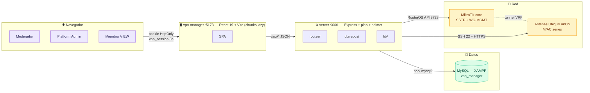
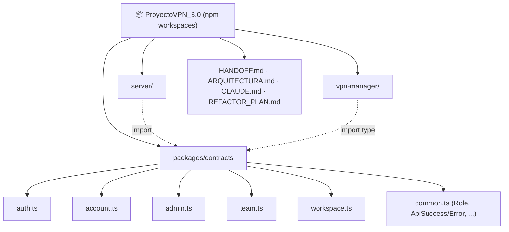
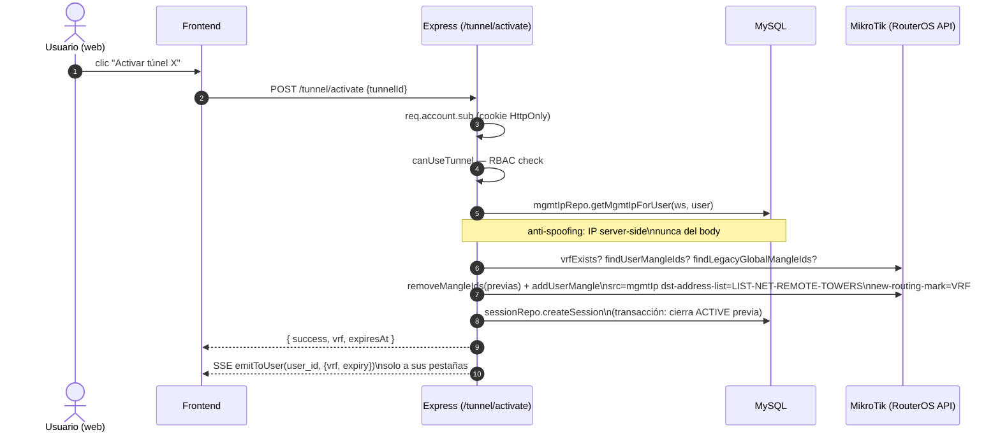
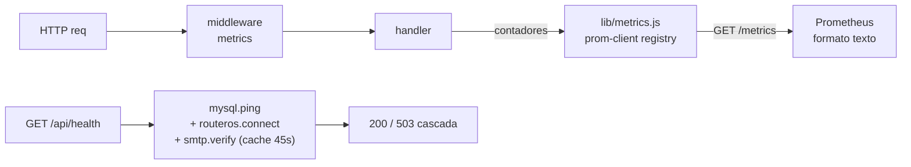
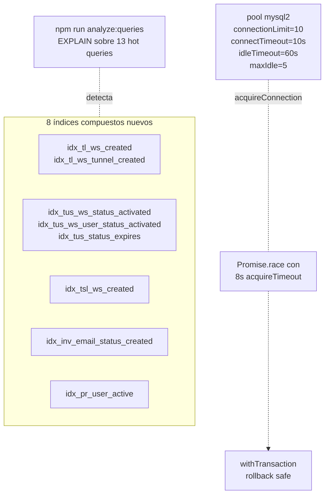

# Arquitectura — MikroTikVPN Remote Manager (`GestionVPN-1.0`)

> Estado post-REFACTOR_PLAN (fases 0-12, 2026-06-10).
> Para detalle por fase ver [HANDOFF.md](./HANDOFF.md).

---

## 1) Vista de alto nivel



**Roles:**
- `platform_admin` — Dashboard + Moderadores + Ajustes (config router core).
- `OWNER` / `CO_MODERATOR` — Nodos · Escanear · Usuarios · Equipo · Monitor AP.
- `MEMBER` — solo sus túneles asignados + perfil WireGuard.

---

## 2) Monorepo



**FASE 5** — el paquete `@gestionvpn/contracts` es la **única fuente de verdad de tipos** entre backend y frontend. Schemas Zod compartidos: cambiar un campo aquí rompe ambos lados en `tsc` (fin del drift).

---

## 3) Backend — capas y splits

```mermaid
flowchart TB
    subgraph Express["index.js — Express + pino-http + helmet + cookie-parser"]
        MW[verifyToken\n+ workspace-aware]
    end

    Express --> RoutesGrp

    subgraph RoutesGrp["routes/ (cada carpeta = compositor + sub-routers)"]
        direction LR
        N[nodes/ — 8 archivos\nmax 472 LOC (provision)]
        C[core/ — 7 archivos\nmax 430 LOC (tunnel)]
        OneOff[auth · admin · team · ap\ndevice · settings · wireguard\nworkspace · users]
    end

    RoutesGrp --> RepoLib

    subgraph RepoLib["db/repos/ + lib/"]
        direction LR
        Repos[session · audit · member\nmemberWg · mgmtIp · passwordReset\nuser · workspace · invitation\nassignment]
        Lib[crypto · logger · jwt\nrouterPeerState · tenantScope\ntunnelProvisioner · wgkeys\nmailer · metrics · apiResponse]
    end

    RepoLib --> Svc

    subgraph Svc["servicios"]
        direction LR
        Mysql[db/mysql.js\npool + acquireTimeout]
        Ros[routeros.service.js\n+ parches !empty/UNKNOWN/UNREGISTERED]
        Ubn[ubiquiti.service.js\nSSH + scan]
    end

    Mysql --> DB[(MySQL)]
    Ros --> MT[MikroTik]
    Ubn --> UB[Ubiquiti]
```

### Split de `node.routes.js` (FASE 6)

```
1264 LOC → 7 sub-routers en routes/nodes/
  ├─ _shared.js     annotateSessions, filterNodesForRole, nodeBelongsToRequester
  ├─ listing.js     POST /nodes (cache fallback), /node/details, /node/script
  ├─ provision.js   /node/next, /provision, /deprovision     ← 472 LOC (orquesta 10 pasos)
  ├─ editing.js     /node/edit, /node/label/save
  ├─ tags.js        /node/tags, /node/tag/save
  ├─ credentials.js /node/{creds,ssh-creds}/{save,get}
  ├─ history.js     /node/history/{add,get}
  └─ scan.js        /node/scan-stream (Worker SSE)
```

### Split de `core.routes.js` (FASE 7)

```
935 LOC → 5 sub-routers en routes/core/
  ├─ _shared.js          registry SSE singleton + emitToUser + canUseTunnel
  ├─ connection.js       /connect, /diagnose
  ├─ ppp.js              /secrets, /active
  ├─ interface.js        /interface/{activate,deactivate}
  ├─ tunnel.js           /tunnel/{activate,deactivate,keepalive,events,...}  ← 430 LOC
  └─ tunnel-repair.js    /tunnel/repair (7 pasos atómicos)
```

**Decisión SSE:** el registry `Map<userId, Set<res>>` vive en `_shared.js` (singleton de módulo). Si cada sub-router crease su Map, los eventos nunca llegarían al frontend.

---

## 4) Frontend — code-splitting (FASE 10)

```mermaid
flowchart TB
    Main["main.tsx\n→ App.tsx"]

    subgraph Eager["Eager (bundle inicial 248 KB / 77 KB gzip)"]
        Ctx[VpnContext\nWorkspaceSession]
        Side[Sidebar]
        Skel[ModuleSkeleton]
    end

    subgraph Lazy["Lazy chunks (carga bajo demanda)"]
        direction LR
        L0[RouterAccess\n23 KB / 5 KB]
        L1[NodeAccessPanel\n127 KB / 27 KB]
        L2[NetworkDevicesModule\n86 KB / 20 KB]
        L3[TeamModule\n415 KB / 85 KB]
        L4[ApMonitorModule\n62 KB / 15 KB]
        L5[UserManagementPanel\n18 KB / 5 KB]
        L6[ModeratorsModule\n19 KB / 4 KB]
        L7[ModeratorSettingsModule\n25 KB / 6 KB]
        L8[SettingsModule\n6 KB / 2 KB]
        L9[AdminDashboard\n4.5 KB / 1.6 KB]
    end

    Main --> Eager
    Main -. React.lazy + Suspense .- Lazy
```

**Bundle inicial: 1090 KB → 248 KB raw (-77%) · 252 KB → 77 KB gzip (-69%).**

Suspense único en `App.tsx` con `key={activeModule}` fuerza nuevo boundary al cambiar de módulo. `RouterAccess` tiene Suspense propio con fallback minimalista (flujo público).

---

## 5) Multi-tenant — aislamiento en cascada

```mermaid
flowchart TB
    Acc[req.account\n{ sub, workspace_id, role, platform_admin }]

    Acc --> Adm{platform_admin?}

    Adm -- sí --> All["ve TODO\n(reqWorkspace === null)"]
    Adm -- no --> Mod{role}

    Mod -- OWNER/CO_MOD --> ScopedWs["WHERE workspace_id = ?\nen: nodes, ap_groups, mgmt_peer_owners,\nuser_mgmt_ips, tunnel_*"]

    Mod -- MEMBER --> MemberScope["+ tunnel_assignments\nsolo túneles asignados"]

    ScopedWs --> Mut[(En cada mutación:\nnodeBelongsToRequester\ncpeForeign\nownsGroupUuid)]
    MemberScope --> Mut
```

Reglas:
- **Lectura** filtrada por `filterNodesForRole(req, nodes)` o `tenantScope.js`.
- **Mutación** chequea ownership ANTES de tocar la BD/router.
- **Hard-delete** de moderador limpia 16 tablas en cascada + remueve peers/mangle del router.

---

## 6) Túnel multi-usuario — aislamiento por sesión (FASE post-RBAC)



N usuarios concurrentes = N mangle rules + N VRFs sin colisión (cada VRF solo enruta su LAN).

---

## 7) Observabilidad (FASE 9)



**Métricas exportadas:**
- `vpn_http_request_duration_seconds` (histograma con buckets) — latencia por método/ruta/status.
- `vpn_auth_attempts_total` — login/OTP/reset (success vs failed).
- `vpn_routeros_*` — writes, errores por tipo, decisiones del parche `!empty`/`UNKNOWN`.
- `vpn_mailer_total` — OTP, invitación, password-reset (success vs failed).
- Defaults de Node (heap, GC, event loop lag).

**Endpoint `/metrics`** loopback-only por defecto (`METRICS_ALLOW_REMOTE=1` para scrape remoto).

---

## 8) MySQL — performance (FASE 11)



`tunnel_session_logs` no tenía índice por `workspace_id` — cada lectura era full scan. Ya cubierto.

---

## 9) Seguridad — pilares vigentes

| Capa | Defensa | Origen |
|------|---------|--------|
| Transport | helmet + CSP API-only + HSTS prod + CORS allowlist | F2 |
| Sesión | Cookie HttpOnly `vpn_session` (sameSite=lax, secure prod, 8h) | F2 + F5 |
| Auth | bcrypt + JWT HS · rate limit `auth_attempts` 5/15min · anti-enumeración en reset | RBAC + F4 |
| Cripto | AES-256-GCM `{ authTagLength: 16 }` para credenciales · `.db_secret` + `.jwt_secret` (no versionados) | F12 |
| Multi-tenant | `workspace_id` en cascada · guardas de mutación · purga cachés del navegador al cambiar de ws | RBAC + sesiones |
| Anti-spoofing | IP de gestión resuelta server-side desde `user_mgmt_ips` (UNIQUE user, UNIQUE ip) | Multi-usuario |
| Auditoría | `tunnel_logs` + `tunnel_session_logs` APPEND-ONLY · semgrep en CI · npm audit | F12 |

**Pendientes futuros:** HTTPS real (proxy reverso), CSRF token explícito en formularios sensibles, V1 (`register-my-ip` debe exigir que el peer sea del usuario).

---

## 10) Testing (FASE 3 + F4)

```
Backend (62 tests)              Frontend (37 tests)            E2E
├─ unit/                        ├─ smoke + providers           └─ Playwright
│  ├─ wgkeys (8)                ├─ permissions (18)               smoke.spec.ts
│  ├─ crypto (5)                ├─ sessionClient (9)
│  ├─ passwordResetRepo (12)    ├─ WgConfigModal (5)
│  ├─ tenantScope (19)          └─ (todos con providers reales)
│  └─ routerosPatches (7)       MSW para mocks de fetch
└─ integration/
   └─ passwordReset HTTP (8)    Vitest 2 + Testing Library 16 + jsdom 25
```

`npm run test:all` corre backend + frontend. CI los ejecuta en GitHub Actions.

---

## 11) Reglas operativas — añadir cosas

| Tarea | Cómo | Dónde |
|-------|------|-------|
| Endpoint nuevo | Schema Zod en `packages/contracts/src/<dom>.ts` → `npm run build:contracts` → handler con `asyncHandler` + `sendOk`/`sendError` | F5 |
| Ruta nueva de nodos/core | Al sub-router temático correspondiente; helpers compartidos en `_shared.js` | F6/F7 |
| Módulo frontend nuevo | `React.lazy(() => import(...))` en `App.tsx`; va en el Suspense único existente | F10 |
| Query SQL nueva | Inputs como `?` en params; agregar a `tools/analyze-queries.js` y correr `npm run analyze:queries`; si falta índice → editar `sql/schema_perf_indexes.sql` y `npm run migrate:perf` | F11 |
| Métrica nueva | Definir counter/histogram en `lib/metrics.js`; usar en el handler con labels acotados (sin PII) | F9 |
| Crypto adicional | AES-256-GCM con `{ authTagLength: 16 }`; reusar `encryptPass`/`decryptPass` de `db.service.js` | F12 |
| Test nuevo | Vitest globals (`describe`/`it`/`expect`); backend usa `test/helpers/stubModule` para CJS mocks; frontend usa `renderWithProviders` | F3-F4 |
