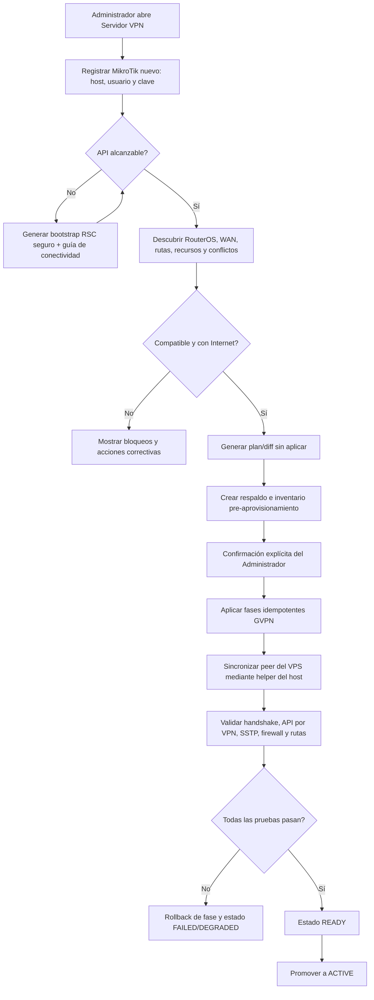
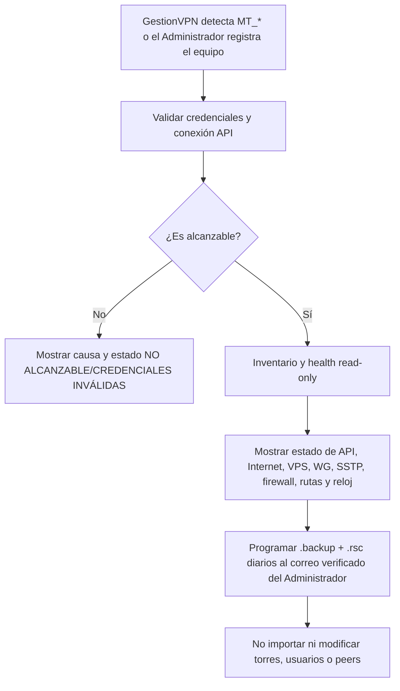
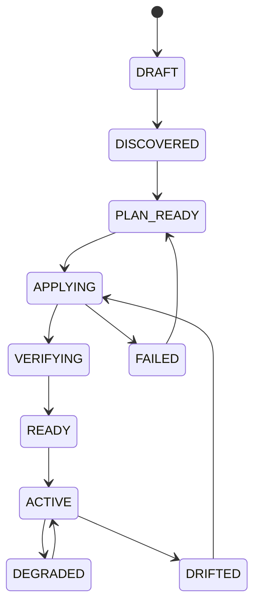
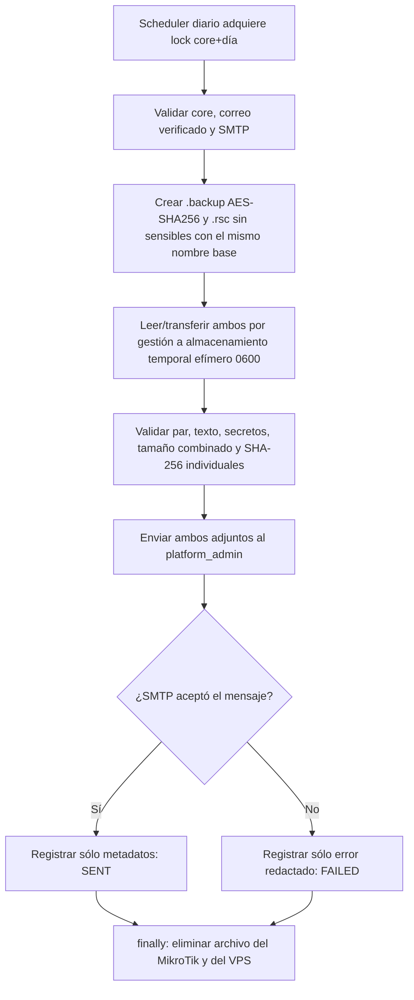

# Plan de implementación — Servidor VPN MikroTik desde cero, salud y respaldo dual diario

Fecha: 2026-07-14
Estado: implementación inicial completada; perfiles multi-Core pendientes desde 2026-07-15
Referencia auditada: `C:\Users\i201720174\Downloads\vpn_habil.rsc` (sin copiar secretos)

## 1. Objetivo

Incorporar en **Ajustes del Administrador** una opción **Servidor VPN** con tres entradas claramente separadas:

1. **Ya existe un servidor:** conectar mediante IP/host, usuario y contraseña; mostrar su estado sin alterar su configuración; y generar una vez al día un respaldo dual (`.backup` cifrado + `.rsc` legible) que se envía exclusivamente al correo verificado del Administrador.
2. **Empezar desde cero:** registrar un MikroTik nuevo o recién restablecido, descubrirlo e instalar toda la configuración de core VPN requerida por GestionVPN sin destruir su salida a Internet.
3. **Alternar un servidor existente de pruebas:** conservar perfiles separados para Producción y Laboratorio, seleccionar temporalmente otro equipo sin aprovisionarlo y volver al principal sin reescribir credenciales ni alterar sus objetos. Esta extensión requiere aislamiento por `core_server_id` y queda pendiente.

**Alcance fijado:** no se migran, copian, importan ni recrean torres, nodos, peers o usuarios desde otro equipo. El aprovisionamiento siempre crea un servidor vacío. Un servidor existente sólo se observa, se usa como core actual si ya lo era y se respalda; su inventario operativo no se convierte en plantilla para otro MikroTik.

### 1.1 Punto de partida mínimo

El asistente puede comenzar cuando el equipo cumple únicamente estos prerrequisitos:

- RouterOS 7.x instalado o restablecido y acceso local/de emergencia disponible.
- Salida a Internet funcional, ya sea por IP estática, DHCP, NAT del proveedor o cloud.
- IP/host alcanzable para el bootstrap o posibilidad de importar localmente un `.rsc` mínimo.
- Usuario y contraseña RouterOS con privilegios suficientes para aprovisionar.
- Si está detrás de NAT, capacidad del Administrador para configurar las redirecciones indicadas en el router del proveedor.

No se presupone ninguna interfaz VPN, peer, pool, perfil, VRF, regla de firewall, cuenta de servicio ni integración previa con el VPS.

### 1.2 Resultado obligatorio del MVP

Al finalizar, el MikroTik debe quedar listo para operar como **servidor VPN de GestionVPN**, incluyendo:

- identidad, hora y resolución DNS validadas y corregidas sólo cuando sea necesario;
- planos WireGuard de VPS, clientes y administradores, con IP, puertos y claves nuevas;
- peer del VPS y retorno del `scan-pool`;
- pool, perfil y listener SSTP cuando ese protocolo esté habilitado;
- address lists, reglas input/forward/NAT y aislamiento requeridos por el sistema;
- API/Winbox restringidos a las redes autorizadas y cuenta de servicio rotada;
- sincronización del host VPS, handshake y acceso API por el túnel de gestión;
- configuración persistente y verificada después de reinicio;
- capacidad comprobada de crear después el primer acceso administrativo/moderador y el primer nodo WireGuard o SSTP mediante los flujos normales del sistema.

El aprovisionador **no rediseña ni reemplaza una WAN que ya funciona**, no configura el router del proveedor y no importa usuarios/nodos de otro core. Detecta la conectividad, valida los prerrequisitos y entrega instrucciones exactas para NAT/security groups cuando corresponda.

### 1.3 Resultado para un servidor ya existente

Si `MT_IP/MT_USER/MT_PASS` ya están configurados o el Administrador registra un equipo existente, la pantalla debe:

- descubrir identidad, modelo, versión RouterOS y tiempo de actividad;
- mostrar conectividad API, salida a Internet y alcance desde el VPS;
- mostrar salud de WireGuard, SSTP, firewall, rutas, reloj y último handshake cuando esos componentes existan;
- diferenciar `SALUDABLE`, `DEGRADADO`, `NO ALCANZABLE` y `CREDENCIALES INVÁLIDAS`;
- mostrar último intento de respaldo dual, último envío aceptado por SMTP y próxima ejecución;
- permitir `Comprobar ahora` y `Generar y enviar respaldo ahora`;
- permanecer en modo observación: no reconciliar ni modificar objetos que no hayan sido creados por GestionVPN.

La presencia de torres o usuarios en ese servidor no dispara ninguna transferencia. Si después se prepara otro equipo, éste empieza vacío.

## 2. Supuestos de diseño

- RouterOS 7.x con WireGuard, SSTP, VRF y API disponibles. La compatibilidad se valida por capacidades, no sólo por número de versión.
- El MikroTik ya tiene salida a Internet mediante una de estas modalidades:
  - IP pública estática directamente en su WAN.
  - Dirección WAN por DHCP con IP pública o nombre DNS/DDNS estable.
  - IP privada detrás del router del proveedor, con redirecciones de puertos hacia el MikroTik.
  - Router virtual/cloud con IP pública asignada por el proveedor.
- El Administrador de plataforma es el único rol autorizado.
- Las credenciales iniciales se solicitan en el asistente y se cifran server-side; nunca se registran en logs ni se devuelven al navegador.
- La implementación inicial mantiene un único `core` activo. La extensión pendiente permitirá varios perfiles guardados, aunque sólo uno estará activo por vez; el modo `Sólo observación` será el predeterminado para Laboratorio.
- La aplicación administra únicamente objetos marcados con comentarios `GVPN:*`; no elimina configuración ajena.
- Antes de aplicar cambios se crea inventario, plan/diff y respaldo. El usuario debe confirmar el plan.
- El backend continúa sin privilegios de red/root. Los cambios de `wg0` del VPS se aplican mediante un helper root acotado, siguiendo el patrón endurecido de `wg0-autosync`.

## 3. Resultado de la auditoría del `.rsc` actual

El export actual sirve como referencia funcional, pero **no debe convertirse en una plantilla para importar completa**.

### 3.1 Base reusable

| Bloque | Uso en el aprovisionador |
| --- | --- |
| Tres interfaces de gestión WireGuard | Crear `VPN-WG-VPS`, `VPN-WG-CLIENTES` y `VPN-WG-ADMIN` con nombres/puertos parametrizados. |
| Planos de gestión | Crear gateways de VPS, clientes y administrador desde `mgmtNet.js`. |
| SSTP | Crear pool y perfil base; habilitar servidor SSTP con MSCHAPv2 y TLS 1.2+ en puerto configurable. |
| Address lists | Crear `LIST-MGMT-TRUSTED`, `vpn-activa` y `LIST-NET-REMOTE-TOWERS`. |
| Firewall | Instalar reglas ordenadas de input/forward para VPN, gestión, aislamiento nodo-nodo y bloqueo final. |
| Peer del VPS | Crear con clave pública obtenida de forma segura del VPS y `Allowed Address` para gestión + scan-pool. |
| Servicios RouterOS | Restringir API/Winbox a redes de gestión; deshabilitar servicios inseguros no usados. |
| Rutas por VRF | Conservar como plantilla para nodos creados posteriormente, no como rutas iniciales del core vacío. |

### 3.2 Valores que deben solicitarse o detectarse

| Dato | Fuente |
| --- | --- |
| IP/hostname para conectar por API | Administrador. |
| Usuario y contraseña inicial | Administrador; contraseña cifrada. |
| Interfaz WAN | Descubrimiento + confirmación del usuario. Nunca asumir `ether1`. |
| Modalidad WAN | Estática, DHCP, detrás de NAT o cloud. |
| Endpoint público | IP, FQDN/DDNS o IP pública del router proveedor. |
| Puerto SSTP y puertos WireGuard | Defaults del sistema, editables antes de aplicar. |
| IP/red LAN local | Opcional; sólo para acceso de emergencia/local, no para operar VPN. |
| Clave pública del peer VPS | Helper del host; nunca ingresada a mano si puede descubrirse. |
| Zona horaria e identidad | Defaults `America/Lima` y nombre editable. |

### 3.3 Elementos que no se deben clonar

- IP WAN, gateway, NAT y subred LAN específicos del router actual.
- Interfaces, peers, VRF, rutas y PPP secrets de torres existentes.
- Peers de administradores, moderadores o miembros actuales.
- Claves WireGuard actuales, contraseñas PPP o credenciales RouterOS.
- IP públicas de confianza históricas y segmentos legacy.
- DHCP LAN, DNS recursivo, SNMP y RoMON salvo opción explícita.
- Entradas actuales de `LIST-NET-REMOTE-TOWERS`.
- Reglas no marcadas `GVPN:*`.

### 3.4 Observaciones concretas del servidor actual

- El export corresponde a RouterOS 7.19.3 en hardware físico antiguo; el asistente debe validar recursos/capacidades y advertir, no aprobar sólo por versión.
- La WAN actual combina una dirección privada, ruta default por gateway privado y una IP pública `/32` usada en `src-nat`. Es un caso de upstream/NAT o direccionamiento entregado por proveedor, no una WAN pública directa genérica.
- Ya existen interfaces, peers, VRF, rutas y secrets de nodos. Son datos operativos actuales y deben quedar fuera del baseline.
- El firewall publica el rango UDP de nodos y el listener SSTP antes del drop WAN. El nuevo asistente debe habilitar únicamente los protocolos seleccionados.
- API/Winbox están restringidos por orígenes, pero contienen redes/IP históricas. El aprovisionador debe regenerar la allowlist desde la configuración vigente, sin copiarlas.
- SNMP y RoMON están habilitados, pero no son necesarios para GestionVPN y no deben activarse por defecto.

## 4. Proceso propuesto

### 4.1 Flujo principal — servidor nuevo



### 4.2 Flujo — servidor ya existente



## 5. Experiencia de usuario

### 5.1 Menú

En Ajustes del Administrador:

- **Servidor VPN** — nueva opción y fuente de verdad del core.
- Escaneo.
- Reportes técnicos.
- Cuenta.

La opción actual **Router Core** se integra gradualmente dentro de **Servidor VPN**. Mantener ambos formularios permanentemente permitiría cambiar `MT_IP/USER/PASS` sin pasar por validación y debe evitarse.

### 5.2 Pantalla de estado

Tarjeta principal:

- Nombre/identidad RouterOS.
- Tipo: Existente en observación o Nuevo administrado por GestionVPN.
- Estado: No configurado, Saludable, No alcanzable, Credenciales inválidas, Descubierto, Preparando, Listo, Activo, Degradado, Desviado o Fallido.
- Host de gestión y endpoint público (sin contraseña).
- Modalidad WAN y última IP observada.
- Versión/modelo/arquitectura RouterOS.
- Último chequeo, última configuración correcta y último handshake del VPS.
- Último respaldo dual enviado, resultado del último intento y próxima ejecución.
- Resumen: WireGuard, SSTP, firewall, API, peer VPS, rutas y reloj.

Acciones:

- `Preparar nuevo MikroTik`.
- `Comprobar ahora`.
- `Generar y enviar respaldo ahora`.
- `Revisar configuración`.
- `Reconciliar` sólo para un equipo aprovisionado por GestionVPN y sólo objetos `GVPN:*`.
- `Ver historial`.
- `Descargar plan/diagnóstico redactado`.

### 5.3 Asistente

| Paso | Datos/acción | Validación |
| --- | --- | --- |
| 1. Conexión | Nombre, host/IP, puerto API, TLS, usuario y contraseña | Formato, timeout, login, identidad única. |
| 2. Internet/WAN | WAN detectada, estática/DHCP/NAT/cloud, endpoint público | Ruta default activa, DNS y salida IP. No cambia WAN automáticamente. |
| 3. NAT del proveedor | IP/FQDN externo y checklist de port-forward | Confirmación manual; prueba externa cuando sea posible. |
| 4. Direccionamiento | Planos management/nodos/scan y puertos | Conflictos contra redes/rutas existentes. |
| 5. Descubrimiento | Inventario read-only | RouterOS/capacidades/recursos/orden de firewall. |
| 6. Plan | Crear, conservar, corregir, conflicto, manual | Cero escrituras hasta confirmar. |
| 7. Respaldo de seguridad | `.backup` cifrado + `.rsc` plano previos, temporales y enviados al Administrador | Evidencia de envío y eliminación de ambos antes de escritura. |
| 8. Aplicación | Progreso por fase persistido | Reanudable e idempotente. |
| 9. Verificación | Pruebas local y desde VPS | Todas obligatorias para `READY`. |

### 5.4 Bootstrap seguro cuando la API no es accesible

Dos modos:

1. **API ya alcanzable:** la aplicación conecta directamente por LAN/VPN o por una regla temporal limitada a la IP del VPS.
2. **Script bootstrap:** la aplicación genera un `.rsc` mínimo que el Administrador pega/importa localmente. Sólo:
   - crea usuario temporal de provisión con política previamente validada en laboratorio;
   - habilita API/API-SSL;
   - permite acceso únicamente desde IP/red indicada;
   - añade comentarios `GVPN:BOOTSTRAP`;
   - no cambia WAN, DHCP, NAT ni firewall ajeno.

Al terminar, el asistente crea/rota la cuenta de servicio definitiva y ofrece retirar el usuario/regla temporal.

## 6. Modalidades de conectividad pública

| Modalidad | Tratamiento |
| --- | --- |
| IP pública estática directa | Endpoint igual a IP/FQDN. Validar ruta default y puertos en el propio MikroTik. |
| DHCP con IP pública | Usar FQDN/DDNS estable. Detectar cambios y alertar si el endpoint deja de resolver a la IP observada. |
| Detrás del router del proveedor | No tocar el router upstream. Mostrar checklist exacto de DNAT hacia la WAN privada del MikroTik y verificar desde el VPS. |
| Cloud | Validar security group/firewall del proveedor como requisito manual y probar desde el VPS. |

Puertos iniciales esperados, parametrizados:

- UDP de gestión VPS/clientes/admin.
- UDP del rango reservado para nodos WireGuard, sólo si se habilitará ese protocolo.
- TCP SSTP, sólo si se habilitará SSTP.
- API RouterOS no debe quedar publicada a Internet sin restricción; tras aprovisionar se administra por el túnel de gestión.

## 7. Configuración base por fases

Cada fase debe ser idempotente y registrar before/after sin secretos.

1. **Preflight read-only:** identidad, versión, recursos, hora, WAN, ruta default, DNS y conflictos.
2. **Identidad y listas:** crear listas/interfaces lógicas necesarias con `GVPN:*`.
3. **WireGuard management:** tres interfaces, puertos, IP gateway y claves generadas por RouterOS.
4. **Peer VPS:** clave pública, IP de gestión y scan-pool.
5. **SSTP base:** pool, perfil y listener opcional.
6. **Servicios de gestión:** API/Winbox restringidos a management; servicios inseguros deshabilitados sólo con confirmación.
7. **Firewall:** insertar reglas en posiciones verificadas antes de drops; nunca usar append ciego.
8. **Forward/NAT de VPN:** aislamiento y retorno; no reemplazar NAT WAN del cliente.
9. **Cuenta de servicio:** credencial rotada y política mínima validada.
10. **Cierre bootstrap:** retirar acceso temporal.
11. **Sincronización VPS:** intención firmada/acotada al helper root.
12. **Verificación y sello:** calcular huella de configuración administrada y marcar `READY`.

## 8. Salud y criterio de “aprovisionado y funcionando”

Un core sólo está `READY/ACTIVE` cuando cumple:

- API autenticada y accesible por la red de gestión, no sólo por WAN.
- RouterOS compatible y reloj razonablemente sincronizado.
- Ruta default y salida a Internet operativas.
- Tres interfaces management presentes, habilitadas, con puertos únicos e IP correctas.
- Peer VPS presente, `Allowed Address` correcto y handshake reciente.
- Scan-pool incluido en el peer del VPS.
- SSTP habilitado si fue seleccionado y listener accesible desde el VPS.
- Address lists base completas sin duplicados.
- Reglas `GVPN:*` en orden correcto antes de los drops.
- API/Winbox restringidos a redes autorizadas.
- Ningún conflicto de subred/puerto detectado.
- Helper del VPS confirma configuración aplicada y persistente tras reinicio.
- Reinicio controlado opcional superado antes de promover a producción.

Estados de salud:



Para un equipo existente, el health usa estados operativos independientes (`HEALTHY`, `DEGRADED`, `UNREACHABLE`, `INVALID_CREDENTIALS`) y nunca lo lleva automáticamente a `APPLYING`.

### 8.1 Respaldo dual diario por correo

Reglas funcionales:

- Frecuencia: una vez por día; default `02:00 America/Lima`, editable por el Administrador.
- Destinatario único: correo verificado de la cuenta `platform_admin`; sin CC, BCC ni destinatarios libres.
- Formatos obligatorios en el mismo correo:
  - `.backup`: respaldo binario completo RouterOS, cifrado con `AES-SHA256` y contraseña definida por el Administrador.
  - `.rsc`: export de configuración en texto plano, generado con `/export file=<nombre>` y sin `show-sensitive=yes`.
- Nombre base canónico: `servervpn_YYYY-MM-DD_HH-mm-ss_NOMBRE-SERVIDOR`. Ejemplo:
  - `servervpn_2026-07-14_02-00-00_GW-VPN-CORE-ISP.backup`
  - `servervpn_2026-07-14_02-00-00_GW-VPN-CORE-ISP.rsc`
- La fecha/hora proviene del backend en la zona configurada y `NOMBRE-SERVIDOR` proviene de `/system identity`; se sanea a `[A-Za-z0-9._-]`, reemplaza otros caracteres por `-` y nunca acepta rutas.
- Comandos equivalentes para el ejemplo:
  - `/system backup save name=servervpn_2026-07-14_02-00-00_GW-VPN-CORE-ISP encryption=aes-sha256 password=<secreto-gestionado>`
  - `/export file=servervpn_2026-07-14_02-00-00_GW-VPN-CORE-ISP`
- La contraseña del `.backup` la define el Administrador, se guarda cifrada server-side y nunca se incluye en el correo, archivo `.rsc`, logs o respuesta API.
- El correo incluye identidad, versión RouterOS, fecha/hora, tamaño y SHA-256 de cada adjunto.
- MIME: `.backup` como `application/octet-stream` y `.rsc` como `text/plain; charset=utf-8`.
- Límite inicial recomendado: 15 MiB combinados antes de codificación de correo, configurable según el relay SMTP. Si se supera, se aborta y se notifica el fallo sin guardar archivos.
- Acción manual: `Generar y enviar respaldo ahora`, sometida a rate limit y auditoría.
- El par es atómico: si falta o falla la validación de cualquiera de los dos archivos, no se envía un correo parcial; se marca `FAILED` y ambos temporales se eliminan.
- Si el backend estuvo detenido a la hora programada y aún no existe un envío exitoso para la fecha local, intenta una recuperación al arrancar.
- Un lock persistente impide dos ejecuciones para el mismo core/día aunque haya reinicios o varias instancias.

Flujo técnico:



Política de no persistencia:

- El contenido del `.backup` y del `.rsc` **nunca se inserta en MySQL**, ni como BLOB, base64, JSON, log o cola persistente.
- El archivo temporal vive en un `tmpfs`/directorio efímero fuera del repositorio, con permisos `0600`, y se elimina en `finally` tanto si el envío funciona como si falla.
- No se conserva el archivo para reintentos. Un reintento posterior genera uno nuevo.
- Un janitor al arrancar elimina temporales locales y archivos RouterOS con prefijo `servervpn_` que hayan quedado por caída abrupta.
- En BD sólo quedan metadatos operativos sin contenido: fecha del intento, estado, tamaños, hashes, destinatario enmascarado y código de error redactado.
- El destino final es el buzón del Administrador. GestionVPN no controla la retención que aplique el proveedor de correo ni una eventual copia en “Enviados” del relay SMTP.

Los dos archivos se complementan: el `.backup` cifrado sirve para una restauración completa compatible; el `.rsc` permite auditar y reconstruir la configuración visible. El export normal no contiene contraseñas de usuarios, claves SSH, ciertos secretos, certificados ni otras bases internas y, por seguridad, no se usará `show-sensitive=yes`.

## 9. Modelo de datos

| Entidad | Propósito | Campos principales |
| --- | --- | --- |
| `core_routers` | Inventario y estado del core conectado | id, label, mode, management_host, api_port, api_tls, username, password_enc, public_endpoint, wan_mode, status, identity, model, routeros_version, capabilities_json, config_hash, last_seen_at, active_at. |
| `core_provision_runs` | Una ejecución auditable | id, core_id, mode, status, plan_hash, started_by, started_at, finished_at, failure_code, rollback_status. |
| `core_provision_steps` | Progreso por fase | run_id, step_key, order_no, status, summary_json_redacted, before_hash, after_hash, started_at, finished_at. |
| `core_drift_findings` | Diferencias posteriores | core_id, resource_type, resource_key, severity, expected_hash, observed_hash, first_seen_at, resolved_at. |
| `core_health_samples` | Historial acotado de salud | core_id, api_ok, internet_ok, wg_handshake_age, sstp_ok, config_ok, checked_at. |
| `core_backup_runs` | Sólo auditoría/metadatos del envío; nunca los archivos | id, core_id, local_date, trigger, status, backup_size_bytes, backup_sha256, rsc_size_bytes, rsc_sha256, recipient_masked, started_at, sent_at, finished_at, failure_code. |

Reglas:

- Índice/constraint para un único core conectado/`ACTIVE`.
- `password_enc` usa el mecanismo cifrado actual y rotación de secretos existente.
- Los JSON son whitelist redactada, nunca respuestas RouterOS crudas.
- `app_settings.active_core_router_id` sustituye gradualmente a `MT_IP/MT_USER/MT_PASS`.
- Durante compatibilidad, un resolver central traduce el core activo a las credenciales usadas por los módulos actuales.
- Constraint único `(core_id, local_date, trigger='scheduled')` para impedir duplicados diarios.
- `core_backup_runs` no admite columnas BLOB, contenido, base64 ni rutas persistentes del archivo.
- La programación y la contraseña del `.backup` viven en settings protegidos; la contraseña se cifra server-side y nunca se devuelve al frontend. El `.rsc` no lleva contraseña.

## 10. API propuesta

Todas bajo `requireSession + requirePlatformAdmin`, Zod, rate limit de acciones y auditoría.

| Método/ruta | Acción |
| --- | --- |
| `GET /api/admin/core-routers` | Obtener el core configurado y su salud resumida. |
| `POST /api/admin/core-routers` | Registrar un MikroTik existente o uno nuevo y cifrar sus credenciales. |
| `PATCH /api/admin/core-routers/:id` | Editar metadatos/endpoints antes de activar. |
| `POST /api/admin/core-routers/:id/discover` | Inventario read-only. |
| `POST /api/admin/core-routers/:id/plan` | Generar diff y validaciones, sin escribir. |
| `POST /api/admin/core-routers/:id/provision` | Iniciar job confirmado. |
| `GET /api/admin/core-provision-runs/:id` | Progreso, pasos y errores redactados. |
| `POST /api/admin/core-routers/:id/verify` | Ejecutar health/readiness. |
| `POST /api/admin/core-routers/:id/reconcile` | Corregir sólo recursos `GVPN:*`. |
| `GET /api/admin/core-routers/:id/bootstrap-script` | Generar bootstrap sin secretos persistidos en el archivo. |
| `GET /api/admin/core-routers/:id/backup-status` | Último intento, último envío y próxima ejecución; sin archivo. |
| `PUT /api/admin/core-routers/:id/backup-settings` | Activar, horario, zona y contraseña cifrada del `.backup`; destinatario fijo al admin verificado. |
| `POST /api/admin/core-routers/:id/backup-now` | Generar, enviar y destruir el par `.backup` + `.rsc`. |

La provisión y el respaldo dual diario deben ejecutarse como jobs controlados; no como peticiones HTTP largas. El estado puede consultarse por polling o SSE autenticado, pero ninguno de los dos archivos pasa por el navegador.

## 11. Componentes backend

- `coreRouterRepo`: cores, activo y estados.
- `coreInventoryService`: lecturas RouterOS normalizadas.
- `coreDesiredState`: configuración deseada desde `mgmtNet.js` y settings.
- `corePlanService`: diff `create/update/keep/conflict/manual`.
- `coreProvisionService`: orquestación por fases y reanudación.
- `coreVerifyService`: matriz de readiness y drift.
- `coreCredentialService`: cifrado, rotación y cuenta de servicio.
- `coreActivationService`: activa el primer core sólo después de superar readiness.
- `coreHealthJob`: health read-only periódico para servidores existentes y nuevos.
- `coreBackupJob`: scheduler diario con lock, catch-up y ejecución manual.
- `coreBackupService`: genera, transfiere, valida, adjunta y destruye el par `.backup` + `.rsc` en `finally`.
- `coreBackupJanitor`: limpia residuos `servervpn_*` tras caídas sin conservar copias.
- `mailer.sendAttachments`: extensión acotada del mailer actual con allowlist `.backup`/`.rsc`, MIME correctos, límite combinado y destinatario fijo.
- `routerosAdapter`: wrapper tipado sobre `connectToMikrotik/safeWrite`.
- `coreConfigOwnership`: comentarios/nombres `GVPN:*` y reglas de no destrucción.

## 12. Helper privilegiado del VPS

El backend no debe recibir `NET_ADMIN` ni acceso a claves privadas.

Nuevo patrón propuesto:

```text
Backend no-root
  -> escribe /coresync/core.desired (sin clave privada)
  -> systemd.path dispara core-sync.service
  -> helper root valida esquema/allowlist
  -> prepara el peer/interfaz del core nuevo
  -> prueba handshake + API
  -> aplica o restaura wg0
  -> escribe /coresync/result.json firmado/permisos restringidos
```

El helper sólo puede modificar:

- peer/endpoint público del core;
- public key del core;
- management/scan AllowedIPs definidos;
- interfaz candidata temporal y `wg0` final.

No acepta comandos libres ni rutas arbitrarias.

## 13. Seguridad y rollback

- Nunca ejecutar un export `show-sensitive` ni devolver respuestas que contengan claves.
- No guardar contraseña en estado React, localStorage, IndexedDB o logs.
- Confirmación reforzada para provisionar, activar o ejecutar un respaldo dual manual.
- El `.backup` contiene secretos y debe cifrarse con AES-SHA256. El `.rsc` contiene topología, direccionamiento, reglas y nombres operativos. Ambos son confidenciales y sólo se adjuntan al correo verificado del Administrador.
- El destinatario se resuelve de nuevo en cada ejecución desde la cuenta `platform_admin`; cambiar el correo mediante el flujo OTP cambia el siguiente destino.
- La contraseña del `.backup` es definida por el Administrador, se cifra en reposo, no se envía junto a los archivos y puede rotarse sólo para respaldos futuros.
- El comando queda fijado a `/export file=<nombre-saneado>` sin `show-sensitive=yes`; después se analiza el texto y se aborta si detecta un valor sensible inesperadamente expuesto.
- `mailer.sendAttachments` debe aceptar exactamente un `.backup` y un `.rsc`, paths temporales generados internamente y el límite combinado; nunca rutas recibidas del cliente.
- La limpieza local y remota corre en `finally`. Un fallo de envío también destruye el archivo y sólo conserva el estado `FAILED`.
- Mantener acceso local/MAC/console como recuperación; nunca cerrar la única vía antes de probar la nueva.
- Firewall por inserción controlada y verificación de posición.
- Rollback por fase para recursos creados por esa ejecución.
- No borrar recursos preexistentes aunque coincidan por nombre sin confirmar ownership.
- Si el modo solicitado es “nuevo desde cero” y el router ya tiene nodos/peers no `GVPN:*`, clasificar como conflicto y detener. En modo existente sólo se informa, sin modificar.
- Rotar la credencial inicial después de crear la cuenta de servicio.

## 14. Backlog de implementación

| Fase | Prioridad | Entrega | Criterio de aceptación |
| --- | --- | --- | --- |
| 0 | P0 | Congelar contrato y laboratorio | Matriz WAN/NAT/cloud y RouterOS/modelos aprobada; router de prueba disponible. |
| 1 | P0 | Evolución DB + resolver de core activo | Módulos actuales funcionan usando `active_core_router_id`; compatibilidad `MT_*` cubierta sin copiar datos del router. |
| 2 | P0 | Detección del servidor existente | Si existen `MT_*`, prueba login y muestra estado read-only sin alterar configuración. |
| 3 | P0 | UI Servidor VPN + estados | El Administrador ve tipo, health, último/próximo respaldo dual e historial; otros roles reciben 403. |
| 4 | P0 | Respaldo dual diario por correo | Genera `.backup` AES-SHA256 + `.rsc` legible con el mismo nombre base, adjunta ambos al admin y elimina toda copia temporal aun si falla. |
| 5 | P0 | Motor desired-state/diff para equipo vacío | Plan determinista e idempotente; secretos redactados; no hay escrituras en preview. |
| 6 | P0 | Aprovisionamiento base por jobs | Reanudable tras restart; rollback; sólo toca recursos `GVPN:*`. |
| 7 | P0 | Helper core-sync del VPS | Aplica el core nuevo, valida handshake/API y restaura automáticamente si falla. |
| 8 | P0 | Readiness y activación inicial | No declara activo antes de validar VPN, API, scan-pool, firewall, persistencia y primera provisión simulada. |
| 9 | P0 | Bootstrap RSC | Script mínimo, limitado por origen, auditable y removible. |
| 10 | P0 | Prueba funcional de sistema vacío | Crea y retira un peer administrativo de prueba y valida plantilla de primer nodo WG/SSTP sin dejar residuos. |
| 11 | P1 | Drift y salud continua | Detecta cambios manuales; sólo permite reconciliar objetos `GVPN:*` del equipo creado por el sistema. |
| 12 | P1 | NAT/DDNS asistido | Checklist y validación externa por modalidad; no promete configurar el router del proveedor. |

## 15. Estrategia de pruebas

### Unitarias

- Validación de host, puertos, subredes y solapamientos.
- Redacción de secretos.
- Motor de diff e idempotencia.
- Transiciones de estados.
- Ownership `GVPN:*`.
- Generación segura del bootstrap.
- Cálculo de próxima ejecución diaria, catch-up y lock único core/fecha.
- Restricción del destinatario al `platform_admin`, límite combinado y hashes SHA-256 individuales.
- Nombre base canónico/saneado, cifrado del `.backup`, export sin sensibles, atomicidad del par, limpieza `finally` y janitor de residuos `servervpn_*`.

### Integración

- RouterOS mock: success, `!trap`, timeout, login incorrecto y recursos duplicados.
- DB: único activo, ejecución reanudada y rollback.
- Autorización platform-admin only.
- Helper: esquema allowlist, permisos, apply/no-op/rollback.
- SMTP: adjunto aceptado, rechazo, timeout y tamaño excedido.
- Confirmar que success/failure dejan cero archivos de ambos tipos en BD, disco temporal y RouterOS.
- Confirmar que la BD sólo guarda metadatos y que dos instancias no duplican el correo diario.

### Laboratorio real

1. MikroTik limpio con WAN DHCP.
2. MikroTik con IP estática.
3. MikroTik detrás de NAT del proveedor.
4. CHR/cloud con security group.
5. Firewall preexistente con drop final.
6. Conflicto de subred/puerto.
7. Corte de API durante cada fase.
8. Reinicio de MikroTik y VPS.
9. Creación y limpieza del primer peer administrativo y del primer nodo de prueba.
10. Servidor existente con torres: health y export sin ninguna escritura ajena al archivo temporal.
11. Caída del backend/SMTP durante el export y limpieza posterior por janitor.

### E2E

- Registrar -> descubrir -> plan -> confirmar -> progreso -> verificar -> activar el primer core.
- Credenciales incorrectas y API inaccesible.
- Usuario no admin bloqueado.
- Aprovisionamiento fallido no se marca como activo y puede reanudarse o revertirse.
- Servidor existente detectado -> health visible -> respaldo dual manual enviado -> estado actualizado sin guardar archivos.
- Scheduler diario -> un solo correo al admin verificado, incluso después de restart.
- Página responsive y accesible.

## 16. Despliegue seguro

1. Feature flag `CORE_PROVISIONING_ENABLED=false` por defecto.
2. Publicar primero DB, detección del core existente, inventario read-only y UI de estado.
3. Probar manualmente ambos adjuntos a una cuenta controlada; verificar apertura del `.rsc`, restauración del `.backup` en laboratorio, nombres y cero residuos.
4. Activar el scheduler diario y observar al menos dos ejecuciones consecutivas, incluida una recuperación tras restart.
5. Validar aprovisionamiento en laboratorio físico/CHR.
6. Habilitar plan/dry-run en producción sin aplicar.
7. Habilitar provisión sólo para el Administrador.
8. Aprovisionar un core nuevo vacío.
9. Probar reinicio, rollback de fase y creación del primer acceso/nodo.
10. Cerrar el MVP cuando health + respaldo dual diario del existente y equipo limpio -> core operativo estén comprobados de extremo a extremo.

## 17. Preguntas abiertas antes de implementar

1. ¿El primer equipo a conectar será el servidor existente actual o un MikroTik vacío de laboratorio?
2. ¿El primer MikroTik nuevo estará en LAN, detrás de NAT o será CHR/cloud?
3. ¿Se desea soportar WireGuard y SSTP desde la primera versión, o priorizar sólo uno?
4. ¿Se dispone de dominio/DDNS y de redirección de los rangos UDP/TCP necesarios cuando exista NAT?
5. ¿Se autoriza crear una cuenta de servicio RouterOS y rotar/desactivar la credencial inicial sólo en el equipo nuevo?
6. ¿Se confirma `02:00 America/Lima` como horario inicial del respaldo dual? El destinatario será siempre el correo verificado del Administrador y la contraseña del `.backup` se definirá una vez en la UI.

## 18. Recomendación final

Implementar primero **inventario + health + dry-run**, y después el aprovisionamiento greenfield por fases. No empezar por un botón que pegue todo el `.rsc`. La parte más riesgosa no es crear interfaces en RouterOS, sino coordinar de forma segura:

- WAN/NAT que la plataforma no controla;
- orden del firewall;
- peer y rutas del VPS;
- credenciales y claves;
- activación inicial sin perder la única vía de administración.

El MVP debe considerarse terminado cuando se cumplan ambos casos: (1) un servidor existente muestra salud y entrega diariamente al Administrador un `.backup` cifrado y un `.rsc` legible, ambos nombrados con fecha/hora e identidad y sin conservarlos en GestionVPN; y (2) un MikroTik con RouterOS, Internet y credenciales puede convertirse en un servidor VPN vacío, completo y comprobado para el sistema. El ownership `GVPN:*`, el helper privilegiado acotado y el plan/diff previo reducen el riesgo sin copiar torres, usuarios, peers ni secretos del servidor actual.

## 19. Referencias técnicas oficiales

- [MikroTik RouterOS — Configuration Management](https://help.mikrotik.com/docs/spaces/ROS/pages/328155/Configuration%2BManagement): sintaxis `/export file=...`, formato textual y límites de los datos exportados.
- [MikroTik RouterOS — Files](https://help.mikrotik.com/docs/spaces/ROS/pages/2555971/Files): lectura por bloques de archivos mayores y administración del área de archivos.
- [MikroTik RouterOS — Cloud/Backup](https://help.mikrotik.com/docs/spaces/ROS/pages/97779929/Cloud): ejemplo oficial de `/system backup save encryption=aes-sha256`.
