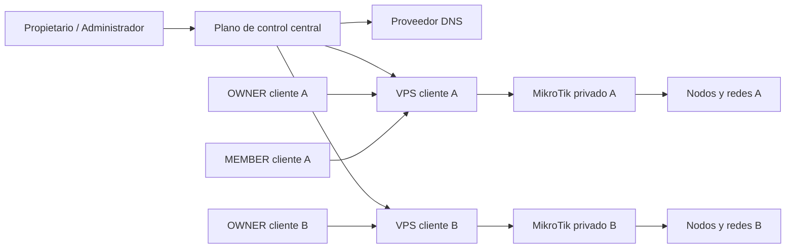
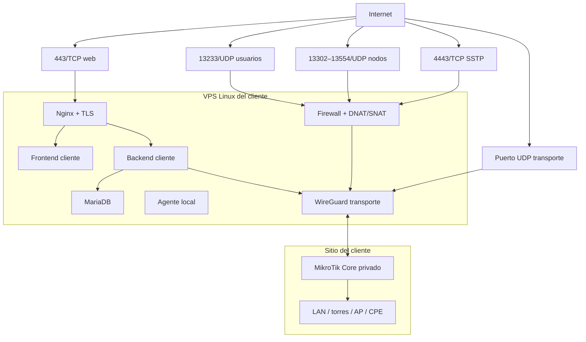
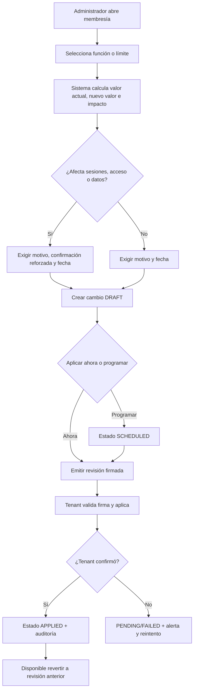
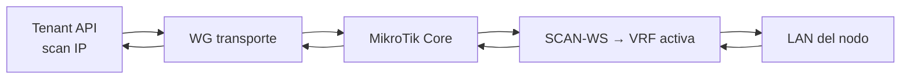
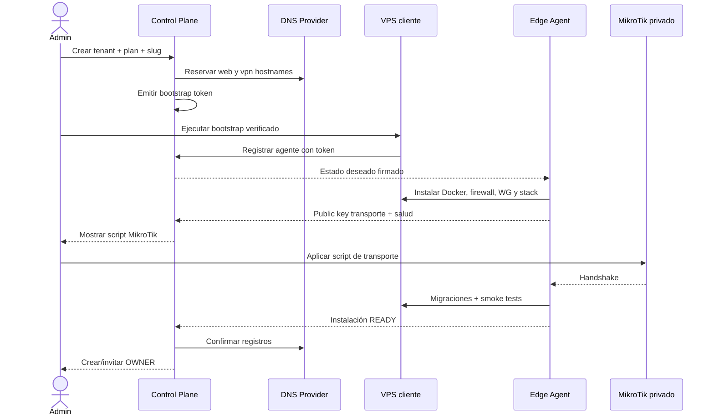
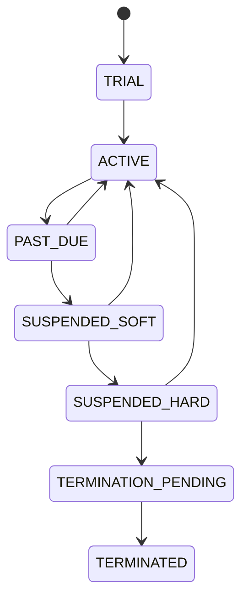
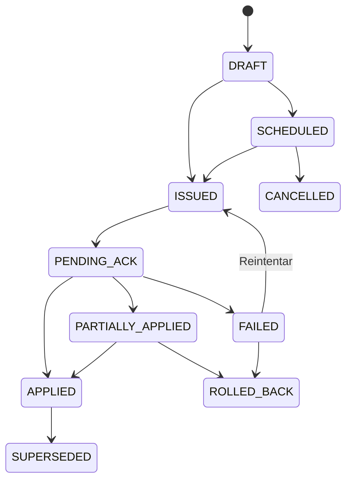
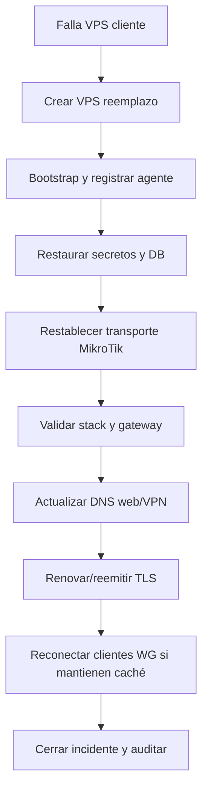

# Plan de arquitectura e implementación VPS multiusuario

**Proyecto:** GestionVPN / MikroTikVPN Remote Manager

**Rama de diseño:** `vps-multiusuario`

**Fecha:** 2026-07-26

**Tipo de documento:** explicación arquitectónica + referencia de implementación + plan operativo

**Estado:** propuesta para revisión; no autoriza despliegues ni cambios en producción

---

## 0. Resumen ejecutivo

La arquitectura recomendada para comercializar GestionVPN es:

1. **Un plano de control central**, administrado por el propietario del servicio.
2. **Un VPS Linux independiente por cliente**, con web, backend, MariaDB, gateway VPN, certificados y agente de instalación.
3. **Un MikroTik Core físico por cliente**, que puede estar detrás de NAT o CGNAT y establece un túnel saliente permanente hacia su VPS.
4. **Un dominio principal** —por ejemplo `gestionvpn.pe`— con subdominios basados en un `slug` estable del workspace.
5. **Una configuración estática de puertos por VPS cliente**, no una regla dinámica por nodo:
   - WireGuard de usuarios: UDP `13233`.
   - WireGuard de nodos ND2–ND254: UDP `13302–13554`.
   - SSTP: TCP `4443`.
   - Web: TCP `443`.
   - Transporte VPS–MikroTik: un puerto UDP exclusivo, configurable.
6. **Automatización por estado deseado**: el panel central crea la instalación, DNS y token de bootstrap; un agente local privilegiado prepara el VPS y mantiene firewall, WireGuard, contenedores, certificados, backups y actualizaciones.

La recomendación evita dos extremos:

- No concentrar el tráfico de todos los clientes en la única IP pública del administrador.
- No crear dos VPS obligatorios por cliente.

El modelo base es:

```text
1 VPS central compartido
        +
1 VPS Linux por cliente
        +
1 MikroTik físico privado por cliente
```

Un segundo VPS con MikroTik CHR queda como modalidad premium cuando el cliente no dispone de un Core físico adecuado.

### Decisión principal

El plano de control **no transporta tráfico operativo** de clientes. Si el panel central se cae, las instalaciones cliente deben continuar trabajando durante un período de gracia. Esta separación reduce el radio de impacto y permite migrar, actualizar o restaurar un cliente sin afectar a los demás.

---

## 1. Alcance

### 1.1 Incluido

- Diagnóstico de la arquitectura actual.
- Arquitectura objetivo.
- Separación entre administrador, cliente, VPS y MikroTik.
- Dominio, DNS, HTTPS y endpoints WireGuard.
- Flujos de escaneo, acceso de usuarios y nodos.
- Modelo de datos del plano central y del plano cliente.
- Panel administrador y panel cliente.
- Automatización de onboarding, instalación, actualización, suspensión, backup, restore y baja.
- Seguridad, permisos, auditoría y secretos.
- Observabilidad, recuperación y escenarios de falla.
- Migración gradual desde la instalación actual.
- Plan de implementación por fases y commits pequeños.
- Criterios de aceptación y pruebas.

### 1.2 Excluido de esta primera fase

- Implementación de código.
- Compra de dominio o VPS.
- Cambios en Cloudflare, Firebase, DigitalOcean o MikroTik.
- Modificaciones en producción.
- Definición final de precios comerciales.
- Facturación electrónica integrada con SUNAT.
- Kubernetes o microservicios distribuidos.
- Alta disponibilidad multi-región desde el primer piloto.

### 1.3 Supuestos de diseño

- Cada instalación cliente comienza con un solo workspace operativo.
- El cliente aporta un MikroTik RouterOS 7.x o contrata la modalidad CHR.
- El VPS cliente tiene IPv4 pública y Linux compatible con Docker.
- El MikroTik privado puede iniciar conexiones salientes UDP.
- El propietario conserva el dominio principal y administra sus registros DNS.
- Toda automatización peligrosa usa acciones permitidas explícitas; nunca una consola remota arbitraria desde el panel.
- Producción actual permanece en `vps_prod` hasta que un piloto separado sea aprobado.

---

## 2. Diagnóstico de la implementación actual

### 2.1 Stack real

| Capa | Implementación actual |
|---|---|
| Monorepo | npm workspaces |
| Frontend | React 19, TypeScript, Vite, Tailwind |
| Backend | Node.js 22, Express |
| Base de datos | MariaDB 11 / MySQL |
| Router | RouterOS API mediante `node-routeros` |
| Equipos | SSH/HTTP hacia Ubiquiti airOS |
| Autenticación | Cookie HttpOnly, CSRF, sesiones revocables, Google/Firebase opcional |
| Tiempo real | SSE |
| Métricas | Prometheus |
| Despliegue | Docker Compose |
| Proxy web | Nginx |
| Red VPS | Backend en `network_mode: host` para usar WireGuard del host |

Archivos principales:

- `docker-compose.prod.yml`
- `server/index.js`
- `server/middleware/authJwt.js`
- `server/routes/nodes/provision.routes.js`
- `server/lib/tunnelService.js`
- `server/lib/tenantScope.js`
- `server/sql/schema_rbac.sql`
- `server/sql/schema_ops.sql`
- `vpn-manager/src/App.tsx`
- `vpn-manager/src/utils/permissions.ts`

### 2.2 Roles actuales

| Rol | Función actual |
|---|---|
| `platform_admin` | Administración global, moderadores y Core |
| `OWNER` | Moderador/propietario del workspace |
| `MEMBER` | Usuario con nodos asignados |

El modelo es adecuado como base funcional, pero mezcla dos conceptos:

- Administrador de la plataforma comercial.
- Administrador técnico de un Core compartido.

En el modelo objetivo, el administrador central gestiona instalaciones y suscripciones; el backend cliente gestiona su propio Core.

### 2.3 Módulos actuales

### Administrador

- Dashboard.
- Moderadores/workspaces.
- Ajustes del Core.
- Aprovisionamiento y respaldo del servidor VPN.
- Habilitación de Gemini.
- Suspensión de usuarios.

### Cliente OWNER

- Nodos.
- Escaneo.
- Monitor AP.
- Equipo/miembros.
- WireGuard de usuarios.
- Ajustes de perfil/workspace.
- Notificaciones.
- Importación/exportación.

### MEMBER

- Nodos asignados.
- Activación temporal de acceso.
- Perfil.
- WireGuard propio.
- Notificaciones permitidas.

### 2.4 Acoplamientos que impiden escalar por instalación

### G-01 — Un solo Core global efectivo

Aunque existe `workspace_routers`, la sesión autenticada carga:

```text
app_settings.MT_IP
app_settings.MT_USER
app_settings.MT_PASS
```

Todas las solicitudes reciben el mismo `req.mikrotik`. La tabla `workspace_routers` no es la fuente efectiva de las operaciones RouterOS.

### G-02 — Ajustes globales

`server_public_ip`, `scan_mode`, `local_scan_ip`, credenciales del Core y parámetros de backup viven en `app_settings`. No están aislados por instalación.

### G-03 — Jobs globales

Los siguientes procesos leen el mismo Core:

- Expiración de sesiones.
- Monitoreo.
- Polling de AP.
- Bot de Telegram.
- Backup del Core.
- Reconciliación de rutas/AllowedIPs.

### G-04 — Identificadores globales

- `nodes.ppp_user` es único globalmente.
- `user_mgmt_ips.mgmt_ip` es único globalmente.
- `app_settings` no contiene `workspace_id`.
- El pool de escaneo se comparte en una sola instancia.

Esto funciona con un Core compartido, pero no modela instalaciones físicamente separadas dentro de la misma base.

### G-05 — Eliminación y suspensión demasiado acopladas

Suspender o eliminar un moderador intenta modificar peers en el Core global. En el modelo distribuido, el panel central necesitará enviar una orden idempotente a la instalación correcta y registrar su confirmación.

### G-06 — Privilegios del host

El backend no-root escribe una intención de `wg0`; un watcher root la aplica. Es un patrón seguro que debe conservarse y ampliarse. El backend de negocio no debe recibir `NET_ADMIN`, acceso a nftables ni claves privadas del transporte.

### G-07 — Reconciliación incompleta

La sincronización actual agrega LAN a `AllowedIPs`, pero la baja de nodo no necesariamente retira redes que ya no se usan. La arquitectura objetivo necesita reconciliación completa de estado deseado, no sólo append.

### G-08 — Rango WireGuard inconsistente

El contrato admite ND hasta 254:

```text
ND254 → 13300 + 254 = 13554
```

Sin embargo, el comentario de firewall declara `13300–13400`. La decisión de esta rama es:

```text
ND2–ND254 → UDP 13302–13554
```

El mismo rango debe aplicarse en:

- Validación de contratos.
- Firewall del MikroTik.
- Firewall del VPS.
- DNAT/SNAT.
- Diagnóstico.
- Documentación.
- Tests de límites.

---

## 3. Arquitectura objetivo

### 3.1 Contexto general



### 3.2 Despliegue por cliente



### 3.3 Separación de planos

| Plano | Responsabilidad | Transporta tráfico cliente |
|---|---|---|
| Control central | Clientes, planes, instalaciones, DNS, versiones, salud, auditoría | No |
| VPS cliente | Aplicación, base local, entrada pública y gateway | Sí |
| MikroTik cliente | WireGuard/SSTP, VRF, rutas, mangle, peers | Sí |
| Agente local | Infraestructura privilegiada del VPS | Sólo administración local |

### 3.4 Principios

1. **Aislamiento físico-lógico:** base y secretos separados por cliente.
2. **Tráfico local al cliente:** el administrador no es tránsito obligatorio.
3. **Continuidad desconectada:** caída central no corta inmediatamente la operación.
4. **Automatización declarativa:** comparar estado deseado con estado real.
5. **Privilegio mínimo:** backend de negocio no administra el host como root.
6. **Acciones allowlist:** el agente no ejecuta comandos arbitrarios enviados desde Internet.
7. **Versiones inmutables:** imágenes fijadas por digest/SHA.
8. **Rollback probado:** backup antes de migración y retorno verificable.
9. **Identidad estable:** dominio por `workspace_slug`, independiente del nombre visible.
10. **Secretos fuera de Git:** claves y credenciales nunca viajan en commits.

---

## 4. Alternativas evaluadas

| Opción | Ventajas | Desventajas | Veredicto |
|---|---|---|---|
| Un Core/VPS central para todos | Menor costo inicial | Alto radio de impacto, puertos y tenants complejos | No recomendada como producto |
| Dos VPS por cliente: web + CHR | Muy aislado, compatible con puertos | Mayor costo y licencia CHR | Premium |
| Un VPS Linux + MikroTik físico privado | Costo/aislamiento equilibrados | Requiere túnel y gateway | Recomendada |
| Un SaaS central + agentes remotos | Menor duplicación de aplicación | Gran refactor, dependencia central | Evolución futura |
| Web en VPS cliente, Core público del cliente | Simple | Cliente necesita IP pública | Soportada como variante |

---

## 5. División del software

No se recomienda dividir inmediatamente en muchos repositorios o microservicios. Se recomienda conservar el monorepo y crear aplicaciones con límites claros.

```text
apps/
  control-web/       Panel del administrador central
  control-api/       API central de clientes e instalaciones
  tenant-web/        Panel operativo del cliente
  tenant-api/        API RouterOS/AirOS del cliente
  edge-agent/        Agente privilegiado local

packages/
  contracts/         Contratos compartidos
  domain/            Reglas puras y estados
  installer/         Manifiestos y plantillas
  observability/     Eventos y métricas comunes

deploy/
  control-plane/
  tenant-plane/
  edge-agent/
  routeros/
```

### 5.1 Control Web

Módulos:

- Resumen del negocio.
- Clientes/tenants.
- Workspaces e identidad DNS.
- Planes comerciales.
- Membresías, capacidades y límites por cliente.
- Consumo, renovaciones y vencimientos.
- Instalaciones y VPS.
- Estado de MikroTik/transporte.
- Dominios y certificados.
- Versiones/despliegues.
- Backups y restauraciones.
- Incidentes/alertas.
- Auditoría.
- Integraciones/proveedores.

### 5.2 Control API

Responsabilidades:

- Fuente de verdad comercial.
- Registro de instalaciones.
- Emisión de tokens de bootstrap de un solo uso.
- Registro y autenticación de agentes.
- Estado deseado y comandos permitidos.
- Recepción de heartbeats y resultados.
- DNS mediante token con permisos mínimos.
- Suscripciones/entitlements.
- Coordinación de despliegues y rollback.
- Auditoría central.

No debe:

- Conectarse directamente a todos los RouterOS para las operaciones normales.
- Guardar claves privadas WireGuard de laptops/nodos.
- Ejecutar shell arbitrario en VPS cliente.
- Compartir la base de datos operacional de clientes.

### 5.3 Tenant Web

Evolución del frontend actual:

- Nodos.
- Escaneo.
- Monitor AP.
- Equipo/miembros.
- WireGuard de usuario.
- Perfil y seguridad.
- Notificaciones.
- Respaldo/importación permitida.
- Estado de instalación visible al OWNER.

No incluye:

- Gestión de otros clientes.
- Planes globales.
- Tokens de proveedor.
- DNS global.
- Despliegues de terceros.

### 5.4 Tenant API

Evolución del backend actual:

- Autenticación local/federada.
- RBAC OWNER/MEMBER.
- Provisión de nodos.
- RouterOS y AirOS.
- VRF/mangle/sesiones.
- Escaneo y Monitor AP.
- Jobs locales.
- Auditoría operacional.
- Aplicación local de entitlements cacheados.

### 5.5 Edge Agent

Servicio separado con privilegios controlados:

- Instala/verifica Docker.
- Administra `docker compose`.
- Gestiona WireGuard del host.
- Aplica nftables/firewall.
- Emite/renueva certificados.
- Ejecuta backup/restore local.
- Informa salud y versión.
- Descarga releases firmadas.
- Ejecuta migraciones permitidas.
- Revierte un despliegue fallido.

El agente expone un catálogo cerrado:

```text
INSTALL
RECONCILE
HEALTH_CHECK
BACKUP
RESTORE_PREVIEW
DEPLOY_RELEASE
ROLLBACK_RELEASE
ROTATE_TRANSPORT_KEY
RENEW_CERTIFICATE
SUSPEND_TENANT
RESUME_TENANT
UNINSTALL_PREVIEW
```

No existe una acción genérica `RUN_SHELL`.

---

## 6. Modelo de roles y permisos

| Acción | Platform Admin | OWNER | MEMBER | Edge Agent |
|---|---:|---:|---:|---:|
| Crear cliente | Sí | No | No | No |
| Crear instalación | Sí | No | No | Ejecuta |
| Configurar DNS | Sí/automático | No | No | No |
| Ver salud de su instalación | Sí | Sí | Limitado | Reporta |
| Crear/eliminar nodos | Soporte excepcional | Sí | No | No |
| Activar nodo asignado | No habitual | Sí | Sí | No |
| Invitar miembros | No habitual | Sí | No | No |
| Cambiar plan | Sí | Solicita | No | Aplica entitlements |
| Habilitar/deshabilitar función del cliente | Sí, con motivo y vista previa | Solicita | No | Sincroniza estado |
| Consultar plan, funciones y consumo | Sí | Sí, sólo su tenant | Limitado | Reporta consumo |
| Desplegar versión | Sí con autorización | No | No | Ejecuta |
| Restaurar backup | Sí con doble confirmación | Solicita | No | Ejecuta |
| Acceder a secretos | Referencias limitadas | No | No | Sólo secretos locales necesarios |
| Desinstalar cliente | Sí con retención | No | No | Ejecuta tras confirmación |

### 6.1 Separación de identidades

- **Cuenta comercial:** contacto/empresa/suscripción en el plano central.
- **Cuenta operacional:** usuario OWNER/MEMBER dentro del VPS cliente.
- Inicialmente pueden compartir correo, pero no deben compartir la misma sesión ni base.
- Un futuro SSO debe usar tokens con audiencia distinta para control y tenant.

### 6.2 Módulo administrativo de membresías y funciones

La membresía es el contrato operativo entre un `tenant` y una versión de plan. No debe confundirse con los usuarios `MEMBER` del workspace.

El Administrador necesita un módulo propio llamado **Membresías y funciones**, con dos niveles:

1. **Catálogo de planes:** define la plantilla que recibirán los nuevos clientes.
2. **Membresía del cliente:** muestra el plan contratado y permite excepciones individuales sin modificar a los demás clientes del mismo plan.

#### Pantallas del Administrador

**Listado de membresías**

- Cliente, workspace y estado.
- Plan y versión contratada.
- Fecha de inicio, renovación, vencimiento y gracia.
- Uso actual frente a límites.
- Instalación conectada, última sincronización y revisión aplicada.
- Alertas por exceso, mora, lease pendiente o agente offline.

**Detalle de membresía**

- Resumen comercial.
- Plan vigente y comparación con otros planes.
- Funciones efectivas.
- Límites y consumo.
- Excepciones del cliente.
- Cambios programados.
- Historial y auditoría.
- Estado de entrega al VPS cliente.

**Editor de plan**

- Plan en borrador.
- Matriz de funciones y límites.
- Precio/metadatos comerciales.
- Vista previa de impacto.
- Publicación como versión inmutable.
- Retiro del catálogo sin alterar contratos anteriores.

Modificar un plan publicado no debe cambiar silenciosamente a los clientes existentes. Se crea una nueva `plan_version` y el Administrador decide qué membresías migrar.

#### Catálogo inicial de capacidades

| Clave estable | Tipo | Controla | Comportamiento seguro al deshabilitar |
|---|---|---|---|
| `nodes.manage` | Booleano | Alta, edición y baja de nodos | Bloquear mutaciones; conservar y mostrar nodos existentes |
| `nodes.limit` | Límite entero | Número máximo de nodos | Bloquear nuevas altas; nunca eliminar excedentes |
| `scan.execute` | Booleano | Nuevos escaneos | Bloquear ejecución; conservar resultados anteriores |
| `monitor.ap` | Booleano | Monitor AP y SSE | Detener nuevas consultas; conservar inventario |
| `team.members.limit` | Límite entero | Miembros activos | Bloquear invitaciones/altas; no expulsar usuarios |
| `auth.google.link` | Booleano | Vincular nuevas cuentas Google | Bloquear nuevos enlaces; no bloquear identidades existentes automáticamente |
| `notifications.telegram` | Booleano | Integración Telegram | Detener job y ocultar configuración |
| `reports.export` | Booleano | PDF/Excel/JSON | Bloquear generación nueva; no borrar exportaciones |
| `ai.air_os` | Booleano | Análisis Gemini/AirOS | Bloquear nuevos análisis; historial sujeto a retención |
| `backups.automatic` | Booleano | Backup programado | No cancelar la copia de seguridad mínima obligatoria del proveedor |
| `backups.retention_days` | Límite entero | Retención contratada | Aplicar sólo hacia adelante; nunca borrar sin job auditado |
| `cores.limit` | Límite entero | Cantidad de MikroTik Core | Bloquear alta adicional; no desconectar Cores existentes |
| `support.level` | Enumerado | Horario/SLA de soporte | Cambiar colas y alertas, no capacidades de red |

La lista exacta se validará comercialmente. Las claves son contratos técnicos y no deben renombrarse al cambiar el texto visible.

#### Tipos de valor

- `BOOLEAN`: habilitado o deshabilitado.
- `INTEGER_LIMIT`: máximo cuantificable.
- `ENUM`: modalidad seleccionada de un catálogo cerrado.
- `PERIODIC_QUOTA`: consumo máximo dentro de un período.

No se recomienda guardar todas las funciones en una sola columna JSON editable. El catálogo, los valores del plan y las excepciones se normalizan; sólo el lease firmado se materializa como snapshot JSON.

#### Precedencia de cálculo

El estado efectivo se resuelve en este orden:

1. **Bloqueo global de seguridad:** sólo puede reducir capacidades.
2. **Estado de suscripción:** `SUSPENDED_SOFT` o `SUSPENDED_HARD` impone restricciones globales.
3. **Excepción temporal o permanente del cliente.**
4. **Valor de la versión de plan contratada.**
5. **Valor seguro del código:** apagado o límite cero si falta configuración.

Cada valor efectivo debe indicar `source`: `SECURITY`, `SUBSCRIPTION`, `OVERRIDE`, `PLAN` o `DEFAULT`.

#### Membresía no reemplaza RBAC

La membresía determina si el cliente contrató una capacidad. Los roles y permisos determinan quién puede usarla dentro del cliente:

```text
Acceso efectivo = entitlement de membresía
                   AND permiso RBAC
                   AND estado válido del usuario/sesión
```

| Entitlement | Permiso RBAC | Resultado |
|---|---|---|
| Habilitado | Permitido | Acción disponible |
| Habilitado | Denegado | `FORBIDDEN` |
| Deshabilitado | Permitido | `FEATURE_DISABLED` |
| Deshabilitado | Denegado | Denegado sin revelar detalles del plan |

En la primera versión, los overrides comerciales se aplican al tenant o instalación. Excepciones por usuario se manejan como permisos/entitlements operativos separados —por ejemplo, habilitar IA sólo a determinados OWNER— y no como una membresía distinta.

#### Flujo de habilitación/deshabilitación



No existe un interruptor que cambie producción sin vista previa. Toda modificación muestra:

- Funciones que se habilitan o bloquean.
- Cantidad de nodos/miembros actual frente al nuevo límite.
- Sesiones o jobs afectados.
- Momento de aplicación.
- Instalación y revisión destinataria.
- Plan de reversión.

#### Política al deshabilitar

La deshabilitación nunca elimina datos ni configuraciones de RouterOS. Cada función declara una estrategia:

| Estrategia | Efecto |
|---|---|
| `HIDE_AND_BLOCK` | Oculta UI y bloquea API; sólo para módulos sin datos críticos |
| `READ_ONLY` | Permite consultar, bloquea crear/editar/eliminar |
| `NO_NEW` | Conserva lo existente, bloquea nuevas altas o ejecuciones |
| `STOP_JOB` | Detiene el job asociado de forma idempotente |
| `WARN_ONLY` | Muestra exceso y permite operar durante transición |
| `REVOKE_ACCESS` | Revoca sesiones/accesos; reservado para suspensión hard o seguridad |

La estrategia `REVOKE_ACCESS` requiere confirmación reforzada. Un toggle comercial normal no debe desconectar túneles existentes.

#### Aplicación en backend y frontend

- El backend cliente es la autoridad con `requireEntitlement(feature_key)`.
- Los límites se verifican dentro de la misma transacción que crea el recurso.
- Los jobs validan entitlement antes de iniciar y registran por qué no corrieron.
- El frontend consume `/api/capabilities` para presentar u ocultar opciones, pero ocultar un botón no sustituye la autorización del backend.
- Los errores usan códigos estables como `FEATURE_DISABLED`, `LIMIT_REACHED`, `SUBSCRIPTION_READ_ONLY` y `ENTITLEMENT_EXPIRED`.
- Al reactivar una función se reutilizan datos/configuración existentes y el reconciliador corrige drift.

#### Visibilidad para el cliente

El OWNER tendrá una vista de sólo lectura **Plan y consumo**:

- Nombre del plan.
- Estado de membresía y próxima fecha relevante.
- Funciones incluidas.
- Uso de nodos, miembros, Cores y cuotas.
- Motivo de una función no disponible.
- Acción para solicitar ampliación.

El MEMBER no administra la membresía. Sólo ve mensajes funcionales cuando intenta una acción no incluida, sin información comercial sensible.

#### Roles centrales recomendados

Para el primer piloto, sólo `platform_admin` modifica membresías. En una etapa posterior:

| Rol central | Alcance |
|---|---|
| `PLATFORM_SUPER_ADMIN` | Planes, membresías, overrides, suspensión y seguridad |
| `BILLING_ADMIN` | Plan, fechas, renovación y estados comerciales; no despliegues |
| `SUPPORT_ADMIN` | Consulta y override temporal previamente permitido |
| `AUDITOR` | Sólo lectura de configuración e historial |

Toda ampliación de roles debe usar permisos explícitos; no comparar únicamente el nombre del rol.

---

## 7. Modelo de red

### 7.1 Puertos del VPS cliente

| Puerto | Protocolo | Destino/uso | Exposición |
|---:|---|---|---|
| 443 | TCP | Nginx/web/API | Pública |
| 80 | TCP | ACME/redirect | Pública controlada |
| 13233 | UDP | `VPN-WG-CLIENTES` | Pública |
| 13302–13554 | UDP | WG ND2–ND254 | Pública |
| 4443 | TCP | SSTP | Opcional/pública |
| configurable | UDP | Transporte VPS–MikroTik | Pública |
| 22 | TCP | SSH del VPS | Restringida |
| 8728/8729 | TCP | RouterOS API | Sólo túnel privado |
| 3306/3307 | TCP | MariaDB | Sólo localhost |
| 3001 | TCP | Backend | Sólo localhost/proxy |

### 7.2 Regla estática por rango

El VPS se configura una vez:

```text
UDP 13302–13554
  DNAT/SNAT conservando puerto
  hacia IP de transporte del MikroTik
```

Consecuencias:

- Crear ND37 habilita `13337` sin cambiar el VPS.
- Eliminar ND37 deja el puerto sin servicio en el MikroTik.
- Reparar ND37 conserva el cálculo determinista.
- No hace falta un gestor de nftables por cada alta/baja.

### 7.3 Transporte

Ejemplo conceptual, no definitivo:

```text
VPS wg-core:       10.250.0.1/30
MikroTik wg-vps:   10.250.0.2/30
```

El instalador debe comprobar solapamientos con las LAN del cliente. Si existe conflicto, selecciona otro CIDR.

El transporte incluye:

- IP RouterOS de gestión.
- Pool de escaneo.
- LAN activas necesarias.
- Rutas de retorno.

### 7.4 Escaneo desde VPS



Requisitos:

- El backend conserva `network_mode: host` o una alternativa con rutas explícitas.
- La IP de escaneo está configurada en el host.
- `AllowedIPs` del transporte contiene las LAN.
- El Core tiene retorno hacia scan-pool.
- El reconciliador añade y retira LAN según estado real.

### 7.5 Acceso de laptop

```text
Endpoint laptop:
vpn-<slug>.gestionvpn.pe:13233

VPS:
13233/UDP → MikroTik privado:13233

MikroTik:
VPN-WG-CLIENTES
```

Después del handshake:

```text
Laptop 10.13.250.x
    ↓
mangle por usuario
    ↓
VRF del nodo activado
```

### 7.6 Configuración conceptual de laptop

```ini
[Interface]
PrivateKey = <GENERADA_LOCALMENTE>
Address = 10.13.250.22/32
MTU = <VALOR_VALIDADO_EN_PREFLIGHT>

[Peer]
PublicKey = <PUBLICA_VPN_WG_CLIENTES>
Endpoint = vpn-housenet.gestionvpn.pe:13233
AllowedIPs = <REDES_DE_GESTION_Y_NODOS_ASIGNADOS>
PersistentKeepalive = 25
```

Reglas:

- Una clave privada por dispositivo.
- No compartir `.conf`.
- No usar `0.0.0.0/0`.
- Preferir redes precisas para evitar colisiones con la LAN local de la laptop.

### 7.7 MTU

Existe doble encapsulación:

1. Laptop/nodo ↔ MikroTik.
2. VPS ↔ MikroTik.

El instalador debe ejecutar:

- Descubrimiento de PMTU.
- Ping DF con tamaños crecientes.
- Prueba SSH/HTTP.
- Prueba de descarga.
- Prueba con varios nodos.

No se fija `1360` como valor universal; es sólo un candidato inicial.

---

## 8. Dominio y DNS

### 8.1 Convención

```text
Nombre visible: Housenet Telecomunicaciones
Slug estable:   housenet

Web:  housenet.gestionvpn.pe
VPN:  vpn-housenet.gestionvpn.pe
```

El slug:

- Es minúsculo.
- Usa letras ASCII, números y guiones.
- Es único.
- No cambia al renombrar el workspace.
- Reserva `admin`, `api`, `www`, `vpn`, `status`, `support`.
- Puede ser opaco si el cliente requiere privacidad.

### 8.2 Registros

| Registro | Tipo | Valor | Proxy |
|---|---|---|---|
| `admin` | A | VPS central | Según política web |
| `<slug>` | A | VPS cliente | DNS-only inicialmente |
| `vpn-<slug>` | A | VPS cliente | Siempre DNS-only |

WireGuard:

```text
vpn-<slug>.gestionvpn.pe:13233
vpn-<slug>.gestionvpn.pe:13302–13554
```

### 8.3 Certificados

- Certificado individual por hostname web.
- Let’s Encrypt HTTP-01 cuando sea posible.
- No distribuir una clave wildcard a todos los VPS.
- El hostname VPN no necesita TLS.
- El agente renueva y reporta expiración.

### 8.4 Automatización DNS

El token DNS vive sólo en el control plane y tiene permisos limitados a la zona requerida.

Proceso:

1. Reservar slug.
2. Crear registro web.
3. Crear registro VPN DNS-only.
4. Validar resolución.
5. Esperar propagación.
6. Emitir certificado.
7. Marcar dominio `READY`.

### 8.5 Cambio de IP

Al restaurar en otro VPS:

1. Preparar nuevo stack.
2. Restaurar base y secretos.
3. Restablecer transporte.
4. Actualizar ambos registros A.
5. Validar HTTPS.
6. Solicitar reconexión WireGuard si el cliente mantiene la IP anterior en caché.

DNS reduce la necesidad de regenerar `.conf`, pero no reemplaza backups ni reconstruye el VPS.

---

## 9. Modelo de datos central

| Entidad | Propósito | Campos principales |
|---|---|---|
| `tenants` | Cliente comercial | id, legal_name, display_name, slug, status |
| `tenant_contacts` | Contactos | tenant_id, type, name, email, phone |
| `feature_catalog` | Contrato de capacidades | key, type, category, scope, safe_default, disable_strategy, status |
| `plans` | Identidad del producto comercial | code, name, status |
| `plan_versions` | Versión inmutable del plan | plan_id, version, state, price_metadata, published_at |
| `plan_feature_values` | Funciones/límites de la versión | plan_version_id, feature_id, value, enforcement |
| `subscriptions` | Membresía vigente | tenant_id, plan_version_id, state, dates, grace |
| `subscription_feature_overrides` | Excepción individual | subscription_id, feature_id, value, reason, starts_at, ends_at |
| `entitlement_revisions` | Snapshot efectivo firmado | subscription_id, revision, payload_hash, valid_until, grace_until, state |
| `entitlement_deliveries` | Entrega/aplicación | revision_id, installation_id, issued_at, ack_at, result |
| `usage_snapshots` | Consumo observado | subscription_id, feature_id, used_value, period, observed_at |
| `installations` | Stack desplegado | tenant_id, mode, provider, region, status |
| `installation_endpoints` | Dominios/IP | web_host, vpn_host, public_ip |
| `agents` | Identidad del edge-agent | installation_id, cert fingerprint, version |
| `bootstrap_tokens` | Registro inicial | hash, expires_at, used_at |
| `desired_state_revisions` | Estado deseado | revision, manifest_hash, created_by |
| `agent_commands` | Outbox de acciones | type, payload allowlist, state, idempotency |
| `deployment_releases` | Versiones | git_sha, image_digests, channel |
| `deployment_runs` | Ejecuciones | release, installation, state, rollback |
| `dns_records` | Inventario DNS | hostname, type, provider_id, status |
| `certificate_status` | TLS | hostname, issuer, expires_at, status |
| `backup_runs` | Backups | type, hash, size, status, storage_ref |
| `health_snapshots` | Salud resumida | installation, component, state, observed_at |
| `incidents` | Fallas | severity, source, state, timeline |
| `audit_events` | Trazabilidad | actor, action, target, result, metadata |
| `provider_integrations` | Referencias | provider, secret_ref, permissions |

### 9.1 Reglas

- Secretos se referencian mediante `secret_ref`; no se guardan en texto plano.
- Todo comando tiene `idempotency_key`.
- Auditoría central es append-only.
- La baja comercial no borra inmediatamente una instalación.
- El slug tiene índice único.
- Un tenant puede tener más de una instalación en el futuro: producción, laboratorio, DR.
- `feature_catalog.key` y `plans.code` son únicos y estables.
- `plan_versions` publicadas son inmutables; una modificación crea otra versión.
- Existe un único valor por `(plan_version_id, feature_id)`.
- Existe como máximo un override activo por `(subscription_id, feature_id, intervalo)`.
- Todo override tiene motivo, actor, vigencia y revisión de auditoría.
- Un límite inferior al consumo actual bloquea nuevas altas, pero no elimina recursos.
- El snapshot firmado es una proyección; las tablas normalizadas son la fuente de verdad.
- `usage_snapshots` es telemetría para decisión central; el límite se aplica autoritativamente en el tenant.

---

## 10. Modelo de datos cliente

La base cliente conserva el dominio operacional actual y añade:

| Entidad/config | Uso |
|---|---|
| `installation_identity` | tenant_id, installation_id, slug |
| `control_plane_binding` | URL, certificado/clave pública, estado |
| `entitlement_lease` | revisión, expiración, firma, período de gracia |
| `local_deployment_state` | versión actual/anterior |
| `gateway_state` | transporte, rango, reglas, hash |
| `reconciliation_runs` | drift y correcciones |
| `local_audit_events` | acciones del agente |

### 10.1 Decisión inicial

Una instalación cliente contiene un workspace principal. Esto evita tener que adaptar inmediatamente toda la capa RouterOS a múltiples Cores dentro de la misma base.

### 10.2 Evolución

Si más adelante un cliente requiere varios Cores:

- Agregar `core_server_id` a nodos, sesiones, AP, backup y jobs.
- Convertir settings globales en perfiles de Core.
- Resolver el Core desde el recurso y no desde la sesión global.
- Probar aislamiento cruzado.

Esta evolución no es requisito del primer piloto por-VPS.

---

## 11. APIs y comunicación central–agente

### 11.1 Registro

```text
POST /agent/register
```

Entrada:

- Token de un solo uso.
- Clave pública/certificate request.
- Fingerprint del host.
- Versión del instalador.

Salida:

- Identidad de instalación.
- Certificado mTLS o credencial equivalente.
- Estado deseado inicial firmado.

### 11.2 Operación

```text
POST /agent/heartbeat
GET  /agent/desired-state
POST /agent/commands/poll
POST /agent/commands/:id/ack
POST /agent/events
```

El agente inicia todas las conexiones hacia el control plane. No se expone una API privilegiada pública en el VPS cliente.

### 11.3 Heartbeat sanitizado

- Versión.
- Uptime.
- Estado de contenedores.
- Salud DB/backend/frontend.
- Último handshake transporte.
- Certificado y expiración.
- Disco/memoria.
- Estado backup.
- Hash de configuración, sin secretos.

### 11.4 Lease de entitlements

El control central firma:

```json
{
  "tenantId": "...",
  "installationId": "...",
  "revision": 12,
  "features": {
    "nodes.manage": true,
    "scan.execute": true,
    "monitor.ap": false
  },
  "limits": {
    "nodes.limit": 25,
    "team.members.limit": 10,
    "cores.limit": 1
  },
  "validUntil": 0,
  "graceUntil": 0
}
```

El tenant valida la firma con una clave pública embebida. No llama al control plane en cada request.

El lease no contiene precios, notas internas ni información de otros clientes. Cuando el control plane está disponible, el tenant consulta nuevas revisiones; si está offline, usa la última revisión válida hasta `graceUntil`.

### 11.5 API de membresías y capacidades

Endpoints centrales propuestos:

```text
GET    /admin/features
GET    /admin/plans
POST   /admin/plans
POST   /admin/plans/:id/versions
PUT    /admin/plan-versions/:id/features
POST   /admin/plan-versions/:id/publish

GET    /admin/subscriptions
GET    /admin/subscriptions/:id
POST   /admin/subscriptions/:id/change-plan
POST   /admin/subscriptions/:id/overrides
DELETE /admin/subscriptions/:id/overrides/:overrideId
GET    /admin/subscriptions/:id/effective-entitlements
GET    /admin/subscriptions/:id/usage
GET    /admin/subscriptions/:id/history
POST   /admin/subscriptions/:id/reissue-lease
POST   /admin/subscriptions/:id/rollback-entitlements
```

Endpoints tenant:

```text
GET /api/capabilities
GET /api/account/plan-usage
```

Reglas de API:

- Toda mutación requiere CSRF, sesión reciente, permiso explícito y `reason`.
- Cambios de alto impacto requieren confirmación reforzada.
- El servidor calcula el resultado efectivo; el cliente nunca envía el snapshot final.
- Las respuestas de vista previa incluyen impacto, pero nunca secretos.
- Cada mutación genera un `audit_event` y una nueva revisión monotónica.
- Repetir una solicitud con el mismo `idempotency_key` no duplica overrides ni revisiones.
- El rollback crea una revisión nueva basada en la anterior; no borra historia.

---

## 12. Procesos del administrador

### 12.1 Alta completa



### 12.2 Actualización

1. Publicar código en rama autorizada.
2. Crear release inmutable con SHA y digest.
3. Seleccionar instalación canary.
4. Ejecutar backup previo.
5. Descargar sin activar.
6. Validar firma/digest.
7. Ejecutar migraciones expandibles.
8. Recrear servicios afectados.
9. Ejecutar health y smoke.
10. Confirmar o revertir.
11. Observar canary.
12. Ampliar sólo con autorización.

### 12.3 Suspensión

Estados propuestos:



Comportamiento recomendado:

- `PAST_DUE`: advertencias; sin cortar servicio.
- `SUSPENDED_SOFT`: sólo lectura, sin nuevas altas/cambios.
- `SUSPENDED_HARD`: revocar sesiones y accesos de usuarios; conservar transporte para soporte/recuperación.
- `TERMINATION_PENDING`: exportación y retención.
- `TERMINATED`: deprovisión explícita después del plazo.

Nunca eliminar nodos o backups sólo por un pago vencido.

### 12.4 Baja

1. Verificar identidad y autoridad.
2. Generar export final.
3. Backup completo.
4. Revocar usuarios.
5. Retener datos por período acordado.
6. Retirar DNS.
7. Revocar agente.
8. Destruir VPS sólo si su propiedad y contrato lo permiten.
9. Registrar hashes y acta de baja.

### 12.5 Gestión de membresía y funciones

#### Proceso de negocio

El Administrador asigna al cliente un plan comercial. Si necesita una excepción, no crea un plan duplicado: registra un override justificado, temporal o permanente. El cliente puede solicitar el cambio, pero no aplicarlo.

#### Flujo del sistema

1. Cargar membresía, versión de plan, overrides, uso y última revisión aplicada.
2. Seleccionar cambio de plan, función o límite.
3. Calcular el resultado efectivo y comparar uso actual.
4. Mostrar impacto sobre UI, API, jobs, sesiones y recursos existentes.
5. Exigir motivo, fecha y confirmación según riesgo.
6. Guardar cambio como `DRAFT` o `SCHEDULED`.
7. Emitir snapshot firmado con revisión monotónica.
8. Entregarlo a cada instalación de la membresía.
9. Esperar `ACK` con hash y resultado.
10. Mostrar `APPLIED`, `PARTIALLY_APPLIED`, `PENDING` o `FAILED`.
11. Alertar si la instalación permanece offline o aplica una revisión distinta.
12. Permitir rollback mediante una revisión nueva.

Estados del cambio:



Tabla de decisión:

| Situación | Resultado recomendado | Datos existentes | Confirmación |
|---|---|---|---|
| Habilitar una función | Emitir entitlement y mostrar módulo | Conservar/reutilizar | Normal |
| Deshabilitar función no crítica | `READ_ONLY`, `NO_NEW` o `STOP_JOB` | Conservar | Normal con motivo |
| Bajar límite por debajo del consumo | Bloquear nuevas altas y mostrar exceso | Conservar | Reforzada |
| Deshabilitar enlace Google | Bloquear nuevos enlaces; mantener login ya vinculado | Conservar identidades | Reforzada para cortar login existente |
| Deshabilitar análisis IA | Bloquear nuevos análisis | Conservar historial según retención | Normal |
| Suspensión soft | Sólo lectura global | Conservar | Reforzada |
| Suspensión hard | Revocar sesiones/accesos según política | Conservar configuración y backups | Reforzada |
| Tenant offline | Dejar cambio pendiente; no afirmar que fue aplicado | Sin cambios hasta entrega/expiración | Alerta |
| Reactivación | Emitir revisión que restaura capacidades | Reconciliar sin recrear innecesariamente | Normal |

#### Trazabilidad mínima

```text
Solicitud -> actor -> motivo -> valor anterior -> valor nuevo
-> fuente efectiva -> impacto previsto -> revisión firmada
-> instalación destinataria -> ACK -> resultado -> rollback
```

No debe existir una modificación directa en la base cliente que el plano central desconozca. Si soporte necesita una excepción de emergencia, se registra como override con expiración automática.

---

## 13. Automatización de instalación

### 13.1 Modos soportados

#### Modo A — VPS administrado

El control plane usa la API del proveedor:

- Crear VPS.
- Inyectar clave SSH temporal.
- Asignar firewall base.
- Ejecutar bootstrap.
- Registrar IP.
- Crear DNS.

#### Modo B — VPS propiedad del cliente

El cliente crea Ubuntu/Debian compatible y ejecuta una instalación guiada:

```text
descargar instalador
verificar SHA/firma
ejecutar con token de un solo uso
```

El token expira, es single-use y no se guarda en el historial de shell cuando sea posible.

#### Modo C — Instalación asistida

El operador se conecta con permiso del cliente, ejecuta el mismo instalador y entrega evidencia. No existe un procedimiento manual distinto.

#### Modo D — CHR premium

- VPS aplicación.
- VPS RouterOS CHR.
- Conexión privada entre ambos.
- Licencia y backups separados.
- Sin MikroTik físico obligatorio.

### 13.2 Preflight

El instalador valida:

- Sistema operativo y arquitectura.
- CPU/RAM/disco.
- IPv4 pública.
- DNS directo e inverso cuando aplique.
- Puertos ocupados.
- Acceso de salida HTTPS y UDP.
- Docker/Compose.
- Sin solapamiento de redes.
- Soporte WireGuard/nftables.
- Hora/NTP.
- Resolución DNS.
- Permisos y filesystem.
- Capacidad para backups.

Falla cerrada antes de realizar cambios.

### 13.3 Fases idempotentes del instalador

1. `preflight`
2. `prepare-host`
3. `install-agent`
4. `register-agent`
5. `configure-firewall`
6. `configure-transport`
7. `install-stack`
8. `configure-dns`
9. `issue-certificate`
10. `run-migrations`
11. `bootstrap-owner`
12. `smoke-test`
13. `mark-ready`

Cada fase:

- Tiene marcador de estado.
- Puede reintentarse.
- No repite acciones destructivas.
- Produce logs sanitizados.
- Define rollback.

### 13.4 Script de MikroTik

El panel genera un script idempotente para:

- Interfaz WG de transporte.
- IP de transporte.
- Peer del VPS.
- Endpoint del VPS.
- Keepalive.
- Rutas hacia scan-pool/gestión.
- Firewall mínimo.
- Restricción RouterOS API al túnel.

El script:

- No contiene la clave privada del VPS.
- Incluye la clave privada del MikroTik sólo si se genera de forma controlada para ese equipo.
- Puede aplicarse por copy/paste.
- Tiene preview y verificación.
- No borra configuración existente.

### 13.5 Reconciliación

El agente compara:

```text
estado deseado firmado
        vs.
estado real local
```

Objetos:

- Contenedores y digests.
- Variables no secretas.
- Puertos.
- nftables.
- WireGuard.
- Certificados.
- Timers/systemd.
- Directorios/permisos.
- Backup schedule.

Si detecta drift:

- Corrige automáticamente sólo cambios reversibles permitidos.
- Informa cambios materiales.
- Nunca sobrescribe secretos o restaura datos sin orden explícita.

---

## 14. Seguridad

### 14.1 Límites de confianza

| Límite | Control |
|---|---|
| Navegador–tenant | HTTPS, cookie HttpOnly, CSRF |
| Tenant API–MikroTik | WireGuard privado, RouterOS allowlist |
| Agent–control | mTLS, firma, replay protection |
| Control–DNS/provider | Token de mínimo alcance |
| Backend–host | Archivo de intención, no root |
| Backups | Cifrado, hashes, acceso restringido |

### 14.2 Secretos

Separar por instalación:

- Clave DB.
- `.db_secret`.
- `.jwt_secret`/keyring.
- Clave transporte.
- Credencial RouterOS.
- SMTP.
- Firebase ADC/WIF.
- Gemini/Telegram si se habilitan.

No incluir:

- Git.
- Imagen Docker.
- Logs.
- Heartbeats.
- Backups sin cifrar.

### 14.3 Agent hardening

- Usuario de servicio dedicado.
- Configuración root-owned.
- mTLS.
- Allowlist de acciones.
- Payload validado con schemas.
- Nonce/timestamp.
- Idempotency key.
- Firma de manifiestos.
- Imágenes por digest.
- Auditoría local/central.
- Timeout por acción.
- Límite de tamaño de output.
- Redacción automática.

### 14.4 Firewall

- Denegar por defecto.
- Sólo puertos documentados.
- RouterOS API nunca pública.
- MariaDB sólo localhost.
- Métricas restringidas.
- SSH por IP autorizada o acceso temporal.
- Rate limit UDP donde no perjudique WireGuard.
- Rango ND consistente `13302–13554`.

### 14.5 Firebase/Google

Cada hostname web debe ser admitido por la configuración de autenticación correspondiente. El onboarding debe:

- Validar dominio autorizado.
- Verificar que frontend/backend usan el mismo proyecto.
- Mantener RBAC en MySQL.
- No auto-crear roles por claims.
- Permitir desactivar federación por instalación.

Si la automatización del proveedor no soporta alta segura de dominios, Google queda apagado en nuevas instalaciones hasta completar el paso manual.

---

## 15. Observabilidad y operación

### 15.1 Salud

Componentes:

- DNS.
- HTTPS/certificado.
- Frontend.
- Backend.
- MariaDB.
- Agente.
- WireGuard transporte.
- RouterOS API.
- WG usuarios.
- Puertos nodos.
- Disco/memoria.
- Backups.
- Jobs.

### 15.2 Métricas centrales sanitizadas

- Instalaciones por estado.
- Versión desplegada.
- Último heartbeat.
- Último handshake.
- Errores por componente.
- Latencia health.
- Reinicios.
- Disco/memoria.
- Certificados por vencer.
- Backup age.
- Drift detectado.

No enviar:

- IP/MAC de clientes finales innecesarias.
- Claves.
- Passwords.
- Tokens.
- Configuraciones completas.
- Payloads RouterOS sensibles.

### 15.3 Alertas

| Severidad | Ejemplo | Acción |
|---|---|---|
| Crítica | DB corrupta, restore fallido, transporte caído prolongado | Notificación inmediata |
| Alta | Certificado próximo a vencer, backup vencido | Intervención prioritaria |
| Media | Disco >80%, drift, job fallido | Ticket operativo |
| Baja | Nueva versión disponible | Planificación |

---

## 16. Backups y recuperación

### 16.1 Contenido mínimo

- Dump consistente MariaDB.
- `.db_secret`.
- Keyring de sesiones según política.
- Clave WG de transporte.
- Configuración no secreta.
- Inventario de versión/digest.
- Metadata de DNS.
- Backup dual RouterOS existente.

### 16.2 No incluir

- Tokens temporales.
- Cachés.
- Logs ilimitados.
- Imágenes Docker reconstruibles.
- Certificados públicos sin necesidad.

### 16.3 Política inicial propuesta

- Backup DB diario.
- Backup previo a deploy/migración.
- Backup RouterOS diario.
- Retención corta local y mayor externa cifrada.
- Prueba de restauración periódica.
- Hash SHA-256.
- RPO/RTO definidos por plan.

### 16.4 Recuperación con nueva IP



Las claves internas de laptops/nodos se conservan porque terminan en el MikroTik, no en el VPS.

---

## 17. Escenarios de falla

| Escenario | Efecto esperado | Recuperación |
|---|---|---|
| Control plane caído | Clientes siguen durante lease/gracia | Restaurar central |
| VPS cliente caído | Web, acceso y nodos de ese cliente caen | Restore + DNS |
| MikroTik apagado | Web puede cargar; RouterOS/escaneo/VPN no | Reparar equipo/transporte |
| Transporte caído | Backend sin RouterOS, puertos sin destino | Rehandshake/reconciliar |
| DNS caído | Caché puede sostener temporalmente | Proveedor redundante |
| Certificado vencido | Web insegura/inaccesible | Renovación automática/manual |
| DB caída | Autorización fail-closed | Restaurar servicio/DB |
| Update fallido | Sólo canary afectado | Rollback a digest anterior |
| Agent comprometido | Riesgo local | Revocar certificado y reinstalar |
| Token bootstrap filtrado | Riesgo hasta uso/expiración | Revocar; single-use corto |
| Rango UDP bloqueado por ISP | Nodos no conectan | Diagnóstico/puertos alternos |
| LAN solapada con transporte | Rutas incorrectas | Preflight selecciona CIDR |
| MTU alta | Fallas parciales/fragmentación | PMTU y ajuste |
| Firebase dominio faltante | Google falla; local debe seguir | Autorizar o apagar federación |
| Central suspende por error | Tenant entra en estado incorrecto | Orden compensatoria + auditoría |

---

## 18. Flujos y casos de uso

### UC-01 — Crear tenant

**Actor:** Platform Admin

**Resultado:** tenant, slug y suscripción creados sin infraestructura.

### UC-02 — Registrar VPS propiedad del cliente

**Actor:** Platform Admin/cliente autorizado

**Resultado:** agente registrado mediante token single-use.

### UC-03 — Conectar MikroTik privado

**Actor:** OWNER/instalador

**Resultado:** handshake de transporte y RouterOS API alcanzable.

### UC-04 — Crear OWNER

**Actor:** Platform Admin

**Resultado:** invitación operacional en la instalación correcta.

### UC-05 — Crear nodo ND

**Actor:** OWNER

**Resultado:** Core crea interfaz/peer/VRF; el rango estático del VPS ya lo transporta.

### UC-06 — Entregar WireGuard a MEMBER

**Actor:** OWNER

**Resultado:** peer individual y `.conf` con hostname estable.

### UC-07 — Actualizar instalación

**Actor:** Platform Admin

**Resultado:** release verificable, backup, health y rollback.

### UC-08 — Suspender y reactivar

**Actor:** Platform Admin

**Resultado:** entitlement y sesiones cambian sin destruir datos.

### UC-09 — Migrar VPS por falla

**Actor:** Platform Admin

**Resultado:** restore en nueva IP con mismos hostnames.

### UC-10 — Baja definitiva

**Actor:** Platform Admin autorizado

**Resultado:** export, retención, revocación y destrucción auditada.

### UC-11 — Cambiar plan de una membresía

**Actor:** Platform Admin

**Resultado:** nueva versión de plan programada o aplicada, con impacto, revisión y ACK trazables.

### UC-12 — Habilitar una función para un solo cliente

**Actor:** Platform Admin

**Resultado:** override individual con motivo y vigencia, sin modificar el plan de otros clientes.

### UC-13 — Deshabilitar una función sin perder datos

**Actor:** Platform Admin

**Resultado:** backend y frontend aplican la estrategia segura; recursos existentes permanecen intactos.

### UC-14 — Consultar plan y consumo

**Actor:** OWNER

**Resultado:** consulta de plan, capacidades, límites, consumo y motivos de bloqueo sin permiso de edición.

### UC-15 — Revertir un cambio de entitlement

**Actor:** Platform Admin

**Resultado:** nueva revisión restaura el estado anterior y conserva toda la auditoría.

---

## 19. Matriz de impacto sobre módulos actuales

| Módulo actual | Acción | Destino |
|---|---|---|
| Admin Dashboard | Separar | `control-web` |
| Moderadores | Convertir en tenants/owners | `control-web/control-api` |
| Membresías y funciones | Crear | `control-web/control-api` |
| Plan y consumo OWNER | Crear, sólo lectura | `tenant-web/tenant-api` |
| Ajustes Core global | Retirar del central | Tenant/instalación |
| Servidor VPN/backup | Mover operación local | Tenant API + agent |
| Nodos | Mantener/adaptar | `tenant-web/api` |
| Escanear | Mantener/adaptar transporte | `tenant-web/api` |
| Monitor AP | Mantener | `tenant-web/api` |
| Equipo/miembros | Mantener | `tenant-web/api` |
| Ajustes perfil | Mantener | Tenant |
| Google/Firebase | Configurable por instalación | Tenant |
| Gemini | Entitlement por tenant/OWNER | Central + Tenant |
| Jobs globales | Instancia local | Tenant |
| `wg0-autosync` | Sustituir por reconciliación completa | Agent |

---

## 20. Estrategia de migración

### Fase M0 — Congelar producción actual

- `vps_prod` continúa como fuente de producción.
- `vps-multiusuario` no se despliega.
- Documentar SHA y backups.

### Fase M1 — Laboratorio

- VPS temporal.
- MikroTik de laboratorio detrás de NAT.
- Dominio de prueba.
- Sin datos reales.
- Validar transporte, rango, MTU, escaneo, OWNER y MEMBER.

### Fase M2 — Control plane mínimo

- Tenants.
- Instalaciones.
- Slug/DNS manual asistido.
- Token bootstrap.
- Heartbeat.

### Fase M3 — Primer cliente piloto nuevo

- No migrar producción.
- Instalar un cliente limpio.
- Observar 7–14 días.
- Ejecutar restore simulado.

### Fase M4 — Migración voluntaria

- Exportar/importar workspace.
- Mantener ventana de retorno.
- Cambiar DNS al nuevo VPS.
- Validar usuarios, nodos y escaneo.

### Fase M5 — Escala controlada

- Automatizar proveedor.
- Releases por canal.
- Canaries.
- SLO y soporte.

---

## 21. Plan de implementación

### 21.1 Fase 0 — ADR y contratos

Entregables:

- ADR plano central vs tenant.
- ADR agente local.
- ADR DNS/slug.
- ADR suspensión.
- Contratos de installation/agent/entitlement.
- Rango ND2–ND254.

### 21.2 Fase 1 — Identidad de instalación

- Crear `installation_identity`.
- Separar configuración central/local.
- Health local con installation ID.
- Evitar secretos en payload.

### 21.3 Fase 2 — Control plane mínimo

- Nuevo backend central.
- Nueva base central.
- Tenants, plans, subscriptions, installations.
- Auditoría.
- Panel central inicial.

### 21.4 Fase 3 — Edge Agent

- Registro single-use.
- mTLS.
- Heartbeat.
- Catálogo de acciones.
- Reconciliador.
- Servicio systemd.

### 21.5 Fase 4 — Gateway de red

- Transporte.
- nftables.
- Rango `13302–13554`.
- Usuarios/SSTP.
- SNAT/retorno.
- MTU preflight.
- Health de handshake.

### 21.6 Fase 5 — DNS/TLS

- Slug.
- Registros web/VPN.
- Certificado individual.
- Renovación.
- Cambio de IP.

### 21.7 Fase 6 — Bootstrap de tenant

- Compose por instalación.
- Secretos locales.
- Migraciones.
- OWNER.
- Smoke tests.
- Idempotencia.

### 21.8 Fase 7 — Entitlements

- Catálogo de funciones tipadas.
- Planes versionados e inmutables.
- Membresías y overrides con vigencia.
- Vista previa de impacto.
- Matriz administrativa de funciones/límites.
- Vista OWNER de plan y consumo.
- Lease firmado.
- ACK por instalación.
- Enforcement en API, jobs y transacciones.
- Período de gracia.
- Suspensión soft/hard.
- Auditoría y rollback por revisión.

### 21.9 Fase 8 — Releases

- Manifiesto firmado.
- Digest.
- Backup previo.
- Canaries.
- Rollback.
- Historial.

### 21.10 Fase 9 — Backup/DR/observabilidad

- Backups externos cifrados.
- Restore test.
- Incidentes.
- Alertas.
- SLO.

---

## 22. Plan de commits pequeños

1. `docs(multi): record target architecture decisions`
2. `contracts(multi): add tenant and installation schemas`
3. `contracts(multi): add agent registration schemas`
4. `contracts(membership): add feature catalog and plan schemas`
5. `contracts(membership): add signed entitlement lease schemas`
6. `db(control): add tenant and installation tables`
7. `db(control): add feature catalog and plan versions`
8. `db(control): add subscriptions overrides and entitlement revisions`
9. `db(control): add usage snapshots and delivery acknowledgements`
10. `db(control): add audit and command outbox`
11. `feat(control-api): create tenant lifecycle`
12. `feat(control-api): reserve immutable workspace slug`
13. `feat(control-api): manage versioned plan catalog`
14. `feat(control-api): preview effective membership changes`
15. `feat(control-api): apply scheduled subscription overrides`
16. `feat(control-web): add tenants list and detail`
17. `feat(control-web): add installation state view`
18. `feat(control-web): add plan catalog editor`
19. `feat(control-web): add membership features and usage matrix`
20. `feat(agent): scaffold local service`
21. `feat(agent): register with one-time token`
22. `feat(agent): add signed heartbeat`
23. `feat(agent): reconcile Docker services`
24. `feat(agent): reconcile nftables gateway`
25. `feat(agent): reconcile WireGuard transport`
26. `fix(network): support ND2-ND254 port range`
27. `test(network): cover boundary ports 13302 and 13554`
28. `feat(tenant): persist installation identity`
29. `refactor(tenant): isolate local operational settings`
30. `feat(tenant): enforce capabilities in API and jobs`
31. `feat(tenant-web): show OWNER plan and usage`
32. `feat(control): automate DNS records`
33. `feat(agent): automate certificate lifecycle`
34. `feat(agent): run idempotent tenant bootstrap`
35. `feat(control): issue and track signed entitlement leases`
36. `feat(tenant): enforce limits with offline grace`
37. `feat(control): add soft and hard suspension`
38. `feat(agent): add backup and restore preview`
39. `feat(control): publish immutable releases`
40. `feat(agent): deploy and rollback signed releases`
41. `feat(observability): report sanitized health and usage`
42. `feat(control-web): add incidents and backup status`
43. `test(e2e): onboard customer-owned VPS`
44. `test(e2e): enable disable membership capabilities safely`
45. `test(e2e): validate OWNER and MEMBER access`
46. `test(dr): restore tenant to replacement IP`
47. `docs(runbook): add onboarding membership and disaster recovery`

Cada commit debe ser independiente, testeable y reversible.

---

## 23. Estrategia de pruebas

### 23.1 Unitarias

- Slug.
- Estados de suscripción.
- Precedencia `SECURITY > SUBSCRIPTION > OVERRIDE > PLAN > DEFAULT`.
- Validación de tipos de feature.
- Versiones publicadas inmutables.
- Overrides temporales y expiración.
- Estrategia segura al deshabilitar.
- Firma/verificación de lease.
- Validación de comandos.
- Cálculo ND/puerto.
- Redacción de telemetría.
- Selección de CIDR sin solape.

### 23.2 Integración

- Token single-use.
- Registro mTLS.
- Outbox idempotente.
- DNS create/update/delete.
- Agent reconcile.
- Migraciones.
- Suspensión/reactivación.
- Cambio de plan y override individual.
- ACK de revisión y reintento idempotente.
- Límites concurrentes sin sobreasignación.
- Backend bloquea aunque la UI sea manipulada.
- Tenant offline conserva el lease anterior hasta gracia.

### 23.3 Red

- MikroTik detrás de NAT.
- Reinicio VPS.
- Reinicio MikroTik.
- Cambio de IP.
- ND2 y ND254.
- Laptop OWNER.
- Laptop MEMBER.
- Dos miembros paralelos.
- LAN repetida entre VRF.
- Escaneo.
- MTU.
- Pérdida/latencia.
- SSTP.

### 23.4 Seguridad

- Cross-tenant.
- Replay de comando.
- Token expirado/reutilizado.
- Certificado agente revocado.
- Payload manipulado.
- Escalada root.
- SSRF RouterOS/AirOS.
- Secretos en logs.
- Imagen con digest incorrecto.
- Backup alterado.

### 23.5 DR

- Restore completo a IP nueva.
- DNS con TTL.
- Reconexión laptop/nodos.
- Clave transporte restaurada y rotada.
- Rollback de migración.
- Control plane offline.

---

## 24. Criterios de aceptación del piloto

- Producción actual no fue modificada.
- Un VPS cliente se instala desde cero de forma repetible.
- MikroTik sin IP pública establece transporte.
- Backend alcanza RouterOS sólo por túnel.
- ND2 y ND254 conectan por `13302` y `13554`.
- Crear/eliminar nodos no modifica reglas del VPS.
- Escaneo desde VPS funciona.
- OWNER conecta y cambia de nodo.
- MEMBER sólo usa nodos asignados.
- Dominio web y VPN resuelven correctamente.
- Certificado se renueva.
- Caída central no corta al cliente dentro de la gracia.
- Backup restaura en otro VPS/IP.
- DNS se actualiza sin regenerar todos los `.conf`.
- Rollback recupera versión anterior.
- No hay secretos en Git/logs/telemetría.
- Auditoría muestra actor, instalación, acción y resultado.
- El Administrador puede habilitar/deshabilitar una función para un solo cliente sin alterar otros tenants.
- Bajar límites no elimina nodos, miembros, identidades ni backups existentes.
- Frontend y backend aplican la misma revisión de capacidades.
- El OWNER ve plan, uso y motivo de bloqueo en modo de sólo lectura.
- Cada cambio muestra impacto, exige motivo, recibe ACK y puede revertirse.
- Un plan publicado no cambia contratos existentes hasta una migración explícita.

---

## 25. Decisiones pendientes del propietario

Estas decisiones no bloquean el documento, pero sí la implementación:

1. Nombre y dominio definitivo.
2. Proveedor VPS inicial.
3. Quién es titular y quién paga cada VPS.
4. Planes y límites de nodos/miembros.
5. Funciones incluidas en cada plan inicial.
6. Qué funciones admiten override individual y su duración máxima.
7. Estrategia de deshabilitación de cada función (`READ_ONLY`, `NO_NEW`, `STOP_JOB` o bloqueo total).
8. Quiénes, además del propietario, podrán modificar membresías.
9. Duración del período de gracia.
10. Comportamiento exacto de suspensión soft/hard.
11. Retención después de baja.
12. Destino de backups externos.
13. Soporte 24/7 o por horario.
14. Si Google se habilita desde el primer piloto.
15. Si el cliente puede gestionar su infraestructura o sólo verla.
16. Si CHR premium entra en la primera versión.
17. RPO/RTO por plan.
18. Si el slug muestra la marca del cliente o usa un código opaco.
19. Alcance de automatización inicial de Cloudflare/DigitalOcean.

---

## 26. Recomendación final

Implementar primero un **piloto dedicado**, no un SaaS compartido completo:

```text
Control plane mínimo
        +
VPS cliente aislado
        +
MikroTik privado de laboratorio
```

La primera meta no es automatizar todos los proveedores. Es demostrar, con restauración real, que:

- El gateway estático soporta todo el ciclo de nodos.
- El escaneo y acceso OWNER/MEMBER funcionan con doble WireGuard.
- El cliente continúa si el control central está temporalmente fuera de línea.
- Una instalación puede reconstruirse en otra IP sin regenerar todas las identidades.

Después de ese piloto se automatiza DigitalOcean/Cloudflare, se añaden releases canary y se incorpora el flujo comercial.

La arquitectura propuesta aprovecha la mayor parte del dominio operacional actual, pero crea límites nuevos y necesarios:

- El administrador gestiona **clientes e instalaciones**.
- El VPS cliente ejecuta **la aplicación y el gateway**.
- El MikroTik cliente ejecuta **la red y las VRF**.
- El agente ejecuta **infraestructura local permitida**.
- El dominio proporciona **identidad estable y recuperación frente a cambios de IP**.
