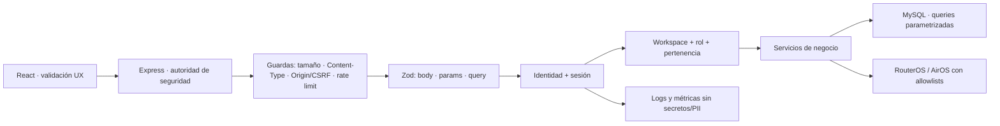

# Plan de hardening de seguridad para autenticación y API

Fecha: 2026-07-18  
Rama base analizada: `vps_prod` (`767c7ae`)  
Estado: Fases 0–5 implementadas localmente; pendientes validación operativa, push y despliegue.

## 1. Objetivo

Endurecer la autenticación y las entradas de la API de GestionVPN contra:

- bypass de validaciones del frontend;
- inyección SQL, XSS y manipulación de parámetros;
- fuerza bruta, password spraying y credential stuffing;
- exposición de contraseñas ante una fuga de base de datos;
- enumeración de usuarios por mensajes, códigos HTTP o diferencias de tiempo;
- errores de diseño al delegar identidad a Firebase Auth o Identity Platform.

El resultado debe conservar el modelo multiusuario actual, la separación por workspace, los roles `OWNER`/`MEMBER`, el administrador de plataforma, las cookies HttpOnly y la revocación por suspensión.

## 2. Decisión ejecutiva

1. **El servidor es la autoridad.** React conserva validación inmediata para UX, pero ningún handler confía en ella. `body`, `params`, `query`, archivos y cabeceras relevantes se validan en Express antes de ejecutar lógica o acceder a MySQL/RouterOS/AirOS.
2. **No se reemplaza el limitador persistente por un contador en memoria.** Se evoluciona el mecanismo MySQL actual a buckets atómicos por IP y por identidad. `express-rate-limit` puede usarse como primera capa, pero nunca con `MemoryStore` como única defensa en producción.
3. **Las contraseñas nuevas pasan a Argon2id.** bcrypt sigue disponible temporalmente sólo para verificar hashes existentes y migrarlos de manera oportunista al iniciar sesión.
4. **La API pública deja de revelar estados de cuenta.** Login, registro y recuperación devuelven respuestas uniformes. La causa exacta queda exclusivamente en logs/métricas internos sin exponer PII.
5. **Firebase no se adopta de inmediato.** Primero se completa el hardening independiente del proveedor. Después se ejecuta un spike y un ADR. Si se aprueba BaaS, Firebase/Identity Platform asume identidad; MySQL continúa siendo la fuente de verdad de workspace, rol, permisos y estado operativo.

## 3. Referencias de seguridad

- [OWASP: validación de entradas](https://cheatsheetseries.owasp.org/cheatsheets/Input_Validation_Cheat_Sheet.html): toda entrada no confiable debe validarse en servidor; se prefieren allowlists y límites explícitos.
- [OWASP: autenticación](https://cheatsheetseries.owasp.org/cheatsheets/Authentication_Cheat_Sheet.html): respuestas genéricas, mitigación de discrepancias y throttling de login.
- [OWASP: almacenamiento de contraseñas](https://cheatsheetseries.owasp.org/cheatsheets/Password_Storage_Cheat_Sheet.html): Argon2id preferido; bcrypt queda como opción heredada con factor mínimo 10.
- [OWASP: prevención de SQL injection](https://cheatsheetseries.owasp.org/cheatsheets/SQL_Injection_Prevention_Cheat_Sheet.html): consultas parametrizadas y allowlists para identificadores que no admitan bind parameters.
- [Firebase Auth](https://firebase.google.com/docs/auth): capacidades base y funciones adicionales de Identity Platform.
- [Identity Platform multi-tenancy](https://docs.cloud.google.com/identity-platform/docs/multi-tenancy): silos de usuarios y configuración por tenant.
- [Firebase: cookies de sesión](https://firebase.google.com/docs/auth/admin/manage-cookies): intercambio server-side, revocación y requisito explícito de protección CSRF.
- [Firebase: importar usuarios](https://firebase.google.com/docs/auth/admin/import-users): migración masiva compatible con hashes bcrypt.

## 4. Estado actual comprobado

### 4.1 Controles ya presentes

| Control | Evidencia actual | Evaluación |
| --- | --- | --- |
| Validación compartida | Zod en `packages/contracts`; rutas de cuenta, admin, team, AI, WireGuard y otras usan `.parse(req.body)` | Buena base, cobertura incompleta |
| SQL parametrizado | `mysql2` y repositorios usan placeholders `?` de forma predominante | Conservar y convertir en invariante verificable |
| Cabeceras | Helmet, CSP restrictiva para la API, HSTS en producción y `x-powered-by` retirado | Cubierto |
| Sesión | Cookie `vpn_session` HttpOnly, `Secure` en producción, `SameSite=Lax`, JWT y comprobación de suspensión | Cubierto parcialmente; falta defensa CSRF explícita |
| Rate limiting | `server/lib/rateLimit.js`, persistencia en `auth_attempts`, límites de login/OTP y `Retry-After` para OTP send | Buena base, pero incompleta y no atómica |
| Hash de passwords | `bcryptjs`, coste 10 para contraseñas y salt único incorporado por bcrypt | Seguro como legado; migrar a Argon2id |
| Recuperación | Mensaje genérico, token aleatorio, sólo hash del token en BD, expiración y single-use | Bien implementado |
| Logging | Pino con redacción de password, cookie y Authorization; métricas de fallos | Bien encaminado |
| XSS frontend | React escapa texto por defecto; no se detectó `dangerouslySetInnerHTML` en producción | Mantener prohibición y revisar otros contextos |
| Análisis estático | `npm run audit:semgrep` con reglas JS/TS/React/secrets/security-audit | El escaneo focalizado terminó sin findings |

### 4.2 Brechas encontradas

1. De 23 archivos de rutas que consumen `req.body`, 11 no muestran un parseo Zod directo: `ap.routes.js`, `device.routes.js` y varias rutas `nodes/*`/`core/*`. Algunas validan manualmente, pero no existe un contrato uniforme ni una prueba de cobertura.
2. `/api/auth/login` heredado no usa `rl.guard('LOGIN')` ni registra intentos; permite eludir el control aplicado a `/api/account/login`.
3. El limitador sólo bloquea por IP. Un ataque distribuido puede probar una misma cuenta desde muchas IP y una IP compartida puede bloquear usuarios legítimos.
4. `clientIp()` confía directamente en `X-Forwarded-For`; debe usar `req.ip` después de una configuración exacta de `trust proxy` y un backend no expuesto directamente.
5. El patrón `isBlocked()` seguido de autenticación y `recordAttempt()` no reserva intentos de forma atómica; solicitudes concurrentes pueden atravesar el umbral.
6. `/api/account/register` devuelve `EMAIL_TAKEN` para cuentas verificadas.
7. `/api/account/login` distingue externamente `EMAIL_NOT_VERIFIED`, `ACCOUNT_SUSPENDED` y `NO_WORKSPACE`; esto confirma existencia y estado de cuentas.
8. Un email inexistente evita `bcrypt.compare`; la diferencia de coste puede convertirse en señal temporal.
9. El setup heredado acepta contraseñas de 6 caracteres, mientras las cuentas modernas exigen 8.
10. `PasswordSchema` admite hasta 128 caracteres, pero bcrypt procesa como máximo 72 bytes; las contraseñas largas pueden tener sufijos ignorados mientras el hash siga siendo bcrypt.
11. No hay una abstracción única para crear/verificar/rehash contraseñas; bcrypt está invocado desde rutas, seeds, bridge y recuperación.
12. Las cookies reducen XSS sobre el token, pero las mutaciones autenticadas no tienen una defensa CSRF explícita basada en token u Origin.
13. `middleware/authJwt.requireSession` degrada a **permitir** cuando falla la comprobación de estado en MySQL, mientras `auth.middleware.verifyToken` bloquea; una cuenta suspendida podría conservar acceso durante esa degradación.
14. Existen dos middlewares que verifican la misma cookie con comportamiento y códigos distintos. La clave JWT se guarda en un único archivo local sin `kid`, procedimiento de rotación ni convivencia active/previous documentada.

## 5. Arquitectura objetivo



Reglas:

- ninguna ruta ejecuta lógica con `req.body`, `req.params` o `req.query` crudos;
- ninguna consulta concatena datos externos;
- ninguna respuesta de autenticación revela existencia o estado de una cuenta;
- el limitador se ejecuta antes del hash de contraseña;
- autorización y aislamiento de workspace se comprueban después de identidad, nunca en React;
- BaaS, si se adopta, reemplaza autenticación, no autorización de negocio.

## 6. Plan por fases

### Fase 0 — Baseline, threat model y contratos de seguridad

#### Cambios

1. Crear `docs/security/AUTH_API_THREAT_MODEL.md` con activos, actores, límites de confianza, flujos de login/registro/reset, riesgos y controles.
2. Crear inventario generado de rutas con método, path, autenticación, rol, esquema de `body/params/query`, rate limit y acceso a sinks.
3. Definir invariantes en `server/SECURITY.md` y `CLAUDE.md`:
   - Zod server-side obligatorio;
   - consultas parametrizadas;
   - no `dangerouslySetInnerHTML`, `eval`, `new Function` ni ejecución shell con entrada externa;
   - respuestas genéricas en flujos de identidad;
   - secretos fuera de logs/errores/handoff.
4. Capturar baseline de latencia de bcrypt y memoria/CPU del VPS antes de elegir parámetros Argon2id.

#### Pruebas y salida

- inventario cubre 100% de rutas mutadoras;
- threat model revisado por una segunda persona;
- `npm run audit:semgrep`, tests y `check:all` guardados como baseline.

#### Estado de implementación — 2026-07-18

- [x] Threat model creado en `docs/security/AUTH_API_THREAT_MODEL.md`.
- [x] Inventario reproducible creado en `docs/security/ROUTE_SECURITY_INVENTORY.md`: 142 rutas detectadas, 94 mutadoras y 73 que consumen `req.body`.
- [x] Gate `check:security-routes` integrado en `check:all` y cubierto por 5 pruebas unitarias.
- [x] Invariantes documentadas en `server/SECURITY.md` y `vpn-manager/CLAUDE.md`.
- [x] Benchmark bcrypt reproducible y línea base local documentados en `docs/security/PASSWORD_HASH_BASELINE.md`.
- [x] Baseline local: 402/402 pruebas backend, `check:all` y Semgrep sobre 484 archivos con 0 hallazgos bloqueantes.
- [ ] Ejecutar el benchmark en el VPS objetivo antes de elegir parámetros Argon2id.
- [ ] Revisión del threat model por una segunda persona.

Hallazgos de entrada para las fases siguientes: 34 rutas con consumo de body sin esquema directo detectable y dos endpoints heredados de identidad (`/setup`, `/login`) sin rate limiting detectable.

### Fase 1 — Validación server-side uniforme

#### Diseño

Crear `server/middleware/validate.js`:

```js
validate({ body, params, query })
```

El middleware:

- usa esquemas Zod explícitos;
- reemplaza cada origen por su valor parseado/normalizado;
- rechaza claves desconocidas en operaciones sensibles;
- limita longitudes, cantidades de arrays, rangos numéricos y enums;
- convierte errores en `400 VALIDATION_ERROR` sin stack ni internals;
- registra sólo nombre de ruta, campos fallidos y request ID, nunca valores sensibles.

#### Migración prioritaria

1. `server/ap.routes.js`.
2. `server/routes/device.routes.js`.
3. `server/routes/core/tunnel.routes.js` y `tunnel-repair.routes.js`.
4. `server/routes/nodes/credentials.routes.js`.
5. `editing.routes.js`, `history.routes.js`, `listing.routes.js`, `provision.routes.js`, `scan.routes.js` y `tags.routes.js`.
6. Params UUID/ID, public keys, IP/CIDR, puertos, nombres VRF/PPP y tags reciben esquemas reutilizables.
7. Configurar `express.json({ limit: '100kb', strict: true })`; aplicar límites menores a endpoints que no necesitan payload grande y conservar el límite especial de AI.
8. Rechazar mutaciones JSON con `Content-Type` incorrecto.

#### SQL injection y comandos

- mantener placeholders para valores;
- nombres de tabla/columna/orden sólo pueden salir de mapas constantes internos;
- crear regla Semgrep local que detecte concatenación/template literals en `query()`/`execute()`;
- crear regla separada para entrada `req.*` que alcance `exec`, `spawn`, RouterOS o SSH sin un validador/allowlist reconocido;
- test-first obligatorio para las reglas, con casos vulnerables y seguros.

#### XSS

- conservar render de texto de React;
- prohibir HTML proporcionado por usuarios salvo requisito documentado;
- si aparece contenido HTML, sanitizar al renderizar con DOMPurify y política mínima;
- escapar en contexto HTML todos los valores incluidos en correos; revisar cada template;
- normalizar texto libre y rechazar caracteres de control, sin aplicar una limpieza destructiva global que cambie datos legítimos.

#### Criterios de aceptación

- 100% de rutas con entrada poseen schemas para `body`, `params` y `query` aplicables;
- peticiones directas con cURL/Postman reciben el mismo rechazo que la UI;
- payloads SQLi/XSS permanecen datos inertes y no alteran queries ni DOM;
- no quedan lecturas crudas fuera del middleware salvo excepciones documentadas.

#### Estado de implementación — 2026-07-18

- [x] Middleware `server/middleware/validate.js` con normalización, error 400 genérico y logs sin valores.
- [x] Primitivas compartidas para IPv4, MAC, puertos, IDs, textos y secretos acotados.
- [x] Schemas estrictos y migración completa de `ap.routes.js` y `routes/device.routes.js`.
- [x] Rechazo de campos desconocidos en endpoints SSH y límites de 20 credenciales / 100 CPEs por lote.
- [x] Defensa SSRF al guardar direcciones y justo antes de conexiones SSH, con validación por lote contra subredes del workspace.
- [x] Inventario actualizado: las 73/73 rutas que consumen body tienen schema detectable; la deuda de params queda en 14 y query en 2.
- [x] Schemas estrictos y migración completa de core tunnel/repair y todos los módulos de nodes.
- [x] El frontend dejó de enviar `ip/user/pass` de MikroTik en los flujos de listar, crear, editar y eliminar nodos; el servidor rechaza esas claves heredadas.
- [x] Baseline tras el segundo lote: 63 suites / 427 pruebas backend, `check:all` y Semgrep focalizado (12 archivos, 125 reglas, 0 hallazgos).
- [x] Aplicar límite global de 100 KiB, JSON estructurado estricto y rechazo 415 de mutaciones con body y `Content-Type` incorrecto.
- [x] Crear y probar reglas Semgrep locales bloqueantes para SQL dinámico y entrada HTTP directa hacia shell/SSH/RouterOS; las excepciones `IN (?,...)` están documentadas y conservan valores parametrizados.
- [x] Fase 1 cerrada: inventario sin alertas `BODY/PARAM/QUERY_SCHEMA_MISSING`, 64 suites / 433 pruebas backend y `check:all` correctos.

### Fase 2 — Rate limiting resistente a fuerza bruta

#### Capas

1. **Nginx:** límite grueso por IP para `/api/auth/*` y `/api/account/{login,register,verify,resend}`; protege Node antes de gastar CPU.
2. **Express/MySQL:** buckets persistentes y atómicos por:
   - IP efectiva;
   - identidad normalizada seudonimizada con HMAC;
   - combinación IP + identidad para telemetría.
3. **Regla de paso:** todos los buckets exigidos deben estar bajo su umbral.

#### Implementación

- [x] Crear tabla `auth_rate_buckets` con `bucket_hash`, `kind`, `count`, `window_started_at`, `blocked_until` y `updated_at`.
- [x] Nunca guardar el password; evitar email crudo en la nueva tabla mediante `HMAC-SHA256(AUTH_RATE_HMAC_KEY, email_normalizado)`.
- [x] Implementar incremento/bloqueo atómico con transacción y `SELECT ... FOR UPDATE`.
- [x] Derivar IP mediante `req.ip`, con `app.set('trust proxy', 1)` sólo en producción y Nginx como único salto; Nginx sobrescribe `X-Forwarded-For`.
- impedir acceso público directo al puerto 3001 mediante Docker/UFW;
- [x] Aplicar el guard a ambos logins, setup, registro, OTP, resend, aceptación de invitaciones y reset.
- [x] Ejecutar rate limit antes de bcrypt/Argon2.
- [x] Emitir `429`, código genérico y `Retry-After` sin confirmar cuenta.
- [x] Limpiar buckets vencidos con job e índice por `updated_at`.
- [x] Añadir métricas por `kind/result`, nunca por IP/email.
- [x] Serializar el setup inicial con un lock global MySQL mantenido hasta después del commit.

Pendiente de despliegue: generar `AUTH_RATE_HMAC_KEY` estable de 32+ bytes, comprobar UFW/puerto 3001 y validar la configuración Nginx dentro de la imagen de producción.

#### Política inicial

| Flujo | IP | Identidad | Ventana/bloqueo inicial |
| --- | ---: | ---: | --- |
| Login | 20 solicitudes | 5 fallos | 15 min, backoff progresivo |
| Setup | 3 solicitudes | N/A | 1 h; además sólo si no está configurado |
| Registro | 5 | 3 | 1 h |
| OTP verify | 10 | 5 | 15 min |
| OTP send/resend | 5 | 5 | 1 h + cooldown 60 s |
| Reset request | 5 | 5 | 1 h |

Los valores se calibran con métricas de staging; no se cambian silenciosamente en producción.

#### Casos de prueba

- fuerza bruta secuencial y 50 solicitudes concurrentes;
- password spraying desde una IP;
- credential stuffing de una cuenta desde IPs diferentes;
- NAT compartido: una cuenta bloqueada no bloquea todas las identidades;
- spoof de `X-Forwarded-For` no cambia el bucket efectivo;
- reinicio del backend no reinicia el límite;
- dos instancias de backend comparten el mismo estado.

### Fase 3 — Password hashing central y migración a Argon2id

#### Abstracción

Estado local 2026-07-18:

- [x] `hashPassword(password)`;
- [x] `verifyPassword(password, encodedHash)`;
- [x] `needsRehash(encodedHash)`;
- [x] `verifyAndUpgrade(password, encodedHash, updateIfCurrent)` con actualización condicionada al hash anterior.

Ninguna ruta o seed invoca bcrypt/Argon2 directamente para contraseñas humanas. Los hashes de tokens/OTP se tratan por separado porque su amenaza y entropía son distintas.

#### Parámetros iniciales

- Argon2id;
- memoria: 19 MiB;
- iteraciones: 2;
- paralelismo: 1;
- salt aleatorio generado por la librería;
- longitud aceptada: 12–128 caracteres para contraseñas nuevas;
- objetivo de verificación en el VPS: menor de 500 ms y siempre menor de 1 s bajo carga controlada.

Los parámetros definitivos salen del benchmark del VPS. Se configuran con env validado al arrancar y se registran sin secretos.

#### Migración sin corte

1. [x] Agregar `argon2` y validar hash/verify dentro de la imagen Alpine de producción.
2. [x] Todo password nuevo/reset/cambio se guarda como Argon2id.
3. [x] Login detecta prefijo `$2...` y verifica con bcrypt.
4. [x] Tras un login bcrypt correcto, rehashea con Argon2id dentro de una actualización condicionada al hash anterior.
5. [x] Si un password bcrypt de entrada supera 72 bytes UTF-8, rechazarlo en vez de aceptar ambigüedad por truncamiento.
6. Mantener el verificador bcrypt durante una ventana de migración; nunca volver a escribir bcrypt.
7. [x] Métrica `password_hash_verifications_total` agregada por algoritmo y resultado, sin user ID ni email.
8. Cuando bcrypt llegue a cero o venza el plazo, retirar la dependencia de rutas y dejar sólo una herramienta offline de recuperación si se aprueba.

#### Seeds y setup

- [x] Retirar credenciales débiles por defecto como `admin/admin` de los seeds.
- [x] Setup acepta una contraseña conforme a la política moderna de 12–128 caracteres.
- fallar el arranque productivo si conserva credenciales bootstrap conocidas;
- documentar rotación y recuperación sin incluir valores secretos.

#### Pruebas

- dos hashes de la misma contraseña son distintos;
- verify correcto/incorrecto;
- rehash bcrypt→Argon2id tras login;
- carrera de dos logins no corrompe el hash;
- password Unicode y límite por bytes para bcrypt legado;
- hash/token/contraseña nunca aparecen en logs ni respuestas.

### Fase 4 — Anti-enumeración y equivalencia temporal

#### Estado de implementación — 2026-07-18

- [x] Ambos logins devuelven exactamente `401 BAD_CREDENTIALS` y `Correo o contraseña incorrectos` para todos los rechazos de identidad.
- [x] El login multi-tenant verifica un hash Argon2id ficticio cuando no encuentra usuario y consulta membresía con un UUID reservado para conservar la forma del trabajo.
- [x] Un username corto ejecuta siempre lookup por email local y por nombre; el login legacy no cae en una segunda verificación multi-tenant después de fallar su hash.
- [x] Registro y reenvío ejecutan el mismo trabajo criptográfico para cuentas nuevas, existentes, verificadas o pendientes; responden con contratos genéricos sin OTP de desarrollo.
- [x] Recuperación ejecuta siempre consulta de frecuencia y generación/hash del token; sólo persiste y envía para una cuenta elegible, fuera de la latencia de la respuesta HTTP.
- [x] Las causas reales se conservan únicamente en métricas agregadas; errores de correo en flujos públicos registran código técnico sin email ni mensaje potencialmente identificable.
- [x] Matriz automatizada de usuario inexistente, password incorrecto, no verificado, suspendido y sin workspace, además de registro, reenvío y reset opacos.
- [ ] Pendiente operativo: comparar distribuciones de latencia en staging/VPS con carga controlada y documentar la tolerancia antes del despliegue.

#### Contrato externo

- Login: siempre `401 BAD_CREDENTIALS` con `Correo o contraseña incorrectos` para usuario inexistente, password incorrecto, cuenta no verificada, suspendida, eliminada o sin workspace.
- Registro/resend: siempre respuesta aceptada genérica; si la cuenta ya existe, no se modifica y opcionalmente se envía aviso de seguridad.
- Recuperación: conservar `Si el correo está registrado...` y uniformar también latencia/código.
- No devolver distintos códigos HTTP, tamaños de body, redirects ni headers que revelen el estado.

La causa real (`not_found`, `bad_password`, `unverified`, `suspended`, `no_membership`) sólo se registra internamente con etiquetas agregadas. El email no se incluye en logs ni labels de Prometheus.

#### Equivalencia de trabajo

- mantener un dummy hash Argon2id válido cargado al arrancar;
- cuando no existe usuario, ejecutar la misma verificación costosa que para uno existente;
- rate limit y validación siguen el mismo orden para todas las ramas;
- evitar respuestas tempranas observables antes del paso equivalente;
- no intentar igualar tiempos con `sleep` fijo: es frágil y facilita DoS.

#### UX segura

- React muestra el mensaje genérico y rutas de ayuda (`Recuperar contraseña`, `Reenviar verificación`) sin afirmar que la cuenta existe;
- soporte administrativo consulta estados sólo en endpoints autenticados y autorizados;
- suspensión activa invalida sesión como ahora, pero el login público no revela esa condición.

#### Pruebas

- matriz de cuerpos/status/headers idénticos para seis estados de cuenta;
- test unitario confirma uso del dummy hash;
- prueba estadística en staging compara distribuciones de latencia con tolerancia documentada, no thresholds frágiles en CI;
- registro y reset no revelan existencia por cuerpo, status o correo enviado al solicitante.

### Fase 5 — Sesión, CSRF y revocación

Aunque no reemplaza los cinco controles solicitados, esta fase es obligatoria porque la autenticación usa cookies.

1. Validar `Origin` en todas las mutaciones autenticadas contra la allowlist canónica.
2. Añadir token CSRF ligado a sesión para POST/PUT/PATCH/DELETE; excluir sólo webhooks autenticados por firma y endpoints técnicamente justificados.
3. Mantener `HttpOnly`, `Secure`, `SameSite=Lax` y `Path=/`; evaluar `SameSite=Strict` donde no rompa enlaces legítimos.
4. Rotar identificador/token al autenticar y renovar sesión.
5. Incluir `jti`/versión de sesión o registro server-side para revocación inmediata por cambio de password, suspensión y cierre global.
6. Aplicar expiración absoluta y renovación explícita ya existentes; impedir renovación después de revocación.
7. Consolidar `verifyToken` y `requireSession` en una sola implementación autoritativa; eliminar diferencias de status/cookie/account check.
8. Fallar cerrado si no puede comprobarse el estado de cuenta: `503 AUTH_STATE_UNAVAILABLE`, sin ejecutar la operación. No confundir una caída de dependencia con token expirado.
9. Añadir `kid` y keyring active/previous para rotar la firma sin cerrar todas las sesiones de forma accidental; secretos inyectados fuera del repo con permisos mínimos.
10. Añadir pruebas de CSRF cross-site, Origin ausente/manipulado, cookie robada, token revocado, BD de estado caída y rotación de clave.

#### Estado de implementación — 2026-07-18

- [x] Allowlist de Origin centralizada; producción no arranca sin `CORS_ORIGINS` explícito.
- [x] Double-submit CSRF ligado criptográficamente al `jti`: cookie legible `vpn_csrf` `SameSite=Strict` y header `X-CSRF-Token` en ambos clientes HTTP del SPA.
- [x] `vpn_session` conserva `HttpOnly`, `Secure` en producción, `SameSite=Lax` y `Path=/`; ambas cookies se borran con atributos simétricos.
- [x] Tabla `auth_sessions` y migración idempotente; cada sesión tiene `jti`, expiración y revocación server-side sin almacenar el JWT.
- [x] Login/verify/accept emiten sesión registrada; renovación y cambio de workspace rotan `jti`; logout revoca la sesión y `logout-all` revoca todas.
- [x] Cambio/reset de password, cambio de email, suspensión, rehabilitación y eliminaciones administrativas revocan sesiones inmediatamente.
- [x] `verifyToken` es un adaptador del único middleware autoritativo `requireSessionWithMikrotik`; toda comprobación de sesión consulta MySQL y falla cerrado con `503 AUTH_STATE_UNAVAILABLE`.
- [x] JWT valida algoritmo, issuer y audience, firma con el `kid` activo y acepta temporalmente una clave previous; secretos de 32+ bytes viven fuera del repo.
- [x] Pruebas negativas cubren Origin hostil/ausente, token CSRF ausente o ajeno, cookie robada, revocación, caída de BD, cookies, migración, rotación de `jti` y convivencia active/previous.
- [ ] Antes del primer despliegue: backup, ejecutar `migrate:auth-sessions`, asumir un cierre único de las sesiones legacy sin `jti`, probar login/logout/renovación con dos navegadores y conservar rollback de aplicación+BD.
- [ ] Para futuras rotaciones: mantener active+previous durante al menos `JWT_EXPIRES`; retirar previous sólo cuando no queden tokens vigentes firmados por ella.

### Fase 6 — Decisión BaaS: Firebase Auth / Identity Platform

#### Recomendación inicial

No migrar hasta completar fases 0–5. El código actual ya posee una base sólida y las brechas detectadas deben corregirse incluso con BaaS. Una migración apresurada añadiría un segundo sistema de identidad y aumentaría temporalmente el riesgo.

#### Spike obligatorio

Crear un prototipo aislado que responda:

1. ¿Firebase Auth base satisface MFA, auditoría, soporte y cuotas, o se requiere Identity Platform?
2. ¿Se usará un único directorio de identidades y MySQL para workspaces, o tenants de Identity Platform? No mapear automáticamente cada workspace a un tenant sin probar invitaciones, soporte y administración.
3. ¿Cuál es el coste mensual y qué ocurre al agotar cuota o perder conectividad con Google?
4. ¿Qué región, retención, DPA y requisitos de privacidad aplican?
5. ¿Cómo se gestionan service accounts sin archivos JSON persistentes en el repo/VPS?
6. ¿Cómo se conserva la revocación inmediata de suspendidos?
7. ¿Cómo se ejecuta rollback sin perder passwords ni crear identidades duplicadas?

#### Arquitectura si se aprueba

- Firebase/Identity Platform autentica y emite identidad.
- Express verifica ID token o intercambia por cookie de sesión HttpOnly.
- El endpoint de intercambio exige CSRF.
- MySQL guarda `auth_provider`, `external_uid` único y la relación con `users`.
- `workspace_members`, roles, permisos, entitlement AI y estado suspendido permanecen autoritativos en MySQL.
- No confiar sólo en claims para roles que requieren revocación inmediata; los claims pueden quedar obsoletos hasta refrescar token.
- Todas las rutas continúan usando `requireSession`, RBAC y validación server-side adaptados al proveedor.

#### Estado del piloto (2026-07-18)

- [x] ADR creado en `docs/adr/0001-firebase-auth-pilot.md`.
- [x] Admin SDK y verificación revocable integrados detrás de `FEDERATED_AUTH_ENABLED=false`.
- [x] Mapping normalizado `auth_identities`, sin tokens ni contraseñas.
- [x] Intercambio con autenticación reciente, correo verificado, CSRF dedicado, rate limit y error anti-enumeración.
- [x] MySQL conserva usuario, workspace, rol y sesión revocable como autoridad.
- [x] SDK web detrás de `VITE_FEDERATED_AUTH_ENABLED=false`, persistencia en memoria, carga dinámica, intercambio por sesión local y `signOut` inmediato.
- [x] Preflight read-only, mapping canary con dry-run/confirmación y rollback que conserva auditoría y revoca sesiones.
- [ ] Configurar proyecto/ADC fuera del repositorio y habilitar solo en staging.
- [ ] Ejecutar canary con un moderador previamente vinculado cuando exista un proyecto aprobado.
- [ ] Probar importación Argon2 vía REST/Java o elegir migración progresiva.
- [ ] Aprobar coste, cuotas, runbook y rollback antes de producción.

#### Migración propuesta

1. ADR aprobado con opción elegida, coste, riesgos y rollback.
2. Añadir integración Admin SDK y verificación de proyecto/audience/issuer.
3. Crear mapping `external_uid` sin eliminar `password_hash`.
4. Importar un lote piloto; Firebase admite importar bcrypt sin salt separado.
5. Ejecutar reconciliación previa para evitar emails/UID duplicados.
6. Habilitar dual-read detrás de feature flag para moderadores piloto.
7. Comparar login, sesión, suspensión, logout global, invitaciones y recuperación.
8. Migrar por lotes con reporte de éxito/fallo y backup cifrado.
9. Mantener rollback al auth local durante la ventana acordada.
10. Sólo después de estabilidad, retirar creación/verificación local de passwords; conservar autorización MySQL.

#### Criterios para adoptar

- MFA o federación empresarial tienen prioridad real;
- el coste y las cuotas son aceptables;
- la operación reduce carga neta después de contar integración, soporte y dependencia externa;
- piloto y rollback completos;
- no se degrada aislamiento por workspace ni revocación.

Si estos criterios no se cumplen, continuar con auth propio endurecido y reevaluar anualmente.

### Fase 7 — Automatización, observabilidad y despliegue

#### CI

- `npm run test:all`;
- `npm run check:all`;
- `npm run audit:semgrep` con reglas curadas y reglas propias;
- auditoría de dependencias con política explícita de severidad/excepciones;
- pruebas de contratos y test de cobertura de rutas;
- ZAP baseline contra staging para errores de headers, exposición y XSS reflejado;
- impedir merge si aparece secreto, query concatenada o ruta mutadora sin esquema.

#### Métricas y alertas

- intentos y bloqueos por tipo/resultado;
- ratio de login exitoso/fallido;
- latencia p50/p95/p99 de hash;
- errores de validación por ruta/campo, sin valor recibido;
- algoritmo de hashes restantes;
- sesiones revocadas;
- alertas por password spraying, aumento de 429 y errores de proveedor BaaS.

#### Despliegue

1. Backup de MySQL y verificación de restauración.
2. Migraciones idempotentes para buckets/mapping externo/sesiones.
3. Secretos nuevos generados fuera del repo: `AUTH_RATE_HMAC_KEY`, claves CSRF/session y credenciales BaaS opcionales.
4. Deploy en staging con pruebas de proxy/IP y carga de hash.
5. Canary con un moderador piloto.
6. Activación gradual mediante flags.
7. Observación mínima 48 h antes de retirar caminos anteriores.
8. Rollback de aplicación sin rollback destructivo de hashes Argon2id; el verificador nuevo debe seguir entendiendo ambos formatos.

## 7. Secuencia de commits pequeños

| # | Commit propuesto | Alcance |
| ---: | --- | --- |
| 1 | `docs(security): add auth threat model` | Activos, flujos y riesgos |
| 2 | `test(security): inventory route guards and schemas` | Inventario/test de cobertura |
| 3 | `docs(security): codify API security invariants` | Reglas de contribución |
| 4 | `feat(api): add shared request validation middleware` | Middleware Zod y errores |
| 5 | `feat(contracts): add network and device input schemas` | IP/CIDR/puerto/SSH |
| 6 | `fix(api): validate AP and device requests server side` | `ap.routes`/device |
| 7 | `fix(api): validate core tunnel requests server side` | core/repair |
| 8 | `fix(api): validate node requests server side` | nodes por módulos |
| 9 | `fix(api): constrain JSON payloads and content types` | tamaño/strict JSON |
| 10 | `test(security): enforce parameterized query rules` | Semgrep test-first |
| 11 | `fix(auth): derive client IP from trusted proxy chain` | `req.ip`, Nginx, tests |
| 12 | `feat(auth): add atomic persistent rate buckets` | migración/repositorio |
| 13 | `fix(auth): rate limit every identity endpoint` | ambos login/setup/OTP/reset |
| 14 | `feat(auth): add per-account pseudonymous throttling` | bucket HMAC |
| 15 | `test(auth): cover concurrent and distributed attacks` | carga/concurrencia/proxy |
| 16 | `feat(auth): centralize password hashing` | abstracción única |
| 17 | `feat(auth): hash new passwords with argon2id` | params y benchmark |
| 18 | `feat(auth): upgrade bcrypt hashes on login` | migración oportunista |
| 19 | `fix(auth): align setup and password policy` | bootstrap seguro |
| 20 | `test(auth): cover salts rehash and unicode limits` | suite de passwords |
| 21 | `fix(auth): return generic login failures` | anti-enumeración |
| 22 | `fix(auth): make registration and resend opaque` | respuesta uniforme |
| 23 | `fix(auth): equalize missing-user verification work` | dummy Argon2id |
| 24 | `test(auth): verify response and timing equivalence` | matriz anti-enumeración |
| 25 | `feat(security): protect cookie mutations from csrf` | Origin/token |
| 26 | `fix(auth): consolidate session verification fail closed` | middleware único + caída BD |
| 27 | `feat(auth): add immediate session revocation` | jti/versión de sesión |
| 28 | `feat(auth): support jwt signing key rotation` | `kid` + active/previous |
| 29 | `docs(auth): decide managed identity provider` | spike + ADR BaaS |
| 30 | `ci(security): gate schemas semgrep and dependencies` | pipeline |
| 31 | `docs(security): add deploy rollback and incident runbook` | operación |

Cada commit debe pasar sus pruebas focalizadas, `check:all` y `git diff --check`. Los hitos 10, 15, 20, 24, 26, 28 y 30 ejecutan además la suite completa.

## 8. Matriz de trazabilidad

| Solicitud | Fases | Evidencia de cierre |
| --- | --- | --- |
| Frontend UX / servidor seguridad | 0, 1, 5, 7 | 100% rutas con schemas; cURL malicioso rechazado; CSRF cubierto |
| Rate limiting | 2, 7 | dual bucket atómico, proxy probado, 429/Retry-After, concurrencia |
| Hash seguro | 3 | Argon2id nuevo, bcrypt migrado, salt/rehash probados |
| Anti-enumeración | 4 | mismos status/body/headers y trabajo equivalente |
| BaaS | 6 | ADR, piloto, coste, migración y rollback o rechazo documentado |

## 9. Definition of Done

El programa se considera terminado sólo cuando:

- todas las entradas externas se validan y normalizan en servidor;
- no existe login sin rate limit por IP e identidad;
- el limitador resiste concurrencia, reinicios y múltiples instancias;
- todo password nuevo usa Argon2id y los hashes bcrypt disminuyen de forma observable;
- login/registro/reset no permiten enumerar cuentas;
- las mutaciones con cookie tienen defensa CSRF;
- Semgrep, tests, contratos, lint y build son gates de CI;
- logs, métricas y handoff no contienen secretos ni identificadores sensibles;
- existe runbook de despliegue, rollback e incidente de credential stuffing;
- Firebase/Identity Platform se adopta únicamente con ADR aprobado y piloto reversible.

## 10. Fuera de alcance

- cambiar reglas, peers o configuración de MikroTik como parte de este plan;
- almacenar permisos operativos únicamente en el token del cliente;
- CAPTCHA como primera defensa; sólo se evaluará de forma adaptativa después de throttling/MFA;
- migrar a Firebase directamente en producción sin spike, staging y rollback;
- sustituir consultas parametrizadas por “limpieza” de strings;
- confiar en CORS como control de autenticación o como bloqueo de cURL/Postman.
