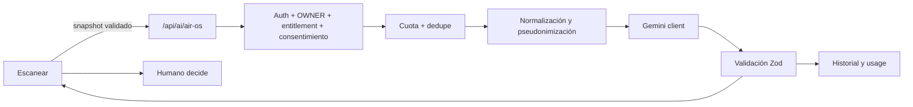

# Plan de implementación: Gemini sobre datos AirOS

**Proyecto:** MikroTikVPN Remote Manager (`GestionVPN-1.0`)
**Rama objetivo:** `vps_prod`
**Fecha:** 16 de julio de 2026
**Última actualización:** 17 de julio de 2026
**Documento base:** [`APLICACIONES_GEMINI_DATOS_AIR_OS_2026-07-16.md`](./APLICACIONES_GEMINI_DATOS_AIR_OS_2026-07-16.md)
**Tipo:** plan ejecutable por entregas pequeñas

## 1. Resultado esperado

GestionVPN incorporará análisis asistido por Gemini en la vista **Escanear** para:

1. Analizar individualmente el snapshot AirOS de un AP o CPE.
2. Analizar el conjunto de equipos que aparece después de aplicar búsqueda y filtros.
3. Guardar un historial pseudonimizado de métricas y análisis para comparaciones temporales.

Gemini será exclusivamente consultivo. No podrá cambiar configuraciones, ejecutar comandos, reiniciar equipos ni decidir acciones operativas.

La función estará disponible sólo para moderadores (`OWNER`) que hayan sido habilitados individualmente por el Administrador de plataforma. Los miembros (`MEMBER`) y el Administrador de plataforma no consumirán análisis desde esta vista.

## 2. Alcance aprobado

| Fase | Alcance | Estado en este plan |
|---|---|---|
| 0 | Preparación, contratos, seguridad, cuota y cliente Gemini | Incluida |
| 1 | Análisis individual por equipo | Incluida |
| 2 | Análisis de la red visible | Incluida |
| 3 | Asistente consultivo conversacional | **Excluida** |
| 4 | Historial, comparaciones y tendencias | Incluida |

No se implementarán:

- Chat o preguntas libres.
- Function Calling.
- Herramientas de lectura o escritura invocadas por el modelo.
- Acciones automáticas o botones para aplicar recomendaciones.
- Acceso de Gemini a MySQL, SSH, AirOS, RouterOS o servicios internos.
- Batch API como dependencia del flujo gratuito.
- Consulta web desde Gemini.
- Envío de credenciales o bloques crudos AirOS por defecto.

## 3. Restricciones no negociables

### 3.1 Gobierno humano

- Toda salida se etiqueta como “Análisis asistido por IA”.
- Cada hallazgo incluye evidencia, hipótesis, verificación manual y confianza.
- `advisoryOnly` debe ser siempre `true`.
- `actionsExecuted` debe ser siempre un arreglo vacío.
- Una respuesta que incumpla estas condiciones se rechaza en el backend.
- No se crean endpoints ni funciones que escriban en equipos de red.

### 3.2 Nivel gratuito

- Se usará una API key asociada al nivel gratuito de Gemini.
- Las cuotas reales se consultarán en Google AI Studio antes del despliegue.
- Los límites del proveedor no se codifican rígidamente porque cambian según modelo y proyecto.
- GestionVPN aplicará límites internos más conservadores y configurables.
- El análisis será manual y bajo demanda; nunca se ejecutará durante el escaneo automático.
- No se llamará a `countTokens` antes de cada análisis: se limitará el tamaño localmente y se registrará `usageMetadata` de la respuesta.

### 3.3 Privacidad

- Nunca enviar `sshPass`, `sshUser`, `wifiPassword`, claves, cookies o tokens.
- IP, MAC, hostname, SSID, nombre de cliente, torre y nodo se pseudonimizan.
- Los campos `_raw*` quedan fuera del DTO.
- El backend reconstruye el DTO permitido; no reenvía el body del navegador a Gemini.
- El análisis respeta `workspace_id` y sólo un `OWNER` habilitado individualmente puede consumir cuota.
- El usuario confirma el tratamiento externo antes del primer análisis bajo una versión de consentimiento.

### 3.4 Habilitación individual por el Administrador

- El acceso nace deshabilitado para todo moderador existente o nuevo.
- El Administrador de plataforma puede activar/desactivar Gemini por `user_id` desde la gestión de moderadores.
- El Administrador administra el permiso, pero no consume los endpoints de análisis.
- La habilitación administrativa y el consentimiento del moderador son comprobaciones independientes.
- Deshabilitar acceso bloquea inmediatamente análisis, historial y tendencias para esa cuenta, sin borrar los registros existentes.
- La comprobación se ejecuta en backend antes de caché, reserva de cuota o llamada a Gemini.
- Suspender o eliminar al moderador continúa prevaleciendo sobre este permiso.
- Cada cambio se audita con actor, moderador objetivo, estado anterior/nuevo y fecha.

## 4. Decisiones técnicas

| Tema | Decisión |
|---|---|
| Cliente | SDK oficial `@google/genai`, cargado sólo en backend |
| API key | `GEMINI_API_KEY` en `server/.env.production`; nunca en DB ni frontend |
| Modelo | `GEMINI_MODEL`, configurable; valor inicial validado contra el nivel gratuito en AI Studio |
| Salida | JSON estructurado + validación Zod propia |
| Autorización | Sesión cookie existente + `requireModerator` |
| Entitlement | Tabla por moderador; deshabilitado por defecto; administrado sólo por platform admin |
| Fuente individual | `ScannedDevice.cachedStats` enviado desde la UI y validado/reducido por backend |
| Fuente de red | `list.sortedRows`, es decir, filas visibles después de filtros y orden |
| Dedupe | SHA-256 del DTO canónico + versión de prompt |
| Caché | Resultado persistido por hash con TTL; no usar caché remota como requisito |
| Cuota | Reserva atómica diaria en MySQL + cooldown en memoria + consumo real acumulado |
| Historial | Snapshots pseudonimizados y métricas normalizadas; sin credenciales ni identificadores directos |
| Retención | Máximo 7 días para diagnósticos y snapshots AirOS |
| Observabilidad | Logs redactados + métricas Prometheus de uso, error, latencia y tokens |

### 4.1 Selección inicial del modelo

El despliegue deberá confirmar en AI Studio un modelo Flash estable disponible en el nivel gratuito. El código no dependerá de un nombre fijo.

Valor candidato al momento de redactar el plan:

```env
GEMINI_MODEL=gemini-3.1-flash-lite
```

Si ese modelo no ofrece cuota gratuita en el proyecto real, se cambia el entorno sin modificar código. No se usarán alias `latest`, modelos preview ni modelos retirados.

## 5. Arquitectura objetivo



No existirá conexión de retorno desde Gemini hacia RouterOS/AirOS.

## 6. Estructura de módulos prevista

### Backend

```text
server/
├── routes/ai.routes.js
├── routes/admin/aiAccess.routes.js
├── lib/ai/
│   ├── geminiClient.js
│   ├── airOsDto.js
│   ├── airOsRules.js
│   ├── airOsPrompt.js
│   ├── aiResponse.js
│   ├── aiQuota.js
│   └── aiRetentionJob.js
├── db/repos/
│   ├── aiAnalysisRepo.js
│   ├── aiSnapshotRepo.js
│   ├── aiUsageRepo.js
│   ├── aiConsentRepo.js
│   └── aiAccessRepo.js
├── db/migrateAirOsAi.js
└── test/
    ├── unit/airOsDto.test.js
    ├── unit/airOsRules.test.js
    ├── unit/aiQuota.test.js
    ├── unit/aiResponse.test.js
    └── integration/airOsAiSecurity.test.js
```

### Contratos compartidos

```text
packages/contracts/src/airOsAi.ts
```

### Frontend

```text
vpn-manager/src/
├── services/airOsAiApi.ts
└── components/Devices/NetworkDevicesModule/
    ├── hooks/useAirOsAnalysis.ts
    └── components/
        ├── AiAnalysisButton.tsx
        ├── AiConsentDialog.tsx
        ├── AiAnalysisResultDialog.tsx
        ├── AiNetworkAnalysisButton.tsx
        ├── AiAnalysisHistory.tsx
        └── ModeratorAiAccessToggle.tsx
```

## 7. Contratos API

### 7.1 Estado y cuota

`GET /api/ai/air-os/status`

Devuelve:

- Integración habilitada, sin exponer la key.
- Modelo configurado.
- Acceso individual del moderador (`enabled`).
- Consentimiento vigente del usuario.
- Solicitudes/tokens internos consumidos y restantes.
- Cooldown actual.
- Límites efectivos del sistema, no supuestas cuotas oficiales.

### 7.2 Consentimiento

`POST /api/ai/air-os/consent`

Body:

```json
{ "policyVersion": "air-os-ai-v1", "accepted": true }
```

El rechazo revoca el consentimiento y bloquea nuevos análisis. No elimina automáticamente el historial; la UI ofrecerá la eliminación por separado.

### 7.3 Administración del acceso por moderador

Sólo platform admin:

- `GET /api/admin/moderators/ai-access`
- `PATCH /api/admin/moderators/:userId/ai-access`

Body:

```json
{ "enabled": true }
```

Reglas:

- El objetivo debe existir, estar activo y tener rol `OWNER`.
- Un `MEMBER` nunca puede recibir el permiso.
- La respuesta no incluye API key, cuota de otros workspaces ni payloads de análisis.
- El cambio se registra en auditoría administrativa.
- Deshabilitar no elimina historial; impide acceder a toda la superficie AI hasta una nueva habilitación.

### 7.4 Análisis individual

`POST /api/ai/air-os/device-analysis`

Body máximo:

```json
{
  "snapshotAt": 1784257303000,
  "device": {
    "ip": "10.1.1.37",
    "mac": "F4:92:BF:EC:B6:57",
    "name": "cliente",
    "model": "LiteBeam M5",
    "firmware": "XW.v6.1.7",
    "role": "sta",
    "cachedStats": {}
  }
}
```

Aunque el navegador envía identidad para asociar el resultado a la fila, `airOsDto.js` debe eliminarla o convertirla a HMAC antes de construir el prompt.

### 7.5 Análisis de red visible

`POST /api/ai/air-os/network-analysis`

Body:

```json
{
  "snapshotAt": 1784257303000,
  "scope": {
    "subnet": "10.1.1.0/24",
    "roleFilter": "sta",
    "ssidFilter": "...",
    "searchApplied": true
  },
  "devices": []
}
```

La ruta limita cantidad y tamaño. Si hay demasiados equipos:

1. Calcula hechos localmente para todos.
2. Construye agregados.
3. Selecciona los equipos con mayor puntaje de riesgo y una muestra saludable.
4. Envía a Gemini sólo agregados y subconjunto.
5. Informa `analyzedCount`, `totalVisibleCount` y `selectionReason`.

### 7.6 Historial

- `GET /api/ai/air-os/analyses?type=device|network&limit=...`
- `GET /api/ai/air-os/analyses/:uuid`
- `DELETE /api/ai/air-os/analyses/:uuid`
- `GET /api/ai/air-os/trends/:deviceFingerprint?from=...&to=...`

El backend verifica workspace en todas las consultas. El frontend nunca envía un `workspace_id` confiable.

## 8. Esquemas de base de datos

La migración `migrateAirOsAi.js` será idempotente y se añadirá al `entrypoint.sh`.

### 8.1 `ai_moderator_access`

| Columna | Tipo | Nota |
|---|---|---|
| `user_id` | VARCHAR, PK | Moderador objetivo |
| `workspace_id` | VARCHAR indexado | Tenant del moderador |
| `enabled` | TINYINT | `0` por defecto |
| `changed_by_admin` | VARCHAR | Identidad del Administrador |
| `enabled_at` | BIGINT nullable | Última activación |
| `disabled_at` | BIGINT nullable | Última desactivación |
| `created_at` | BIGINT | Auditoría |
| `updated_at` | BIGINT | Auditoría |

No se crea una fila al registrar al moderador: la ausencia equivale a deshabilitado. El repositorio sólo permite crear/actualizar filas para usuarios `OWNER`.

### 8.2 `ai_user_consents`

| Columna | Tipo | Nota |
|---|---|---|
| `user_id` | VARCHAR, PK parcial | Usuario autenticado |
| `policy_version` | VARCHAR | Versión aceptada |
| `accepted_at` | BIGINT nullable | Fecha de aceptación |
| `revoked_at` | BIGINT nullable | Revocación |
| `updated_at` | BIGINT | Auditoría |

Clave única: `(user_id, policy_version)`.

### 8.3 `ai_usage_daily`

| Columna | Tipo | Nota |
|---|---|---|
| `usage_date` | DATE | Zona horaria configurada |
| `workspace_id` | VARCHAR | Tenant |
| `request_count` | INT | Solicitudes reservadas/consumidas |
| `input_tokens` | BIGINT | Uso real |
| `output_tokens` | BIGINT | Uso real |
| `total_tokens` | BIGINT | Uso real |
| `failed_count` | INT | Errores del proveedor |
| `updated_at` | BIGINT | Auditoría |

Clave única: `(usage_date, workspace_id)`. La reserva se realiza con transacción/UPSERT antes de llamar al proveedor.

### 8.4 `ai_analysis_runs`

| Columna | Tipo | Nota |
|---|---|---|
| `id` | BIGINT AUTO_INCREMENT | Interno |
| `uuid` | VARCHAR UNIQUE | Público |
| `workspace_id` | VARCHAR indexado | Aislamiento |
| `user_id` | VARCHAR nullable | Solicitante |
| `analysis_type` | ENUM | `DEVICE`, `NETWORK` |
| `snapshot_hash` | CHAR(64) | Dedupe |
| `prompt_version` | VARCHAR | Reproducibilidad |
| `model` | VARCHAR | Modelo real |
| `status` | ENUM | `PENDING`, `SUCCEEDED`, `FAILED`, `REJECTED` |
| `summary_json` | JSON nullable | Respuesta validada |
| `scope_json` | JSON nullable | Alcance redactado |
| `input_tokens` | INT | Usage metadata |
| `output_tokens` | INT | Usage metadata |
| `total_tokens` | INT | Usage metadata |
| `latency_ms` | INT | Observabilidad |
| `error_code` | VARCHAR nullable | Sin payload sensible |
| `created_at` | BIGINT | Fecha |
| `expires_at` | BIGINT | Retención |

Índice de caché: `(workspace_id, analysis_type, snapshot_hash, prompt_version, status, expires_at)`.

### 8.5 `ai_air_os_snapshots`

| Columna | Tipo | Nota |
|---|---|---|
| `id` | BIGINT AUTO_INCREMENT | Interno |
| `workspace_id` | VARCHAR indexado | Aislamiento |
| `analysis_run_id` | BIGINT nullable | Origen |
| `device_fingerprint` | CHAR(64) | HMAC, no MAC/IP |
| `role` | VARCHAR | AP/STA |
| `model` | VARCHAR | Modelo no personal |
| `firmware` | VARCHAR | Versión |
| `signal_dbm` | SMALLINT nullable | Métrica consultable |
| `noise_dbm` | SMALLINT nullable | Métrica consultable |
| `snr_db` | SMALLINT nullable | Calculada localmente |
| `ccq_pct` | DECIMAL nullable | Métrica |
| `airmax_quality_pct` | DECIMAL nullable | Métrica |
| `airmax_capacity_pct` | DECIMAL nullable | Métrica |
| `tx_rate_mbps` | DECIMAL nullable | Métrica |
| `rx_rate_mbps` | DECIMAL nullable | Métrica |
| `cpu_pct` | DECIMAL nullable | Métrica |
| `memory_pct` | DECIMAL nullable | Métrica |
| `temperature_c` | DECIMAL nullable | Métrica |
| `risk_score` | SMALLINT | Regla determinista 0–100 |
| `extra_metrics_json` | JSON | Sólo campos permitidos |
| `captured_at` | BIGINT indexado | Serie temporal |
| `expires_at` | BIGINT | Retención |

Índice de tendencia: `(workspace_id, device_fingerprint, captured_at)`.

## 9. Normalización y reglas locales

`airOsDto.js` debe usar una allowlist explícita de `AntennaStats`. Ningún `...spread` del objeto recibido.

### 9.1 Hechos calculados

- SNR = señal − ruido, sólo con ambos valores válidos.
- Edad del firmware como desconocida si no existe catálogo confiable.
- Reinicio reciente a partir de uptime, con umbral configurable.
- Desbalance de cadenas = diferencia absoluta máxima.
- Saturación de CPU/RAM según umbrales configurables.
- Riesgo de interfaz por velocidad, dúplex y errores.
- Calidad RF combinada con señal, SNR, CCQ, capacidad y reintentos.

### 9.2 Puntaje reproducible

El puntaje no lo inventa Gemini. Se implementa como función pura y versionada:

```text
risk = RF + rendimiento + sistema + interfaz + reinicio + datos críticos ausentes
```

Cada componente devuelve:

- Puntos.
- Regla activada.
- Evidencia.
- Severidad.

Gemini recibe esas reglas activadas y las explica.

### 9.3 Pseudonimización

```text
fingerprint = HMAC-SHA256(AI_PSEUDONYM_KEY, workspace_id + "|" + mac_normalizada)
```

Fallback si no hay MAC: IP + modelo + nombre, marcado como identidad inestable. `AI_PSEUDONYM_KEY` es un secreto distinto de `GEMINI_API_KEY`.

## 10. Prompt y respuesta

### 10.1 Prompt fijo y corto

`airOsPrompt.js` tendrá una versión, por ejemplo `air-os-v1`, con estas reglas:

- Responder sólo con el schema.
- No afirmar tendencias sin historial.
- No inventar valores ausentes.
- No proponer ejecución automática.
- Citar evidencia mediante claves y valores del DTO.
- Limitar hallazgos: individual máximo 5; red máximo 8.
- Limitar causas y verificaciones por hallazgo.
- Español claro y técnico.

### 10.2 Respuesta Zod

Campos mínimos:

- `summary`.
- `severity`.
- `confidence`.
- `findings[]` con `title`, `evidence[]`, `interpretation`, `possibleCauses[]`, `manualChecks[]`.
- `limitations[]`.
- `advisoryOnly: true`.
- `actionsExecuted: []`.

El backend realiza:

1. Parse JSON.
2. Validación Zod.
3. Verificación de evidencia contra claves disponibles.
4. Rechazo de URLs, comandos o instrucciones de modificación no solicitadas.
5. Límite de longitud por campo.
6. Persistencia sólo después de validar.

## 11. Presupuesto gratuito y protección de cuota

Variables propuestas:

```env
GEMINI_AI_ENABLED=false
GEMINI_API_KEY=
GEMINI_MODEL=gemini-3.1-flash-lite
GEMINI_MAX_OUTPUT_TOKENS_DEVICE=700
GEMINI_MAX_OUTPUT_TOKENS_NETWORK=1200
GEMINI_MAX_DEVICES_PER_NETWORK=40
GEMINI_MAX_INPUT_BYTES=60000
GEMINI_DAILY_REQUEST_BUDGET=20
GEMINI_DAILY_TOKEN_BUDGET=150000
GEMINI_WORKSPACE_DAILY_REQUEST_BUDGET=10
GEMINI_USER_COOLDOWN_SECONDS=60
GEMINI_CACHE_TTL_HOURS=24
GEMINI_ANALYSIS_RETENTION_DAYS=7
GEMINI_SNAPSHOT_RETENTION_DAYS=7
AI_PSEUDONYM_KEY=
```

Estos números son límites internos iniciales, no cuotas oficiales. Se calibran después de medir el piloto.

Orden de protección:

1. Feature flag apagado por defecto.
2. Rol `OWNER`; platform admin y MEMBER no consumen análisis.
3. Entitlement individual habilitado por el Administrador.
4. Consentimiento vigente.
5. Validación de tamaño.
6. Cooldown por usuario.
7. Caché por hash.
8. Reserva diaria atómica.
9. Timeout y una sola llamada.
10. Sin retry automático ante `429`.
11. Registrar usage real y liberar/ajustar reserva.

## 12. Experiencia de usuario

### 12.1 Control del Administrador

En el módulo de moderadores, cada cuenta `OWNER` tendrá el toggle **“Gemini para AirOS”**:

- Apagado por defecto.
- Confirmación al habilitar, indicando que consumirá la cuota gratuita compartida.
- Deshabilitado mientras se guarda para evitar doble cambio.
- Estado y error accesibles; la interfaz confirma el estado devuelto por el servidor.
- No se muestra para miembros ni para el Administrador.

Cuando está apagado, Escanear no renderiza botones, consentimiento ni historial de IA para ese moderador.

### 12.2 Análisis individual

En `M5FullInfoModal`:

- Botón “Analizar con IA”.
- Deshabilitado si no hay `cachedStats`.
- Primer uso abre consentimiento.
- Estado de carga no bloquea cerrar el modal.
- Resultado en `AiAnalysisResultDialog` con:
  - Resumen.
  - Severidad/confianza.
  - Hallazgos y evidencia.
  - Comprobaciones manuales.
  - Limitaciones.
  - Aviso permanente “No se realizaron cambios”.

### 12.3 Red visible

Junto a Exportar/Columnas:

- Botón “Analizar red con IA”.
- Usa `list.sortedRows`.
- Confirmación muestra total visible, subconjunto que podría enviarse y advertencia de cuota.
- Si no hay cuota, muestra fecha de restablecimiento interno sin llamar a Gemini.
- Resultado identifica equipos mediante alias locales (`Equipo 01`, `Equipo 02`), con mapa conservado sólo en el navegador para mostrar nombre/IP al usuario.

### 12.4 Historial

- Pestaña o bloque “Análisis anteriores”.
- Filtros por tipo, fecha y severidad.
- Comparación de métricas, no conversación.
- El usuario puede eliminar un análisis propio/del workspace según rol.

## 13. Manejo de errores

| Caso | Código interno | Comportamiento |
|---|---|---|
| Feature apagado/key ausente | `AI_NOT_CONFIGURED` | No consumir cuota |
| Sin consentimiento | `AI_CONSENT_REQUIRED` | Abrir diálogo |
| MEMBER | `FORBIDDEN` | 403 |
| OWNER no habilitado | `AI_ACCESS_DISABLED` | No reservar cuota ni llamar a Gemini |
| Payload grande | `AI_PAYLOAD_TOO_LARGE` | Reducir selección |
| Cooldown | `AI_COOLDOWN` | Mostrar segundos |
| Presupuesto diario | `AI_BUDGET_EXHAUSTED` | No llamar al proveedor |
| Caché disponible | `cached: true` | Reutilizar sin tokens |
| Gemini 429 | `AI_PROVIDER_QUOTA` | Sin retry automático |
| Timeout/503 | `AI_PROVIDER_UNAVAILABLE` | Reintento manual posterior |
| JSON inválido | `AI_INVALID_RESPONSE` | No mostrar texto crudo |
| Respuesta no consultiva | `AI_POLICY_REJECTED` | Rechazar y auditar |

## 14. Observabilidad

### Logs redactados

Permitidos:

- `requestId`, workspace pseudónimo, tipo, modelo, hash corto, latencia, tokens y código.

Prohibidos:

- Prompt completo, respuesta completa, IP, MAC, SSID, hostname, credenciales y API key.

### Prometheus

- `gestionvpn_ai_requests_total{type,status,model}`.
- `gestionvpn_ai_latency_seconds{type,model}`.
- `gestionvpn_ai_tokens_total{direction,type,model}`.
- `gestionvpn_ai_cache_hits_total{type}`.
- `gestionvpn_ai_rejections_total{reason}`.

No usar `workspace_id` como label para evitar cardinalidad alta y exposición.

## 15. Pruebas obligatorias

### Contratos

- Acepta snapshot válido M5 y AC.
- Rechaza claves desconocidas sensibles.
- Impone máximos de equipos, strings y arrays.
- Respuesta exige `advisoryOnly=true` y `actionsExecuted=[]`.

### Backend unitario

- DTO omite todos los secretos y `_raw*`.
- HMAC estable por workspace y diferente entre workspaces.
- SNR, desbalance y risk score reproducibles.
- Dedupe canónico independiente del orden de propiedades.
- Cuota resiste solicitudes concurrentes.
- Caché no cruza workspaces ni versiones de prompt.
- Parser rechaza comandos y respuesta fuera de schema.

### Backend integración

- Sin sesión: 401.
- MEMBER: 403.
- Platform admin: no puede consumir endpoints de análisis.
- OWNER sin entitlement: `AI_ACCESS_DISABLED` y mock Gemini no invocado.
- El Administrador puede habilitar/deshabilitar sólo usuarios `OWNER`.
- Deshabilitar tiene efecto en la siguiente solicitud sin reiniciar backend.
- OWNER de otro workspace: no ve historial ajeno.
- API key nunca aparece en respuestas/logs.
- 429/timeout/JSON inválido se transforman en códigos estables.
- El mock de Gemini confirma que sólo recibe el DTO permitido.
- Ningún módulo RouterOS/AirOS de escritura es importado por la ruta AI.

### Frontend

- Consentimiento previo.
- Toggle administrativo por moderador con estado server-side.
- Moderador deshabilitado no ve ninguna acción de IA.
- Botón individual con/sin stats.
- Red usa exactamente filas filtradas.
- Loading, error, caché y presupuesto agotado.
- Evidencia y advertencia consultiva accesibles.
- No existe botón “Aplicar”.
- Responsive 375 px y modo oscuro.

### Seguridad estática

- Semgrep: API key sólo server-side.
- Búsqueda de secretos en payloads/logs.
- Dependencias sin vulnerabilidades altas alcanzables.

## 16. Plan por entregas y commits pequeños

Cada commit debe compilar y dejar pruebas verdes.

### Fase 0 — Fundación

1. `docs(ai): define AirOS Gemini implementation contracts`
   - Aceptar este plan y fijar invariantes.

2. `feat(contracts): add advisory AirOS AI schemas`
   - Requests/responses Zod, límites y exports.
   - Tests de contratos.

3. `feat(ai): add deterministic AirOS DTO and rules`
   - Allowlist, cálculos, HMAC, hash canónico y risk score.
   - Tests unitarios amplios.

4. `feat(db): add AI consent usage analysis and snapshot tables`
   - Migración idempotente, entitlement por moderador, repos y entrada en `entrypoint.sh`.
   - Tests de repositorios/aislamiento.

5. `feat(ai): add free-tier quota and cache guards`
   - Reserva diaria, cooldown, dedupe y TTL.
   - Pruebas de concurrencia.

6. `feat(ai): integrate Gemini structured output client`
   - SDK oficial, timeout, modelo configurable, no retries 429.
   - Mock total en tests; sin llamadas reales en CI.

7. `feat(ai): expose moderator access status consent and history endpoints`
   - Router, OWNER+entitlement, workspace y errores estables.
   - Tests de seguridad.

8. `feat(admin): manage AirOS AI access per moderator`
   - Endpoints platform admin, auditoría y toggle en lista de moderadores.
   - Ausencia de fila equivale a deshabilitado.

**Gate Fase 0:** integración apagada, sin UI de análisis, migraciones idempotentes y pruebas verdes.

### Fase 1 — Equipo individual

9. `feat(ai): add individual AirOS analysis endpoint`
   - Normalizar → cuota → Gemini → validar → persistir.

10. `feat(frontend): add AirOS AI service and analysis state hook`
   - Cliente tipado, cancelación y errores.

11. `feat(scan): add AI consent flow`
    - Texto de privacidad del nivel gratuito y versión de política.

12. `feat(scan): add advisory AI analysis to AirOS report`
    - Botón y diálogo de resultados en `M5FullInfoModal`.

13. `test(scan): cover individual AI analysis UX`
    - Componente, a11y, responsive y estados.

**Gate Fase 1:** piloto manual con fixtures; confirmar que el request real no contiene identidad ni secretos y medir tokens.

### Fase 2 — Red visible

14. `feat(ai): add network aggregation and anomaly selection`
    - Agregados, top riesgo, muestra saludable y límites.

15. `feat(ai): add visible-network analysis endpoint`
    - Persistencia y respuesta con cobertura real.

16. `feat(scan): add visible-network AI analysis action`
    - Usa `list.sortedRows`; confirmación de alcance/cuota.

17. `feat(scan): render network priorities and coverage`
    - Ranking, hallazgos globales y limitaciones.

18. `test(ai): cover filtered network and free-tier limits`
    - Filtros, redes grandes, caché y presupuesto.

**Gate Fase 2:** análisis de 5, 20 y 40 equipos; validar costo, latencia, selección y utilidad con el operador.

### Fase 4 — Historial

19. `feat(ai): persist pseudonymous AirOS metric snapshots`
    - Métricas normalizadas y retención.

20. `feat(ai): add AirOS trend queries and comparisons`
    - Comparaciones deterministas; Gemini sólo resume si el usuario lo solicita.

21. `feat(scan): add AI analysis history and metric trends`
    - Lista, detalle, eliminación y gráficos simples.

22. `feat(ai): add retention cleanup and observability`
    - Job, métricas Prometheus y logs.

23. `test(ai): complete history privacy and retention coverage`
    - Tenant, expiración, borrado y tendencia.

**Gate Fase 4:** 30 días de piloto o dataset simulado suficiente antes de habilitar afirmaciones temporales en producción.

### Cierre

24. `docs(ai): publish runbook privacy and free-tier operations`
    - Configuración, rotación de key, cuota, deshabilitado y recuperación.

25. `chore(ai): enable production feature flag after validation`
    - Sólo después de revisión humana y health checks.

## 17. Verificación por fase

Ejecutar como mínimo:

```powershell
cd packages/contracts
npm.cmd run build

cd ../../server
npm.cmd test

cd ../vpn-manager
npm.cmd test -- --run
npm.cmd run lint
npm.cmd run build

cd ..
npm.cmd run check:all
git diff --check
```

Antes del deploy:

- Semgrep focalizado en nuevas rutas/cliente.
- Escaneo de secretos.
- Migración sobre copia de base de datos.
- Prueba con Gemini usando datos sintéticos, no producción.
- Revisión visual autenticada desktop/móvil y claro/oscuro.

## 18. Despliegue gradual

1. Desplegar con `GEMINI_AI_ENABLED=false`.
2. Verificar migraciones y `/api/health` sin API key.
3. Configurar API key gratuita y clave HMAC fuera del repositorio.
4. Confirmar modelo/cuota en AI Studio.
5. Habilitar el entitlement únicamente para un moderador piloto; el Administrador no ejecuta el análisis.
6. Probar con fixtures y luego un equipo real autorizado desde esa cuenta moderadora.
7. Revisar logs, tokens y payload redactado.
8. Habilitar otros moderadores individualmente.
9. Activar análisis de red con límite inicial pequeño.
10. Ampliar límites sólo con evidencia de consumo real.

Rollback:

- `GEMINI_AI_ENABLED=false` desactiva nuevas solicitudes sin afectar Escanear.
- No eliminar tablas durante rollback.
- Mantener historial legible, sujeto a retención.
- Rotar/revocar la API key si existe sospecha de exposición.

## 19. Criterios de aceptación final

- Un OWNER puede analizar un equipo con datos AirOS y recibe JSON validado presentado en español.
- Sólo puede hacerlo si el Administrador habilitó su acceso individual y el moderador aceptó el consentimiento vigente.
- El Administrador puede activar/desactivar cada moderador y el cambio se aplica sin reinicio.
- MEMBER y platform admin no pueden consumir endpoints de análisis.
- Puede analizar exactamente la red visible después de filtros.
- Los resultados muestran evidencia, confianza, limitaciones y aviso consultivo.
- No existe camino de ejecución o modificación de equipos.
- El payload enviado a Gemini no contiene secretos ni identificadores directos.
- MEMBER no consume cuota.
- El caché evita repetir un snapshot idéntico.
- Los límites internos evitan superar el presupuesto configurado.
- Tokens, latencia, errores y cache hits son observables.
- El historial está aislado por workspace y usa fingerprints HMAC.
- Las comparaciones no afirman tendencias sin suficientes snapshots.
- La fase 3 conversacional no existe en rutas, UI ni dependencias.
- La función Escanear sigue operativa cuando Gemini está apagado o caído.

## 20. Riesgos y mitigaciones

| Riesgo | Mitigación |
|---|---|
| Cuota gratuita agotada | Presupuesto interno, cooldown, caché y sin retry 429 |
| Moderador consume cuota sin autorización | Entitlement server-side, apagado por defecto y chequeo antes de caché/cuota |
| Modelo deja de estar disponible | Modelo por env, health/status y runbook |
| Datos usados por proveedor en free tier | Consentimiento explícito y pseudonimización estricta |
| Alucinación técnica | Hechos locales, evidencia obligatoria, Zod y confianza |
| Fuga entre workspaces | Scope server-side, HMAC por workspace y tests negativos |
| Payload excesivo | Allowlist, agregados, selección y límite de bytes |
| Dependencia rompe Escanear | Feature desacoplada, timeout y degradación segura |
| Usuario interpreta recomendación como acción | Aviso permanente y ausencia de botón Aplicar |
| Historial identifica clientes | Fingerprint HMAC y sin IP/MAC/hostname/SSID |

## 21. Documentación oficial de referencia

- [Modelos Gemini](https://ai.google.dev/gemini-api/docs/models)
- [Structured Outputs](https://ai.google.dev/gemini-api/docs/structured-output)
- [Facturación y nivel gratuito](https://ai.google.dev/gemini-api/docs/billing/)
- [Precios y tratamiento de datos](https://ai.google.dev/gemini-api/docs/pricing)
- [Límites de uso](https://ai.google.dev/gemini-api/docs/rate-limits)
- [Deprecaciones](https://ai.google.dev/gemini-api/docs/deprecations)

Las cuotas y modelos se revisan nuevamente al comenzar la implementación y antes de cada despliegue.
