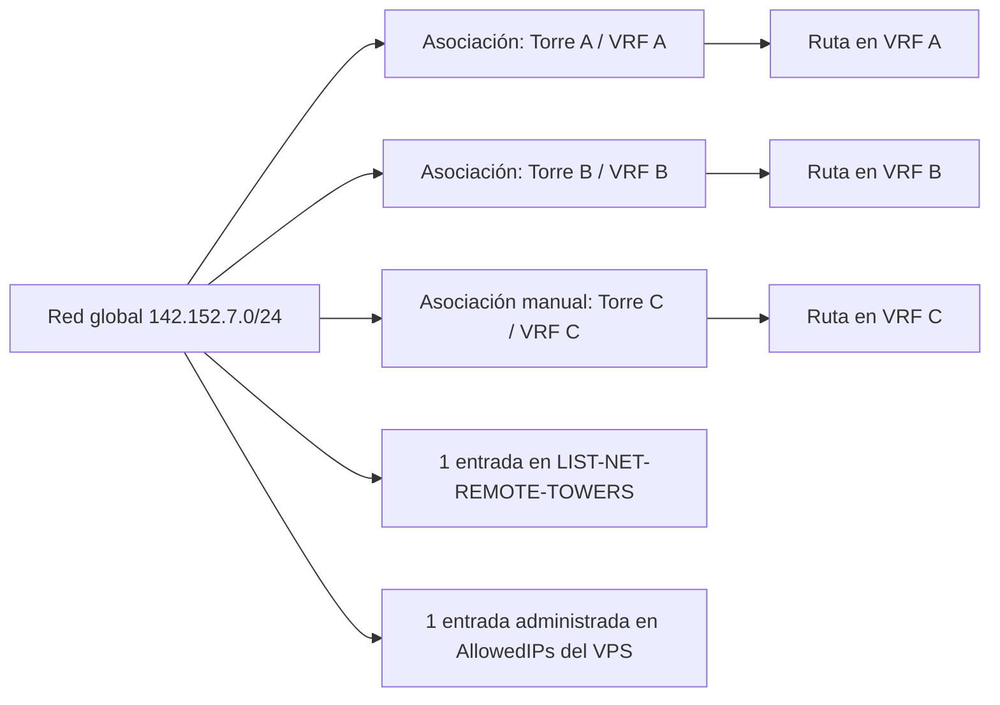
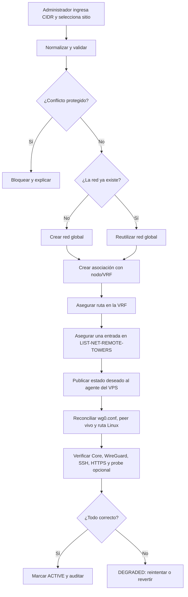

# Plan de implementación — Administración de redes remotas WireGuard

**Fecha:** 2026-07-31  
**Estado:** propuesta lista para implementar; no modifica todavía producción  
**Alcance inicial:** IPv4, Administrador de plataforma, `wg0` del VPS y
`LIST-NET-REMOTE-TOWERS` del MikroTik Core

## 1. Objetivo

Permitir que el Administrador gestione desde el panel las redes utilizadas por
los túneles, incluidas redes RFC1918 y rangos públicos que un cliente usa
internamente, sin editar manualmente el MikroTik ni `/etc/wireguard/wg0.conf`.

Una red debe:

1. registrarse una sola vez globalmente;
2. poder asociarse a uno o varios túneles/nodos;
3. existir una sola vez en `LIST-NET-REMOTE-TOWERS`;
4. existir una sola vez en el conjunto administrado de `AllowedIPs` del VPS;
5. crear una ruta por cada VRF/nodo que la utilice;
6. conservar las entradas globales mientras exista al menos una asociación;
7. retirarse globalmente sólo al eliminar la última asociación;
8. aplicarse sin bajar `wg0` y con respaldo, verificación y rollback.

### Resumen del proceso

| Elemento | Definición |
| --- | --- |
| Inicio | El Administrador registra, asocia, deshabilita o retira una red |
| Fin | DB, rutas por VRF, lista MikroTik, WireGuard y rutas Linux coinciden |
| Actor principal | Administrador de plataforma |
| Actores técnicos | Backend no-root, reconciliador root del host y MikroTik Core |
| Evidencia | Diff, checks, operación auditada y estado real por target |
| Éxito | Red alcanzable por el túnel correcto sin duplicados ni pérdida de servicios |
| Fallo | Estado `DEGRADED`, explicación, reintento o rollback verificable |

## 2. Decisiones confirmadas

- Se admiten redes privadas y públicas usadas internamente.
- El Administrador trabaja con CIDR (`142.152.7.0/24`) o un host (`/32`).
- Una red manual debe indicar a qué sitio/túnel se dirige; agregarla sólo a
  `AllowedIPs` no es suficiente porque el Core necesita una ruta en la VRF.
- Dos o más clientes pueden reutilizar el mismo CIDR.
- La deduplicación global es por CIDR canónico exacto.
- Que una red esté cubierta por un supernet se muestra como información, pero no
  elimina automáticamente la entrada específica. Esto permite retirar el
  supernet en el futuro sin perder las redes detalladas.
- Los rangos base del sistema, IP pública del VPS, endpoint WireGuard, gateway y
  demás rutas vitales son protegidos.
- No se expondrá una caja de texto para editar la línea completa de
  `AllowedIPs`, una terminal web ni el socket Docker.
- El backend continúa sin `root`, `NET_ADMIN` ni acceso a la clave privada de
  WireGuard.

## 3. Auditoría del comportamiento actual

| Área | Estado actual | Consecuencia |
| --- | --- | --- |
| Alta de nodo | `addTowerEntries()` consulta `LIST-NET-REMOTE-TOWERS` y agrega sólo CIDR faltantes | Ya existe deduplicación correcta en provisión |
| Alta en VPS | `appendWg0Intent()` agrega sólo CIDR nuevos a `allowedips.desired` | Ya existe deduplicación correcta, pero sólo de alta |
| Watcher del host | Une configuración existente + intención, ejecuta `wg syncconf` y `ip route replace` | No corta el túnel y también asegura rutas Linux |
| Reinicio backend | `wg0Reconcile` vuelve a sembrar todas las LAN desde `nodes` | Recupera altas perdidas, siempre de forma aditiva |
| Borrado de nodo | No toca la lista global ni `AllowedIPs` | Evita romper redes compartidas, pero acumula huérfanas |
| Edición de nodo | Agrega directamente con `writeIdempotent` y elimina la primera entrada global coincidente | Puede duplicar entradas y puede retirar una red usada por otro nodo |
| Peers de gestión | `mgmtAllowedIpsFor()` combina base RFC1918 + redes públicas del workspace/router | La entrega de `.conf` ya conoce las LAN públicas |

### Brechas que este plan debe cerrar

1. No existe propiedad ni conteo de referencias por red.
2. `allowedips.desired` y el watcher son append-only.
3. No existe un estado deseado completo para eliminar de forma segura.
4. La edición de nodos evita el helper de deduplicación.
5. El estado deseado de MySQL, MikroTik, `wg0.conf`, peer vivo y rutas Linux no
   se compara en una sola vista.
6. Las operaciones distribuidas no tienen estados, reintentos ni rollback común.
7. Las entradas históricas del MikroTik/VPS no están clasificadas por origen.

## 4. Modelo operativo objetivo

La red global y sus usos son conceptos distintos:



### Conjuntos deseados

```text
MIKROTIK_LIST_DESIRED =
  DISTINCT CIDR con al menos una asociación ACTIVE que aplique al Core
  + entradas SYSTEM protegidas

WG0_ALLOWED_DESIRED =
  BASE_ALLOWED_IPS protegidos
  + DISTINCT CIDR con al menos una asociación ACTIVE que aplique al VPS
  + entradas importadas que aún no han sido clasificadas

VRF_ROUTES_DESIRED(node) =
  DISTINCT CIDR de asociaciones ACTIVE ligadas a ese nodo
```

La deduplicación es exacta. `10.1.1.0/24` puede conservarse aunque
`10.0.0.0/8` la cubra; la UI mostrará “cubierta por 10.0.0.0/8”.

## 5. Proceso

### 5.1 Alta o asociación



### 5.2 Retiro

1. Deshabilitar primero la asociación seleccionada.
2. Retirar la ruta únicamente de la VRF del nodo afectado.
3. Contar asociaciones activas restantes del mismo CIDR.
4. Si quedan asociaciones:
   - conservar `LIST-NET-REMOTE-TOWERS`;
   - conservar `AllowedIPs` y la ruta `dev wg0`.
5. Si no quedan asociaciones y la red no es protegida/importada sin clasificar:
   - retirar la entrada global del MikroTik;
   - retirar el CIDR del estado deseado del VPS;
   - reconciliar peer, `wg0.conf` y ruta Linux.
6. Verificar salud y registrar resultado.
7. Mantener el registro como `RETIRED` para auditoría; no hacer hard delete.

## 6. Reglas de negocio

| ID | Regla |
| --- | --- |
| RN-01 | Sólo `platform_admin` puede crear, deshabilitar, retirar o reconciliar redes |
| RN-02 | IPv4 en v1; IP suelta se normaliza a `/32` |
| RN-03 | CIDR se almacena en forma canónica; hosts fuera de la dirección de red se normalizan o se rechazan con vista previa |
| RN-04 | Se permiten redes públicas internas con advertencia y confirmación |
| RN-05 | `0.0.0.0/0` está prohibido |
| RN-06 | No se admite un CIDR que contenga IP pública del VPS, endpoint WG, gateway, DNS vital o IP pública de la sesión administradora |
| RN-07 | Prefijos públicos más amplios que `/16` requieren confirmación reforzada y política explícita; el default los bloquea |
| RN-08 | Una red manual requiere al menos un nodo/túnel destino |
| RN-09 | Un CIDR global puede tener múltiples asociaciones |
| RN-10 | Sólo una entrada exacta por CIDR en la lista global y en el estado administrado del VPS |
| RN-11 | Una asociación crea una ruta en su VRF aunque la red global ya exista |
| RN-12 | Retirar una asociación no retira la red global mientras exista otra referencia activa |
| RN-13 | Entradas `SYSTEM` y rutas vitales no se pueden deshabilitar ni retirar |
| RN-14 | Entradas `IMPORTED` se preservan hasta ser adoptadas o retiradas explícitamente |
| RN-15 | Toda mutación requiere motivo, actor, IP de origen, before/after y resultado |
| RN-16 | No se ejecutan comandos arbitrarios provenientes del navegador |
| RN-17 | Cada operación es idempotente y serializada por un lock global de reconciliación |
| RN-18 | Un fallo parcial queda `DEGRADED` y es reintentable; nunca se reporta falso éxito |

## 7. Modelo de datos propuesto

### `managed_networks`

| Campo | Tipo orientativo | Uso |
| --- | --- | --- |
| `id` | `CHAR(36)` | UUID |
| `cidr` | `VARCHAR(43)` ASCII UNIQUE | CIDR canónico |
| `address_family` | `TINYINT` | 4 en v1 |
| `network_address` | `VARBINARY(16)` | Comparación y solapamientos |
| `prefix_length` | `TINYINT` | Máscara |
| `purpose` | enum | `LAN_REMOTE`, `NODE_MGMT`, `BASE` |
| `classification` | enum | `RFC1918`, `PUBLIC_INTERNAL`, `SYSTEM` |
| `label` | `VARCHAR(120)` | Nombre visible |
| `probe_ip` | `VARCHAR(45)` NULL | Prueba opcional |
| `protection` | enum | `NONE`, `SYSTEM`, `VPS`, `WG_ENDPOINT`, `GATEWAY` |
| `lifecycle` | enum | `ACTIVE`, `DISABLED`, `RETIRED` |
| `created_by` | FK users | Actor |
| `created_at`, `updated_at`, `retired_at` | `BIGINT` | Auditoría temporal |

### `managed_network_bindings`

| Campo | Uso |
| --- | --- |
| `id` | UUID |
| `network_id` | FK a `managed_networks` |
| `workspace_id` | FK; dueño lógico |
| `node_id` | FK; determina VRF/gateway |
| `source` | `NODE_PROVISION`, `MANUAL`, `IMPORTED`, `SYSTEM` |
| `desired_state` | `ACTIVE`, `DISABLED`, `REMOVED` |
| `apply_to_mikrotik` | Objetivo Core |
| `apply_to_vps` | Objetivo VPS |
| `created_by`, `reason`, timestamps | Trazabilidad |

Restricción única recomendada:
`(network_id, node_id, source, active_slot)`, donde `active_slot` es una columna
generada que vale `1` para bindings vigentes y `NULL` para históricos. Así MySQL
impide dos bindings activos equivalentes y permite conservar varios retirados.

Las IP `/32` de gestión propias de nodos WireGuard se registran con
`purpose=NODE_MGMT`, binding al nodo, `apply_to_mikrotik=true` y normalmente
`apply_to_vps=false` cuando ya están cubiertas por una base protegida.

### `managed_network_operations`

| Campo | Uso |
| --- | --- |
| `id` | UUID de operación |
| `network_id`, `binding_id` | Objetivo |
| `action` | `IMPORT`, `ADD`, `BIND`, `DISABLE`, `UNBIND`, `RETIRE`, `RECONCILE`, `ROLLBACK` |
| `state` | Estado de la saga |
| `actor_user_id`, `actor_ip`, `reason` | Auditoría |
| `before_json`, `after_json` | Diff sin secretos |
| `error_code`, `error_message`, `attempts` | Diagnóstico |
| `created_at`, `started_at`, `finished_at` | Métricas |

### Estados de operación

```text
PENDING
  → VALIDATING
  → APPLYING_ROUTER
  → APPLYING_VPS
  → VERIFYING
  → SUCCEEDED

Cualquier fase → DEGRADED → RETRYING → SUCCEEDED
                         └→ ROLLING_BACK → ROLLED_BACK
```

## 8. Reconciliador y agente del host

### 8.1 Evolución del intent file

Reemplazar el modelo append-only por un protocolo versionado:

```json
{
  "version": 2,
  "generation": 42,
  "operationId": "uuid",
  "desiredAllowedIps": ["10.0.0.0/8", "142.152.7.0/24"],
  "managedCidrs": ["142.152.7.0/24"],
  "protectedCidrs": ["10.0.0.0/8"]
}
```

- Escritura atómica: archivo temporal + rename.
- Tamaño y cantidad máximos.
- Sólo CIDR canónicos.
- `flock` para impedir reconciliaciones concurrentes.
- Archivo de estado root-written con generación aplicada, diff, resultado y
  checks de salud.
- Separar inbox escribible por backend y status sólo lectura.

### 8.2 Aplicación host-side

1. Validar nuevamente el documento; no confiar sólo en el backend.
2. Leer `wg0.conf`, `wg show wg0 allowed-ips` y rutas actuales.
3. Detectar entradas desconocidas.
4. Durante la migración, preservar entradas desconocidas y reportar
   `UNMANAGED_DRIFT`; nunca borrarlas automáticamente.
5. Crear backup versionado.
6. Calcular `final = protected + desired + unknown-preserved`.
7. Reescribir sólo `AllowedIPs`.
8. Ejecutar `wg syncconf wg0 <(wg-quick strip wg0)`.
9. Crear rutas deseadas con `ip route replace <cidr> dev wg0`.
10. Retirar únicamente rutas anteriormente administradas que dejaron de ser
    deseadas; nunca rutas protegidas o desconocidas.
11. Verificar handshake, rutas esenciales, HTTPS local y estado de `wg0`.
12. Escribir status; restaurar backup si falla.

No se reinicia ni baja la interfaz.

## 9. Reconciliación en MikroTik

Crear un único servicio backend, por ejemplo `managedNetworkService`, que sea la
única ruta para mutar redes.

Responsabilidades:

- Leer una vez `/ip/firewall/address-list/print`.
- Asegurar entradas faltantes mediante el helper de deduplicación.
- Detectar y reportar duplicados históricos.
- Crear por binding la ruta `dst-address=<cidr>` en la VRF del nodo.
- Para eliminar, retirar primero la ruta de esa VRF.
- Retirar la entrada de `LIST-NET-REMOTE-TOWERS` sólo cuando el conteo de
  bindings activos llegue a cero.
- Verificar que la entrada exacta y las rutas esperadas existan.
- Reintentar con conexión RouterOS nueva ante fallos transitorios.

### Cambio obligatorio en flujos existentes

- `provision.routes.js`: registrar red/binding y delegar al servicio.
- `editing.routes.js`: dejar de agregar/eliminar directamente address-list y
  rutas; delegar completamente.
- `nodeDeprovision.js`: retirar bindings del nodo; la limpieza global la decide
  el conteo de referencias.
- `wg0Reconcile.js`: sembrar desde `managed_network_bindings`, con fallback a
  `nodes` durante la migración.
- `mgmtAllowedIps.js`: leer redes públicas del registro por workspace; mantener
  RouterOS como observación/fallback temporal, no como fuente primaria final.

## 10. API propuesta

Todas bajo `/api/admin/managed-networks`, con sesión, CSRF y
`requirePlatformAdmin`.

| Método y ruta | Uso |
| --- | --- |
| `GET /` | Lista redes, bindings, dependencias y estado real |
| `POST /validate` | Normaliza CIDR y devuelve conflictos/impacto sin mutar |
| `POST /` | Crea red y primera asociación |
| `POST /:id/bindings` | Asocia red existente a otro nodo |
| `PATCH /:id` | Etiqueta, probe IP y metadata; CIDR no se edita in-place |
| `POST /:id/disable` | Deshabilita de forma reversible |
| `POST /:id/enable` | Reactiva y reconcilia |
| `DELETE /:id/bindings/:bindingId` | Retira una asociación |
| `POST /:id/retire` | Retira globalmente si no hay dependencias |
| `POST /reconcile` | Dry-run o aplicación del diff |
| `GET /operations/:operationId` | Estado y pasos de una operación |
| `GET /inventory` | Comparación DB/Core/wg0/rutas |

El contrato de respuesta debe separar:

```json
{
  "desired": {},
  "actual": {
    "mikrotikAddressList": true,
    "mikrotikRoutes": [],
    "wgConfig": true,
    "wgRuntime": true,
    "linuxRoute": true
  },
  "coverage": {},
  "drift": []
}
```

## 11. Interfaz de Administración

Agregar una sección `Redes remotas` en `SettingsModule`, junto a Router Core,
Servidor VPN y Escaneo.

### Resumen

- Redes totales.
- Redes privadas.
- Redes públicas internas.
- Redes compartidas.
- Pendientes/degradadas.
- Drift detectado.
- Última reconciliación.

### Tabla

| Columna | Contenido |
| --- | --- |
| Red | CIDR canónico |
| Clasificación | Privada, pública interna o sistema |
| Clientes/sitios | Cantidad y nombres |
| Cobertura | Supernet que la cubre, si existe |
| MikroTik | Lista y rutas por VRF |
| VPS | Config, runtime y ruta |
| Estado | Activa, pendiente, degradada, deshabilitada |
| Acciones | Ver, asociar, probar, deshabilitar, retirar |

### Alta

1. CIDR/IP.
2. Etiqueta.
3. Workspace.
4. Nodo/túnel.
5. Probe IP opcional.
6. Motivo.
7. Vista previa de impacto.
8. Confirmación reforzada si parece pública.

### UX de retiro

- Acción primaria: `Deshabilitar`.
- `Retirar de este sitio` elimina sólo el binding.
- `Retirar globalmente` aparece sólo sin dependencias.
- Confirmación escribiendo el CIDR para operaciones públicas o críticas.
- Progreso por pasos y resultado verificable; nunca cerrar con falso éxito.

## 12. Permisos y seguridad

| Acción | Platform admin | OWNER | MEMBER |
| --- | --- | --- | --- |
| Ver inventario global | Sí | No |
| Ver redes de su workspace | Futuro/read-only | Futuro/read-only | No |
| Validar/dry-run | Sí | No | No |
| Crear/asociar | Sí | No | No |
| Deshabilitar/retirar | Sí + reautenticación reciente | No | No |
| Reconciliar | Sí + confirmación | No | No |

Controles adicionales:

- Rate limit separado para mutaciones.
- Reautenticación reciente para retiros.
- Idempotency key en POST críticos.
- Lock distribuido/DB para una operación de red a la vez.
- Validación Zod en contratos compartidos.
- Ningún secreto, clave WireGuard o credencial RouterOS en responses/logs.
- Alertas de operación fallida por el canal administrativo configurado.

## 13. Migración sin indisponibilidad

### Inventario inicial

1. Leer sólo:
   - `nodes.segmento_lan` y `nodes.lan_subnets`;
   - rutas VRF del MikroTik;
   - `LIST-NET-REMOTE-TOWERS`;
   - `allowedips.desired`;
   - `wg0.conf`;
   - `wg show wg0 allowed-ips`;
   - `ip route show dev wg0`.
2. Normalizar y comparar.
3. Crear un informe de:
   - redes con binding conocido;
   - entradas compartidas;
   - duplicados;
   - huérfanas;
   - sólo-MikroTik;
   - sólo-VPS;
   - cubiertas por supernet.
4. No eliminar nada durante la importación.

### Backfill

- Crear una red global por CIDR único encontrado en `nodes`.
- Crear un binding por nodo que la declare.
- Importar entradas extra de MikroTik/VPS como `IMPORTED`.
- Marcar base de gestión como `SYSTEM` protegida.
- Requerir adopción explícita de huérfanas antes de permitir su retiro.

## 14. Fases de implementación

### Fase 0 — Contratos, validación y pruebas puras

- Utilidad IPv4/CIDR canónica.
- Clasificación RFC1918/pública.
- Detección de igualdad, cobertura y solapamiento.
- Política de redes protegidas.
- Contratos Zod y catálogo de errores.

**Aceptación:** unit tests para límites `/0`, `/32`, IP no canónica, duplicados,
supernets y conflictos vitales.

### Fase 1 — Esquema y backfill dry-run

- Migración idempotente de las tres tablas.
- Repositorios.
- CLI `managed-networks:inventory`.
- Dry-run de importación sin escribir.
- Backfill explícito `--apply`.

**Aceptación:** conteos reproducibles y ninguna mutación de RouterOS/VPS.

### Fase 2 — Inventario read-only en API y UI

- Endpoint de estado deseado/real.
- Nueva sección `Redes remotas`.
- Filtros, dependencias y drift.
- Sin botones de mutación.

**Aceptación:** la pantalla representa exactamente DB, MikroTik, config/runtime
de WireGuard y rutas.

### Fase 3 — Servicio único y altas idempotentes

- `managedNetworkService`.
- Refactor de provisión y edición para usarlo.
- Dual-write temporal: registro nuevo + mecanismo actual.
- Alta manual detrás de feature flag.

**Aceptación:** agregar el mismo CIDR dos veces no duplica lista/AllowedIPs; al
asociarlo a otro nodo sí crea la segunda ruta VRF.

### Fase 4 — Reconciliador host v2

- Intent versionado y status.
- Validación host-side, lock, backup y rollback.
- Diff de altas y bajas administradas.
- Pruebas de shell con `wg`, `wg-quick` e `ip` falsos.
- Timer de reconciliación periódico como red de seguridad.

**Aceptación:** alta/baja en vivo sin reiniciar `wg0`, persistencia tras reboot y
rollback ante health check fallido.

### Fase 5 — Deshabilitación y eliminación por referencias

- Saga de retiro.
- Soft-disable.
- Borrado de ruta por binding.
- Retiro global sólo con cero referencias.
- Reintentos de estados `DEGRADED`.

**Aceptación:** retirar una de dos asociaciones conserva la red global; retirar
la última limpia ambos extremos.

### Fase 6 — Integración completa de ciclo de nodo

- Alta, edición, deprovisión y eliminación de workspace usan el registro.
- Eliminar mutaciones directas legacy.
- `mgmtAllowedIpsFor` usa el registro.
- Reconciliación de arranque usa bindings.

**Aceptación:** no queda otro escritor de `LIST-NET-REMOTE-TOWERS`,
`allowedips.desired` ni rutas LAN salvo el servicio/reconciliador canónico.

### Fase 7 — Canary y activación

1. Producción en read-only.
2. Canary de alta con una red de laboratorio.
3. Alta de una red pública interna real.
4. Misma red asociada a un segundo nodo.
5. Retiro de una asociación.
6. Deshabilitar/rehabilitar.
7. Retirar última asociación.
8. Reiniciar VPS y confirmar persistencia.
9. Activar mutaciones globalmente.

## 15. Secuencia de commits sugerida

1. `docs(network): define managed remote networks`
2. `feat(contracts): add managed network schemas`
3. `feat(db): add managed network registry`
4. `feat(ops): inventory remote network state`
5. `feat(admin): show remote network inventory`
6. `refactor(network): centralize RouterOS network writes`
7. `feat(wg0): add versioned desired-state reconciler`
8. `feat(admin): add safe network creation`
9. `feat(network): track shared bindings`
10. `feat(admin): add disable and reference-safe removal`
11. `refactor(nodes): use managed networks lifecycle`
12. `test(network): cover reconciliation and rollback`
13. `docs(ops): add deployment and recovery runbook`

Cada commit debe ser desplegable o estar apagado mediante feature flag.

## 16. Feature flags

```text
MANAGED_NETWORKS_READ_ENABLED=true
MANAGED_NETWORKS_WRITE_ENABLED=false
MANAGED_NETWORKS_DELETE_ENABLED=false
WG0_RECONCILER_V2_ENABLED=false
NETWORK_OPS_DRY_RUN=true
```

Activación gradual:

1. read;
2. dry-run;
3. add;
4. disable;
5. delete.

## 17. Pruebas obligatorias

### Unidad

- Normalización y validación real de octetos/máscaras.
- Redes públicas permitidas con warning.
- Bloqueo de default route y rutas vitales.
- Exact duplicate y coverage por supernet.
- Cálculo de referencias.
- Estado deseado por target.

### Backend/RouterOS simulado

- Alta nueva crea lista y ruta.
- Alta existente no duplica lista.
- Misma red en otro nodo crea sólo la ruta de la segunda VRF.
- Retiro parcial conserva global.
- Retiro final limpia global.
- Router caído deja `DEGRADED` y reintenta.
- Dos peticiones concurrentes se serializan.
- OWNER/MEMBER reciben 403.

### Host

- Intent inválido rechazado.
- Entrada desconocida preservada.
- Backup antes de escribir.
- `wg syncconf` sin down/up.
- Altas y bajas de rutas Linux.
- Error de `wg` o `ip` restaura configuración.

### End-to-end

- CIDR público usado internamente.
- CIDR repetido entre dos workspaces/nodos.
- Navegador pierde conexión durante operación.
- Reboot conserva estado.
- HTTPS, SSH, Docker y WireGuard siguen sanos.

## 18. Despliegue y rollback

### Respaldo previo

- Dump MySQL verificado.
- Export de `LIST-NET-REMOTE-TOWERS`.
- Export de rutas VRF.
- Copia checksum de `wg0.conf`.
- Copia de `allowedips.desired`.
- `wg showconf wg0`.
- Rutas `dev wg0`.

### Rollback

- Desactivar flags de escritura.
- Restaurar watcher v1.
- Restaurar `wg0.conf` y ejecutar `wg syncconf`.
- Restaurar únicamente las entradas/rutas del diff de la operación.
- Mantener tablas nuevas: son aditivas y no afectan al flujo antiguo al apagar
  las flags.
- Nunca revertir con una lista completa antigua sin comparar, porque podría
  retirar redes creadas después del backup.

## 19. Criterios de aceptación finales

| Escenario | Resultado esperado |
| --- | --- |
| Nueva red privada | 1 global + 1 binding + 1 ruta VRF + 1 ruta VPS |
| Nueva red pública interna | Igual, con advertencia y confirmación |
| CIDR ya global, nuevo túnel | 0 duplicados globales + nueva ruta VRF |
| Retirar uno de varios túneles | Sólo desaparece su ruta VRF |
| Retirar última referencia | Se retira lista global, AllowedIP y ruta VPS |
| Red protegida | Operación bloqueada |
| MikroTik/VPS caído | Estado `DEGRADED`, auditado y reintentable |
| Reinicio VPS | Estado persistente y reconciliado |
| Drift manual | Visible; desconocidos preservados hasta decisión humana |

## 20. Defaults recomendados pendientes de aprobación

- Gestión inicial exclusiva del Administrador.
- IPv4 solamente en v1; modelo preparado para IPv6.
- CIDR público permitido; prefijos públicos más amplios que `/16` bloqueados por
  defecto salvo política explícita.
- Deshabilitar antes de retirar.
- Entradas importadas preservadas hasta clasificación.
- Redes base RFC1918 actuales marcadas `SYSTEM`.
- Una red global compartida puede pertenecer a múltiples workspaces/nodos.
- El CIDR no se edita: se crea el nuevo, se verifica y luego se retira el viejo.
