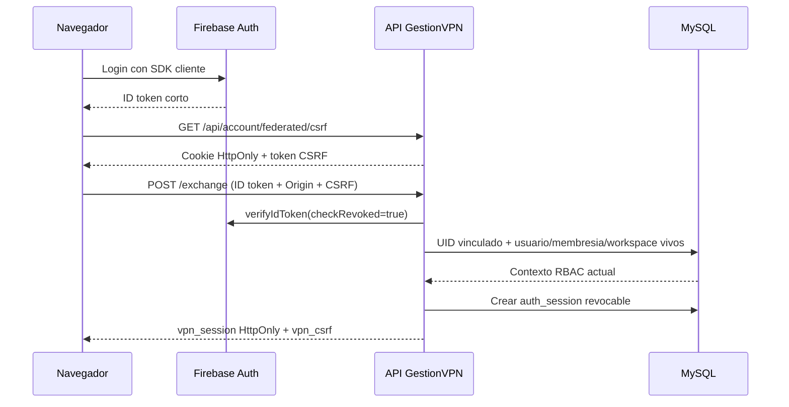

# ADR 0001: piloto de identidad con Firebase Auth

- Estado: **piloto implementado, no adoptado en produccion**
- Fecha: 2026-07-18
- Alcance: autenticacion de usuarios web; no autorizacion de negocio

## Contexto

La autenticacion local ya aplica Argon2id, anti-enumeracion, rate limiting persistente, CSRF y sesiones revocables. Firebase puede reducir la carga futura de MFA, recuperacion y proveedores sociales/empresariales, pero introduce dependencia externa, costes por MAU, cuotas y una migracion de hashes que debe demostrarse antes de activarse.

## Decision

Se implementa un **piloto reversible y apagado por defecto**. Firebase prueba la identidad; MySQL conserva la autoridad exclusiva sobre:

- usuario activo, verificado, suspendido o eliminado;
- membresia, workspace y rol `OWNER`/`MEMBER`;
- bandera de administrador de plataforma;
- sesiones locales `auth_sessions` y revocacion inmediata.

No se crean usuarios ni roles automaticamente desde claims de Firebase. Cada identidad externa requiere un vinculo previo en `auth_identities`. Se conserva `users.password_hash` durante todo el piloto y la ruta local de login sigue siendo el camino predeterminado.

El token federado no se usa como sesion de la API. El cliente configura persistencia Firebase solo en memoria, intercambia el ID token por la cookie local y ejecuta `signOut` inmediatamente despues del intercambio; tambien limpia defensivamente Firebase al cerrar la sesion local. No copia ID/refresh tokens a `localStorage`, `sessionStorage` ni IndexedDB. El SDK web se carga con imports dinamicos solo cuando el piloto esta configurado y el usuario elige ese acceso. El intercambio exige autenticacion reciente (por defecto, no mas de 300 segundos), correo verificado, revision de revocacion, Origin permitido, double-submit CSRF dedicado y rate limit persistente por IP. Los rechazos usan un unico contrato `BAD_CREDENTIALS` para no enumerar cuentas.

## Modelo multi-tenant

La primera prueba usa **un directorio global** y mantiene la multitenencia en MySQL. No se crea un tenant de Identity Platform por workspace: un usuario puede participar en varios workspaces y esa relacion ya pertenece al modelo local. `FIREBASE_TENANT_ID` queda disponible solo para un piloto empresarial separado y justificado. La documentacion oficial de [multi-tenancy de Identity Platform](https://docs.cloud.google.com/identity-platform/docs/multi-tenancy) se revisara antes de usarlo.

## Credenciales del backend

El Admin SDK usa Application Default Credentials. En el VPS se prefiere [Workload Identity Federation](https://docs.cloud.google.com/iam/docs/workload-identity-federation) para evitar claves de cuenta de servicio persistentes. Si el entorno obliga temporalmente a usar un JSON, se monta read-only fuera del repositorio y de la imagen, con una cuenta dedicada y permisos minimos; Google recomienda evitar claves administradas por el usuario cuando existe una alternativa ([practicas de claves de service account](https://docs.cloud.google.com/iam/docs/best-practices-for-managing-service-account-keys)). La inicializacion oficial por ADC esta descrita en [Firebase Admin setup](https://firebase.google.com/docs/admin/setup).

## Migracion de usuarios

1. Hacer backup cifrado y reconciliar emails/UID duplicados.
2. Crear el usuario Firebase usando, cuando sea seguro, el UUID local como UID; conservar siempre `auth_identities` como mapping explicito.
3. Importar primero un lote no productivo y luego un moderador canary.
4. Firebase Admin para Node admite importaciones de hasta 1.000 usuarios por llamada y bcrypt, segun [Import users](https://firebase.google.com/docs/auth/admin/import-users).
5. Los hashes actuales son Argon2id. La API REST de Identity Platform expone parametros Argon2 y `batchCreate`, pero el helper de importacion Argon2 no esta disponible en el Admin SDK Node actual; por ello se requiere una prueba aislada con REST o un helper Java antes de migrar hashes ([Argon2 parameters](https://docs.cloud.google.com/identity-platform/docs/reference/rest/v1/Argon2Parameters), [accounts.batchCreate](https://docs.cloud.google.com/identity-platform/docs/reference/rest/v1/projects.tenants.accounts/batchCreate)).
6. Nunca pedir, exportar ni registrar contraseñas en claro. Si la importacion Argon2 no queda demostrada, usar migracion progresiva tras un login local valido o mantener autenticacion local.
7. Comparar sesiones, suspension, logout global, invitaciones, recuperacion y cambio de workspace durante al menos 48 horas.

## Coste, cuotas y operacion

Antes del go-live se registraran MAU esperados y presupuesto. La [tabla oficial de precios de Identity Platform](https://cloud.google.com/identity-platform/pricing) y los [limites de Firebase Authentication](https://firebase.google.com/docs/auth/limits) son la fuente de verdad; deben revisarse nuevamente al aprobar produccion porque pueden cambiar.

Metricas minimas del canary:

- intercambios permitidos, rechazados y limitados, sin UID/email crudo;
- latencia y errores del proveedor;
- mappings faltantes o desactualizados;
- sesiones locales creadas/revocadas;
- uso, cuota y coste del proveedor.

## Go / no-go

Adoptar solo si:

- MFA, recuperacion o federacion justifican la dependencia;
- la importacion o migracion progresiva de Argon2 fue probada sin texto plano;
- coste y cuotas fueron aceptados;
- un canary confirma que MySQL sigue imponiendo RBAC y revocacion;
- existe runbook de incidente y rollback ensayado.

Si falla cualquiera, mantener `FEDERATED_AUTH_ENABLED=false` y continuar con auth local endurecido.

## Rollback

1. Poner `FEDERATED_AUTH_ENABLED=false` y reiniciar el backend.
2. Revocar las sesiones locales del lote piloto.
3. Mantener `auth_identities` para auditoria/reintento; no borrar usuarios Firebase durante el incidente.
4. Los usuarios vuelven a `/api/account/login` con su hash local conservado.
5. Investigar por codigos internos y metricas, nunca exponiendo el motivo al cliente.

## Consecuencias

Ventajas: integracion aislada, rollback inmediato, RBAC sin duplicar y credenciales del proveedor fuera del codigo. Costes: dos planos de revocacion durante el piloto, mapping operativo, dependencia del proveedor y trabajo pendiente de configuracion externa, importacion y canary. Este ADR no autoriza habilitar Firebase ni subir credenciales a produccion.
