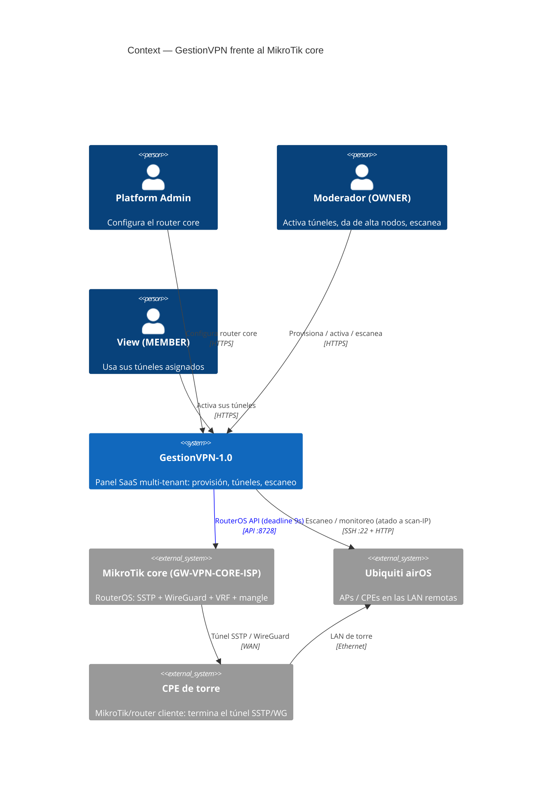
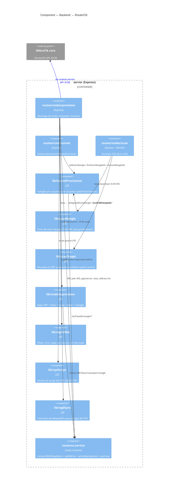
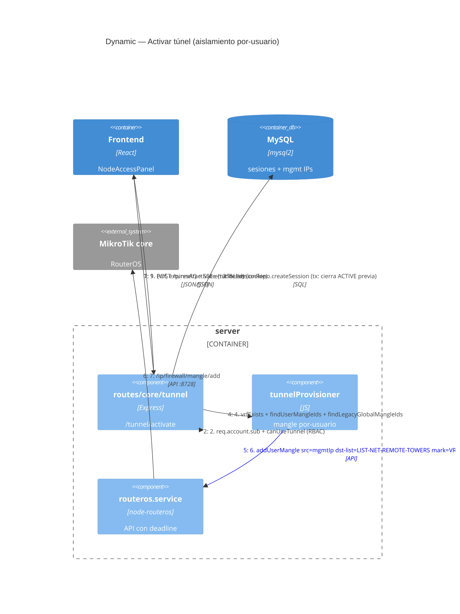
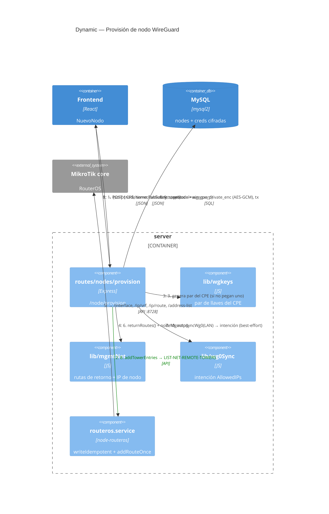
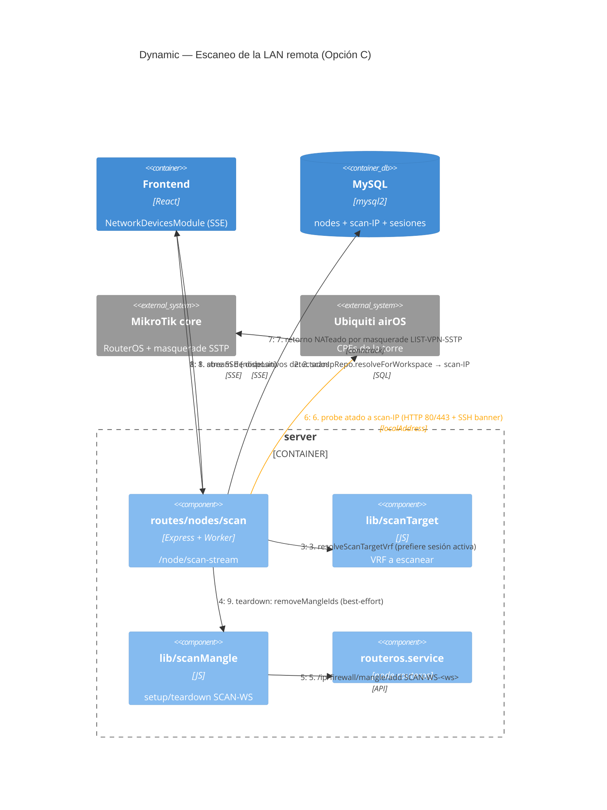
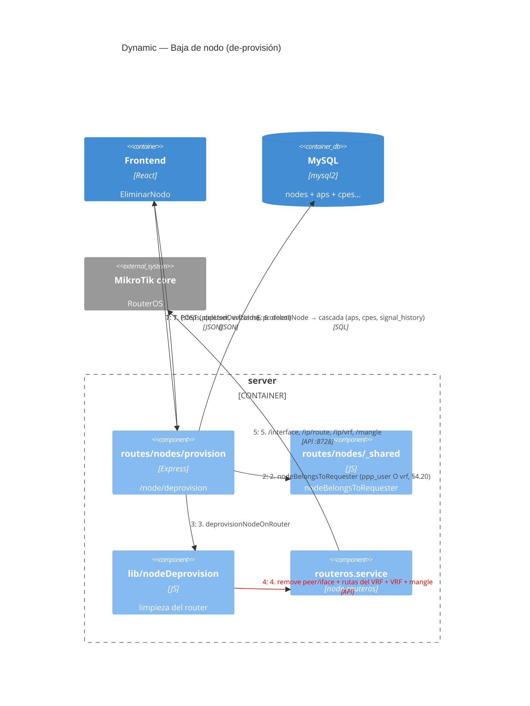

# 🔌 C4 — MikroTik ↔ Funciones del Core

> Diagramas C4 (Mermaid) que muestran **cómo el backend opera el MikroTik core**: activar túnel, provisión/baja de nodo, escaneo, y el rol de **VRF + mangle**.
> Generado: **2026-06-24** sobre `cfa8de0`. Acompaña a [`Project_Architecture_Blueprint.md`](./Project_Architecture_Blueprint.md). El *porqué* de cada decisión vive en [`HANDOFF.md`](../../HANDOFF.md) §4.
> Niveles incluidos: **Context (1)** · **Component (3, foco RouterOS)** · **Dynamic** (activar túnel · provisión · escaneo · baja).

---

## 0) Modelo mental en una frase

El MikroTik core es **compartido por todos los tenants**. El aislamiento se logra con dos primitivas de RouterOS combinadas:

- **VRF** (`VRF-ND<n>-<NOMBRE>`) — una tabla de rutas aislada por nodo físico. Solo enruta la LAN de su torre.
- **mangle `mark-routing`** — marca el tráfico **por origen** (`src-address`) hacia un VRF. Hay un namespace por-usuario (`ACCESO-USER-<tag>`) para el acceso del moderador y otro por-workspace (`SCAN-WS-<ws>`) para el escaneo desde el VPS.

> N usuarios concurrentes = N mangles + N VRFs **sin colisión**, aunque varias torres compartan la misma LAN.

---

## 1) C4 Context — el sistema frente al Core y las antenas

**Clave:** el panel **nunca** habla directo con las antenas en producción; el tráfico de escaneo/monitoreo sale atado a una **scan-IP** y el Core lo enruta al VRF correcto vía mangle. El CPE termina el túnel y expone la LAN de la torre.

---

## 2) C4 Component — funciones del backend que operan el Core

Foco: qué módulo del backend maneja qué objeto de RouterOS. Todo pasa por `routeros.service` (única conexión con deadline).

### Mapa objeto RouterOS ↔ función

| Objeto RouterOS | Lo crea/lee | Función | Comment / convención |
|---|---|---|---|
| `/ip/vrf` | provision · scanMangle (lee) | `computeNextAllocation`, `vrfExists` | `VRF-ND<n>-<NOMBRE>` |
| `/interface/wireguard` + `/peers` | provision | paso 1–3 | iface `WG-ND<n>-<NOMBRE>`, peer `Cliente ND<n>` |
| `/ppp/secret` + `/interface/sstp-server` | provision (SSTP) | paso 1–2 | secret `ppp-<nombre>-nd<n>` |
| `/ip/route` (LAN + retorno + scan) | provision | `addRouteOnce`, `addMgmtReturnRoutes`, `addScanReturnRoute` | ida dist 1, retorno **dist 2** |
| `/ip/firewall/address-list` `LIST-NET-REMOTE-TOWERS` | provision | `addTowerEntries` | nunca se borra al dar de baja (§4.13) |
| `/ip/firewall/mangle` (acceso) | tunnel | `addUserMangle` | `ACCESO-USER-<tag>` |
| `/ip/firewall/mangle` (escaneo) | scanMangle | `addScanMangle` | `SCAN-WS-<ws>` |
| `/interface/list/member` | provision | paso 4 | `LIST-VPN-TOWERS` + `LIST-VPN-WG`/`LIST-VPN-SSTP` |

---

## 3) C4 Dynamic — Activar túnel (mangle por-usuario → VRF)

`POST /tunnel/activate`. La IP de gestión y el VRF se resuelven **server-side** (anti-spoofing §4.3/§4.5); nunca del body.

**Por qué así:** una regla mangle marca **solo** el tráfico cuyo `src-address` es la mgmt-IP de *ese* usuario → su tráfico entra a *su* VRF. Las mangle GLOBALES legacy (`ACCESO-ADMIN`, `src=<toda la /24>`) se eliminan automáticamente porque rompen el aislamiento (§4.3).

---

## 4) C4 Dynamic — Provisión de nodo WG (alta server-side, ~10 pasos)

`POST /node/provision`. El servidor genera todo y devuelve el script del CPE. Progreso por SSE (`provisionId`).

**Notas de implementación verificadas:**
- **`addRouteOnce`** verifica antes de añadir: RouterOS trata `/ip/route/add` duplicado como ECMP (no lanza "already have") → sin esto se acumulaban rutas (§4.26). Set canónico: 1 ruta de ida (dist 1) + 4 de retorno (CLIENTES/ADMIN/VPS + scan, **dist 2**).
- **SSTP** NO crea la `/32` del mgmt-ip (el PPP la da dinámica vía `remote-address`); **WG sí**.
- **VRF merge:** si el VRF ya existe (nodo SSTP previo), se añade la iface WG; solo se borra en rollback si `vrfCreatedByUs`.
- **Rollback H4:** si un paso falla, `rollbackProvision` borra solo lo que esta llamada creó (por nombre/comment determinístico), nunca LANs compartidas.
- **wg0 autosync (§4.27):** `appendWg0Intent` escribe la LAN en `/wg0sync/allowedips.desired` (bind-mount); un watcher root del host la aplica con `wg syncconf`. El backend no gana privilegios.

---

## 5) C4 Dynamic — Escaneo desde el VPS (scan-IP → SCAN-WS → VRF)

`GET /node/scan-stream`. El escaneo sale atado a la **scan-IP del workspace** (`localAddress`); el Core la marca con la mangle `SCAN-WS-<ws>` hacia el VRF.

**Por qué funciona el retorno (§4.28):**
- La mangle `SCAN-WS-<ws>` marca `src=scan-IP AND dst-address-list=LIST-NET-REMOTE-TOWERS` → por eso la LAN **debe** estar en esa address-list (la añade `addTowerEntries` al provisionar).
- En **SSTP** el retorno lo resuelve el `masquerade out-interface-list=LIST-VPN-SSTP` del Core: reescribe el origen a la PPP-local `10.11.251.1`, así el CPE no necesita ruta del scan-pool (conntrack des-NATea).
- En **WG** el retorno necesita la ruta del scan-pool en el VRF (`addScanReturnRoute`, dist 2) **y** que el `wg0` del VPS rutee la LAN en sus `AllowedIPs` (§4.27).
- **Limitación actual:** el probe detecta **solo** Ubiquiti airOS (`status.cgi` + banner SSH). Hosts no-airOS no aparecen → feature "Otros" pendiente.

---

## 6) C4 Dynamic — Baja de nodo (cascada)

`POST /node/deprovision` → delega en `lib/nodeDeprovision.deprovisionNodeOnRouter`.

**Invariantes de la baja:**
- **NUNCA** se toca `LIST-NET-REMOTE-TOWERS` (varias torres comparten LAN → borrar la entrada rompería a los nodos hermanos, §4.13).
- **Best-effort:** un router caído **no** bloquea el borrado en BD (§4.12/§4.17).
- **Identidad consistente:** el nodo se identifica por `ppp_user` **O** `nombre_vrf` (§4.20) — si difieren (nodos legacy), igual se borra.

---

## 7) Resumen de invariantes MikroTik (referencia rápida)

| # (HANDOFF) | Invariante |
|---|---|
| §4.1/§4.2 | Alta de nodo = todo server-side; toda la infra por-túnel se crea sola |
| §4.3 | Mangle **por-usuario**; prohibido mangle global; `src`/VRF server-side |
| §4.10 | `.conf` split-tunnel, **nunca** `0.0.0.0/0` |
| §4.13 | Nunca borrar `LIST-NET-REMOTE-TOWERS` al dar de baja |
| §4.17 | Toda conexión al router con deadline propio (9s); best-effort |
| §4.18 | El plano `10.x` debe estar en `/ip service api address=` (no solo firewall) |
| §4.19 | Nunca borrar el peer WG de administración (`10.14.250.2→.1`) |
| §4.26 | `/ip/route/add` por `addRouteOnce` (RouterOS permite duplicados) |
| §4.27 | El `wg0` del VPS debe rutear cada LAN en `AllowedIPs` (autosync) |
| §4.28 | El escaneo detecta solo Ubiquiti; retorno SSTP por masquerade |

---

> **Generado:** 2026-06-24 · **Base:** `cfa8de0` · Fuentes: `routes/nodes/provision.routes.js`, `routes/core/tunnel.routes.js`, `lib/tunnelProvisioner.js`, `lib/scanMangle.js`, `lib/scanTarget.js`, `lib/nodeDeprovision.js`, `lib/mgmtNet.js`.
> Si los diagramas Mermaid C4 no renderizan en tu visor, usa un visor con Mermaid ≥ 10 (VS Code "Markdown Preview Mermaid Support" o GitHub).
