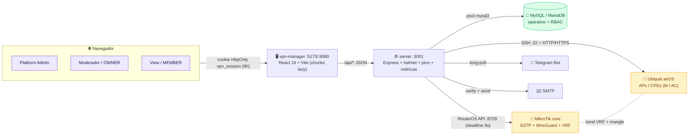
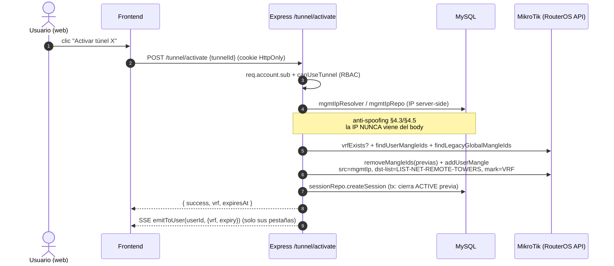

# 🏛️ Project Architecture Blueprint — MikroTikVPN Remote Manager (`GestionVPN-1.0`)

> Documento maestro de arquitectura. Describe **cómo está construido el sistema HOY**, sus capas, patrones, invariantes y los puntos de extensión.
> Generado: **2026-06-24** (sobre `dev`=`main`=`cfa8de0`). Mantener al ritmo de los cambios estructurales (ver §16).
> Complementos: [`HANDOFF.md`](../../HANDOFF.md) (estado vivo + el *porqué* de cada regla §4) · [`C4_MikroTik_Funciones.md`](./C4_MikroTik_Funciones.md) (diagramas C4 MikroTik↔funciones) · topología de red (network-diagram) · [`DESPLIEGUE_VPS.md`](../../DESPLIEGUE_VPS.md).
> ⚠️ El antiguo [`ARQUITECTURA.md`](../../ARQUITECTURA.md) (2026-06-10) quedó **desactualizado** (menciona `CO_MODERATOR` retirado, 62 tests, sin plano `10.x` ni autosync wg0). Este blueprint lo **supersede**.

---

## 1) Detección de arquitectura (qué se analizó)

| Eje | Resultado |
|---|---|
| **Tipo de proyecto** | Monorepo full-stack JS/TS — `npm workspaces` (`packages/*` + `server` + `vpn-manager`) |
| **Frontend** | React 19 + TypeScript (strict) + Vite 8 + Tailwind v3 + `lucide-react` |
| **Backend** | Node.js + Express 4 (JavaScript CommonJS plano), arquitectura **por capas + feature-modular** |
| **Datos** | MySQL/MariaDB (`mysql2/promise`, pool) — única BD operativa + RBAC |
| **Patrón dominante** | **Layered (capas) + Modular monolith**, con **contratos compartidos** como costura (seam) anti-drift y un **proxy de borde** hacia infra de red (RouterOS API + SSH) |
| **Integraciones de borde** | MikroTik RouterOS API (:8728), Ubiquiti airOS (SSH :22 + HTTP/HTTPS), SMTP, Telegram Bot |
| **Despliegue** | Docker Compose (MariaDB 11 + backend `network_mode: host` + frontend nginx) en VPS DigitalOcean |

**Cómo se detectó:** `package.json` raíz (`workspaces`), dependencias de cada paquete, el pipeline de middleware en [`server/index.js`](../../server/index.js), el montaje de routers, el `lazy()/Suspense` de [`vpn-manager/src/App.tsx`](../../vpn-manager/src/App.tsx), y el paquete `@gestionvpn/contracts`.

---

## 2) Visión general arquitectónica

El sistema es un **panel SaaS multi-tenant** que administra túneles VPN sobre un **MikroTik central compartido** (SSTP + WireGuard) y monitorea equipos **Ubiquiti airOS** en las LAN remotas, aisladas por **VRF + mangle por-usuario**.

### Principios rectores (evidentes en el código)

1. **Todo server-side / nada manual.** El alta de nodo genera llaves, credenciales y rutas; el cliente solo pega un script. La IP de gestión y el VRF se resuelven desde la sesión, nunca del body (anti-spoofing). → invariantes §4.1, §4.3, §4.5 del HANDOFF.
2. **Contratos como única fuente de verdad de tipos.** `@gestionvpn/contracts` (Zod + TS) une backend y frontend: cambiar un campo rompe ambos lados en `tsc`. Fin del drift.
3. **El borde de red es best-effort y acotado por deadline.** Toda llamada al router corre con un *hard deadline* propio (9s); una caída del router **nunca** bloquea una petición HTTP (§4.17). Patrón: trabajar en BD y responder primero; sincronizar el router aparte.
4. **Aislamiento multi-tenant en cascada.** `workspace_id` filtra lectura; las mutaciones verifican *ownership* antes de tocar BD/router; el hard-delete limpia en cascada y de-provisiona del router.
5. **Color = intención, movimiento = estado** en la UI (sistema de diseño con gate CI `audit:design`).

### Fronteras arquitectónicas y cómo se imponen

- **Frontend ⇄ Backend:** solo `/api/*` JSON + cookie HttpOnly `vpn_session`. El backend es **API-only** (helmet CSP `default-src 'none'`; no sirve HTML/estáticos).
- **Backend ⇄ Datos:** todo acceso pasa por `db/repos/*` o servicios (`db.service.js`, `db/mysql.js`). Sin SQL disperso en handlers.
- **Backend ⇄ Borde:** RouterOS solo vía `routeros.service.js`; airOS solo vía `ubiquiti.service.js`. Las credenciales se cifran (AES-256-GCM).
- **Tipos:** ambos lados importan de `@gestionvpn/contracts`; el frontend re-exporta en `src/types/`.

---

## 3) Visualización de la arquitectura

### 3.1 Contexto de alto nivel (C4 nivel 1 simplificado)



### 3.2 Capas del backend

```mermaid
flowchart TB
    subgraph Edge["index.js — pipeline Express"]
      direction TB
      H[helmet CSP API-only] --> CO[cors allowlist] --> J[express.json + cookieParser]
      J --> PL[pino-http reqId] --> ME[middleware métricas] --> VT[verifyToken]
    end

    VT --> Routes

    subgraph Routes["routes/ — feature-modular"]
      direction LR
      Pub["públicas:<br/>health · auth · account<br/>team · audit · events · admin · workspace"]
      Prot["protegidas (verifyToken):<br/>core/ · nodes/ · device · wireguard<br/>settings · diagnostics · dashboard · ap-monitor"]
    end

    Routes --> Domain

    subgraph Domain["lib/ — lógica de dominio + servicios"]
      direction LR
      Prov[tunnelProvisioner · nodeDeprovision<br/>mgmtNet · mgmtAllowedIps · cpeScript]
      Sec[crypto · jwt · audit · rateLimit · tenantScope]
      Net[routerPeerState · routerCleanup<br/>scanMangle · scanTarget · wg0Sync]
      Jobs[expirationJob · monitoringJob<br/>apPollJob · telegramBot]
    end

    Domain --> Persist

    subgraph Persist["db/ — acceso a datos"]
      direction LR
      Repos[repos/: session · member · memberWg<br/>mgmtIp · scanIp · workspace · invitation<br/>assignment · user · audit · notification · monitoring]
      Svc[mysql.js (pool) · db.service.js]
    end

    Persist --> Backends
    subgraph Backends["servicios de integración"]
      direction LR
      MySQL[(MySQL)]
      ROS["routeros.service.js<br/>+ parches !empty/UNKNOWN"]
      UBN["ubiquiti.service.js<br/>SSH + scan worker"]
    end

    Repos --> MySQL
    Net --> ROS
    Prov --> ROS
    UBN -.-> UB[Ubiquiti]
    ROS -.-> MT[MikroTik]
```

### 3.3 Flujo de datos — activación de túnel (anti-spoofing + aislamiento por sesión)



---

## 4) Componentes arquitectónicos núcleo

### 4.1 `routes/` — compositores feature-modular

Cada feature compleja es una **carpeta** con un compositor (`index.js`) + sub-routers temáticos + un `_shared.js` con helpers comunes. Las features simples son un único `*.routes.js`.

| Componente | Propósito | Estructura interna |
|---|---|---|
| **`routes/nodes/`** | Ciclo de vida de nodos (CPE) | `_shared` (annotateSessions, `filterNodesForRole`, `nodeBelongsToRequester`) · `listing` · `provision` (orquesta el alta server-side) · `editing` · `tags` · `credentials` · `history` · `scan` (Worker SSE) |
| **`routes/core/`** | Túnel + conexión al router | `_shared` (registry SSE singleton + `emitToUser` + `canUseTunnel`) · `connection` · `ppp` · `interface` · `tunnel` · `tunnel-repair` (pasos atómicos) |
| `auth` / `account` / `team` / `admin` / `workspace` | Identidad, RBAC, invitaciones, multi-tenant | un archivo c/u |
| `device` / `wireguard` / `settings` / `diagnostics` / `dashboard` / `ap` | Operación y monitoreo | un archivo c/u |

**Patrón de evolución:** una ruta nueva va al sub-router temático correspondiente; los helpers compartidos viven en `_shared.js` (NO duplicar). **Decisión SSE:** el registry `Map<userId, Set<res>>` vive en `core/_shared.js` como singleton de módulo — si cada sub-router creara su Map, los eventos no llegarían al cliente.

### 4.2 `lib/` — lógica de dominio y servicios transversales

Fuentes de verdad únicas (NO duplicar lógica fuera de aquí):

| Archivo | Responsabilidad |
|---|---|
| `mgmtNet.js` | Plano de red de gestión `10.x` (interfaces WG, scan-pool, VRF). Espejo en frontend: `vpn-manager/src/config.ts` |
| `tunnelProvisioner.js` | Mangle por-usuario (`addUserMangle`), provisión por-túnel |
| `mgmtAllowedIps.js` | `AllowedIPs` del `.conf` = base RFC1918 + LANs de torre leídas **dinámicamente** del address-list del router (`readTowerLans`) |
| `cpeScript.js` | Script del CPE (`buildCpeWgScript` + `buildCpeSstpScript`) — único generador |
| `sstpCreds.js` | Credenciales SSTP server-side |
| `nodeDeprovision.js` / `routerCleanup.js` / `routerPeerState.js` | De-provisión y limpieza del router (best-effort) |
| `mgmtIpResolver.js` | Auto-cura de la IP de gestión del usuario desde el peer vivo (§4.23) |
| `wgDetect.js` | Detección read-only de IPs WG locales (alerta de scan-IP obsoleta) |
| `wg0Sync.js` | Autosync event-driven del `wg0` del VPS (modelo hardened, §4.27) |
| `crypto.js` | AES-256-GCM para credenciales |
| `jwt.js` / `audit.js` / `rateLimit.js` / `tenantScope.js` | Seguridad transversal |
| `metrics.js` / `logger.js` | Observabilidad (prom-client + pino) |

### 4.3 `db/repos/` — acceso a datos

Un repo por agregado (`sessionRepo`, `memberWgRepo`, `mgmtIpRepo`, `scanIpRepo`, `workspaceRepo`, `invitationRepo`, `assignmentRepo`, `userRepo`, `auditRepo`, `notificationRepo`, `monitoringRepo`, `passwordResetRepo`). Patrón: funciones que reciben params `?`, soporte de transacciones (`withTransaction`/`*InTx`), asignación por **menor octeto libre** (`ipAlloc.lowestFreeOctet`).

### 4.4 Servicios de integración

- **`routeros.service.js`** — `connectToMikrotik` con `connectWithDeadline` (9s, destruye socket); parches `!empty`/`UNKNOWN`/`UNREGISTERED` para rarezas de la API RouterOS.
- **`ubiquiti.service.js`** — SSH (ssh2 con kex legacy para airOS) + probe HTTP del scanner.
- **`db/mysql.js`** — pool (`connectionLimit=10`, `acquireTimeout` con `Promise.race`, `withTransaction`).

### 4.5 Frontend — módulos lazy

`App.tsx` monta un `VpnProvider` + `WorkspaceSessionProvider` y un **Suspense único** con `key={activeModule}`. Cada módulo es un chunk `React.lazy`:

```
AdminDashboard · ModeratorsModule · NodeAccessPanel · TeamModule
NetworkDevicesModule · ApMonitorModule · SettingsModule / ModeratorSettingsModule
```

`RouterAccess` (flujo público) tiene su propio Suspense con fallback minimalista. `Sidebar`/`ModuleSkeleton` son eager (universales).

---

## 5) Capas y reglas de dependencia

```
Frontend (React)  ──importa tipos──▶  @gestionvpn/contracts  ◀──importa──  Backend (Express)
                                                                                  │
        Express pipeline  →  routes/  →  lib/ (+ servicios)  →  db/repos  →  mysql.js  →  MySQL
                                          │
                                          └─▶  routeros.service / ubiquiti.service  →  borde de red
```

**Reglas (verificadas en código):**
- La dependencia fluye **hacia abajo**: `routes` → `lib`/`repos` → `servicios` → backends. Los servicios no conocen las rutas.
- Los **contratos** son una dependencia transversal compartida; no dependen de nada del runtime.
- **Sin SQL en handlers**: todo va por repos/servicios.
- **Sin lógica de red en rutas**: las rutas orquestan; el `routeros.service`/`tunnelProvisioner` ejecutan.
- No hay ciclos de capa observados; el único singleton compartido inter-router es el registry SSE (deliberado).

---

## 6) Arquitectura de datos

- **Esquemas** (`server/sql/`): `schema_ops.sql` (operativo: `nodes`, `node_ssh_creds`, `aps`, `cpes`, `signal_history`, `vpn_users`, `app_settings`…), `schema_rbac.sql` (`users`, `workspaces`, `workspace_members`, `invitations`, `tunnel_assignments`, `member_wireguard`…), `schema_multiuser.sql` (`user_mgmt_ips`, `tunnel_user_sessions`, `tunnel_session_logs`), `workspace_scan_ip` (Opción C), `schema_perf_indexes.sql` (8 índices compuestos).
- **Acceso:** patrón Repository (`db/repos/*`), pool `mysql2/promise`, transacciones con rollback seguro.
- **Identidad de nodo:** `ppp_user` **O** `nombre_vrf` (consistente en visibilidad y propiedad, §4.20) — el VRF es el identificador estable.
- **Asignación de IPs:** `user_mgmt_ips` (1 IP↔1 usuario) y `workspace_scan_ip` (1 scan-IP↔1 workspace) con UNIQUE constraints; reutilizan huecos por menor octeto libre.
- **Validación:** Zod en los contratos (entrada de API) + constraints/ENUM en BD. ⚠️ Lección durable §4.23: cualquier valor nuevo de un ENUM debe existir en BD o el upsert falla en silencio (best-effort) — pasó con `source='auto-provision'`.
- **Auditoría:** `tunnel_logs` + `tunnel_session_logs` **append-only**.

---

## 7) Concerns transversales

### Autenticación y autorización
- Cookie HttpOnly `vpn_session` (sameSite=lax, secure en prod, 8h) leída por `verifyToken` (acepta cookie o Bearer). Login por email / `usuario@local.app` / nombre.
- **RBAC:** `platform_admin` · `OWNER` (moderador, 1 por workspace) · `MEMBER` (view). El rol `CO_MODERATOR` fue **retirado** del enum/contratos/guards/UI. La etiqueta de UI sale de `roleLabel(session)`, nunca de `credentials.role` (§4.24).
- **Anti-spoofing:** IP de gestión y VRF resueltos server-side (`sessionRepo.getActiveByUser`, `mgmtIpResolver`); el navegador nunca envía IPs ni credenciales SSH.
- **Aislamiento de túnel:** mangle **por-usuario** (`ACCESO-USER-<tag>`, `src=<su mgmt_ip>`); prohibido crear mangles globales (el backend los elimina).

### Manejo de errores y resiliencia
- **Deadline duro** en toda conexión al router (`connectWithDeadline` 9s); no confiar en el `timeout` de `node-routeros` (no dispara en el login).
- `isUnreachable` clasifica cortes transitorios (`ECONNRESET`/`EPIPE`/`EHOSTDOWN`/`socket hang up`) como **503** (overlay "Router no alcanzable · Reintentar"), no 500.
- **Guards de proceso** (`uncaughtException`/`unhandledRejection`): los errores de red de `node-routeros` (`SAFE_CODES`) no tumban el server.
- **Best-effort:** la limpieza del router al borrar nunca bloquea el borrado en BD.
- **Middleware de error central** (`lib/apiResponse.errorMiddleware`) estandariza respuestas (`sendOk`/`sendError`).

### Logging y monitoreo
- **pino-http** con `reqId` UUID por request; headers `Authorization`/`Cookie` redactados; silencia `/api/health`.
- **prom-client** en `GET /metrics` (loopback-only por defecto): `vpn_http_request_duration_seconds`, `vpn_auth_attempts_total`, `vpn_routeros_*`, `vpn_mailer_total` + defaults de Node.
- **`GET /api/health`** en cascada: `mysql.ping` + `routeros.connect` + `smtp.verify` (cache) → 200/503.

### Validación
- Schemas Zod compartidos en `@gestionvpn/contracts`; el handler valida la entrada y responde con `sendOk`/`sendError`.

### Configuración y secretos
- `.env` de la **raíz** cargado por ruta absoluta en `index.js` (no por cwd, §4.21); en prod, compose inyecta `env_file: server/.env.production`.
- Secretos no versionados: `.jwt_secret`, `.db_secret`. Config global del router = solo `platform_admin` (`/settings/save`).
- CORS por allowlist (`CORS_ORIGINS` + defaults); `trust proxy=1` en prod (detrás de nginx).

---

## 8) Comunicación entre componentes

- **Frontend ⇄ Backend:** REST JSON `/api/*` (síncrono) + **SSE** para tiempo real (`/api/events`, túnel, scan-stream) — el registry SSE entrega eventos solo a las pestañas del usuario.
- **Backend ⇄ MikroTik:** RouterOS API binaria (:8728) vía `node-routeros`, siempre con deadline.
- **Backend ⇄ Ubiquiti:** SSH (ssh2) + HTTP/HTTPS de probe; credenciales server-side.
- **Backend ⇄ Telegram:** long-polling (`telegramBot.js`); vinculación por código `/link`.
- **Jobs internos:** `expirationJob`, `monitoringJob`, `apPollJob`, `dashboardMetrics` arrancan en `app.listen`.
- **Versionado de API:** sin versión explícita aún; el contrato Zod es la barrera de cambio.

---

## 9) Patrones específicos de tecnología

### React (frontend)
- **Composición:** un componente por carpeta cuando crece (`NodeCard/`, `NodeAccessPanel/`), con `components/` (presentación), `hooks/` (lógica), `utils/` (helpers) y barrel `index.ts`.
- **Estado:** Context API (`VpnContext`, `WorkspaceSessionProvider`) + hooks por feature; `zustand` puntual; cachés del navegador (`localforage`) purgadas al cambiar de workspace.
- **Side effects / data fetching:** hooks por feature (`useDeviceList`, `useAntennaData`…), MSW en tests.
- **Code-splitting:** `React.lazy` + Suspense único; objetivo bundle inicial < 250 KB raw / < 80 KB gzip (`npm run analyze`).
- **Sistema de diseño:** clases del sistema (`.btn-*`, `.badge-*`, `.card`); dropdowns sobre tablas en **portal** (`useKebabMenu` + `createPortal` + `position:fixed`), no `absolute z-N` (§4.22).

### Node.js / Express (backend)
- **CommonJS** plano (`require`), sin transpilación. `asyncHandler` + `sendOk`/`sendError`.
- **Pipeline ordenado:** helmet → cors → json/cookies → pino → métricas → `verifyToken` → routers → error middleware.
- **Arranque resiliente:** `bootstrap()` reintenta MySQL; `startServer()` reintenta puerto ocupado (Windows TIME_WAIT); shutdown drena bot/jobs.

---

## 10) Patrones de implementación

- **Interfaces / contratos:** Zod schema en `packages/contracts/src/<dom>.ts` → `npm run build:contracts` → tipos `.d.ts` consumidos por ambos lados.
- **Servicios:** funciones puras de dominio en `lib/`; las que tocan el router son best-effort y con deadline.
- **Repositorios:** params `?`, `*InTx` para transacciones, asignación por menor octeto libre, queries calientes registradas en `tools/analyze-queries.js`.
- **Controllers/API:** validación Zod → lógica en `lib`/`repos` → `sendOk`/`sendError`; SSE para streams.
- **Dominio:** la "infra por-túnel" (mangle, rutas de retorno `distance=2`, scan-route, IP de gestión) se crea sola al provisionar; `addRouteOnce` evita rutas duplicadas (RouterOS permite ECMP, §4.26).

---

## 11) Arquitectura de testing

```
Backend — vitest (server/test/)              Frontend — vitest + Testing Library (vpn-manager)
├─ unit/ (wgkeys, crypto, tenantScope,       ├─ smoke + providers reales (renderWithProviders)
│   routerosPatches, ipAlloc, scanMangle,    ├─ permissions, sessionClient, WgConfigModal…
│   mangleFilters, mgmtAllowedIps,           └─ MSW para mocks de fetch
│   cpeScript, mgmtIpResolver, wg0Sync, …)
├─ integration/ (nodesAccessControl,         E2E — Playwright (smoke.spec.ts)
│   deviceSecurity, apMonitorSecurity,
│   settingsAccess, provisionAllocation,
│   passwordReset HTTP)
└─ mocks/ (mysql, routeros, mailer)
```

- **Conteo actual:** ~**288 tests backend** + ~**66 frontend** (HANDOFF §0). `npm run test:all` corre ambos; CI los ejecuta.
- **Doubles:** `test/helpers/moduleMock.js` para mocks CJS; mocks dedicados de MySQL/RouterOS/mailer.
- **Foco de los tests de integración:** control de acceso y aislamiento multi-tenant (donde más duele un bug).

---

## 12) Arquitectura de despliegue

- **Topología prod:** VPS DigitalOcean `134.199.212.232`, `docker-compose.prod.yml`:
  - **MariaDB 11** (volumen `db-data`),
  - **backend** Node `network_mode: host` (necesita alcanzar el router por la WG de gestión),
  - **frontend** nginx (sirve el SPA + proxy `/api`).
- **Persistencia:** los volúmenes `db-data`/`backend-data` **sobreviven** al redeploy; las migraciones son idempotentes y no hacen DROP → la BD de prod conserva datos viejos entre deploys (lección operativa del HANDOFF).
- **Migraciones:** `server/entrypoint.sh` las corre solas al arrancar el contenedor.
- **Deploy:** en el VPS `git fetch && git reset --hard origin/main` (NUNCA `git pull`) + `docker compose up -d --build`.
- **Red de gestión:** plano `10.x` (`mgmtNet.js`); el `wg0` del VPS es config manual con **autosync event-driven hardened** (host watcher `systemd .path` → `wg0-autosync.sh`, ver `deploy/wg0-autosync/`).
- **Correo en prod:** DO bloquea 25/465/587 → puerto/relay alterno gestionado por el usuario.
- Detalle: [`DESPLIEGUE_VPS.md`](../../DESPLIEGUE_VPS.md) · [`MIGRACION_RED_GESTION.md`](../../MIGRACION_RED_GESTION.md).

---

## 13) Patrones de extensión y evolución

### Añadir features
| Tarea | Cómo | Dónde |
|---|---|---|
| Endpoint nuevo | Schema Zod en `packages/contracts/src/<dom>.ts` → `build:contracts` → handler con `asyncHandler`+`sendOk`/`sendError` | contratos + router |
| Ruta de nodos/core | Sub-router temático; helpers en `_shared.js` | `routes/nodes/` o `routes/core/` |
| Módulo frontend | `React.lazy(() => import(...))` en `App.tsx`, dentro del Suspense único | `vpn-manager/src/components/<Dom>/` |
| Query SQL | Params `?`; registrar en `analyze-queries.js`; si falta índice → `schema_perf_indexes.sql` + `migrate:perf` | `db/repos` + `sql/` |
| Métrica | counter/histogram en `lib/metrics.js`, labels acotados (sin PII) | `lib/metrics.js` |
| Crypto | AES-256-GCM `{authTagLength:16}`, reusar helpers de `crypto.js` | `lib/crypto.js` |

### Integración de sistemas externos
- Nueva integración de borde = un servicio dedicado en `lib/` o `*.service.js` (como RouterOS/Ubiquiti), best-effort y con deadline; credenciales cifradas; nunca lógica de red en las rutas.

### Modificación segura
- Cambiar un contrato propaga el error a ambos lados en `tsc` (red de seguridad). Antes de tocar un ENUM de BD, ensanchar el enum **y** la migración (§4.23).

---

## 14) Ejemplos de patrones (referencias en el código)

- **Separación por contratos:** `packages/contracts/src/index.ts` (single entry) ↔ `vpn-manager/src/types/*` (re-export).
- **Anti-spoofing server-side:** `routes/core/tunnel.routes.js` + `lib/mgmtIpResolver.js` (la IP viene de la sesión, no del body).
- **Deadline de router:** `routeros.service.js` → `connectWithDeadline`.
- **SSE singleton:** `routes/core/_shared.js` (`Map<userId, Set<res>>` + `emitToUser`).
- **Portal sobre tabla:** `NodeAccessPanel/.../NodesExportMenu` (`useKebabMenu` + `createPortal`).
- **Autosync hardened:** `lib/wg0Sync.js` (intención) + `deploy/wg0-autosync/wg0-autosync.sh` (watcher root).

---

## 15) Decisiones arquitectónicas (ADR-lite)

| Decisión | Contexto | Consecuencia |
|---|---|---|
| **Monorepo con contratos compartidos** | Drift silencioso de tipos backend↔frontend | Un cambio de campo rompe ambos lados en `tsc`; coste: build de contratos antes de usar |
| **MySQL única (operativo + RBAC)** | Migrado desde SQLite | Una sola fuente; transacciones; pero acopla los dos dominios en una BD |
| **Mangle por-usuario (no global)** | Aislamiento multi-tenant sobre un router compartido | N usuarios = N mangles + N VRFs sin colisión; prohíbe reglas globales |
| **Best-effort + deadline en el router** | El fetch del frontend no tiene timeout; el login de la API puede colgar | La UI nunca queda en spinner eterno; coste: la sync del router puede quedar a medias y requiere reconciliación |
| **Autosync wg0 event-driven hardened** | El backend no-root no puede tocar `wg0`; necesita rutear LANs nuevas | El watcher root aplica el cambio; el backend solo escribe intención (no gana NET_ADMIN) |
| **Backend `network_mode: host`** | Debe alcanzar el router por la WG de gestión del host | Acceso directo a la red del host; menos aislamiento de contenedor |
| **API-only + helmet `default-src 'none'`** | El backend no sirve HTML | Cualquier asset que llegue al cliente sería un bug; CSP ultra-restrictiva |

Más *porqués* (cada regla §4 del HANDOFF): [`HANDOFF.md`](../../HANDOFF.md).

---

## 16) Gobernanza y mantenimiento del blueprint

- **Consistencia automatizada:** `audit:design` (gate CI 0 errores), `audit:semgrep` (0 findings), `check:backend`/`check:frontend` (node --check + tsc), `analyze:queries`, pre-commit (husky + lint-staged), tests `test:all`.
- **Documentación viva:** el estado del día y las reglas durables se mantienen con la skill `handoff-keeper` en [`HANDOFF.md`](../../HANDOFF.md) (durable) + `HANDOFF_LOG.md` (cronológico).
- **Cuándo actualizar este blueprint:** ante cualquier cambio **estructural** — nueva capa/servicio, cambio de patrón de routing, nuevo contrato de dominio, cambio de topología de despliegue. No para cambios de feature menores (esos van al LOG).

---

## 17) Blueprint para desarrollo nuevo

**Flujo recomendado para una feature full-stack:**
1. **Contrato primero:** define/ajusta el schema Zod en `packages/contracts` → `npm run build:contracts`.
2. **Backend:** sub-router/handler con `asyncHandler`; lógica en `lib/`, datos en `db/repos`; nada de SQL ni red en el handler.
3. **Frontend:** módulo `React.lazy` + hook de feature + componentes con clases del sistema de diseño.
4. **Tests:** unit (dominio) + integration (control de acceso) en backend; `renderWithProviders` + MSW en frontend.
5. **Verifica:** `npm run check:all && npm run test:all && npm run audit:design`.

**Pitfalls (errores de arquitectura a evitar):**
- ❌ Tomar IP/VRF/credenciales del body (rompe anti-spoofing §4.3/§4.5).
- ❌ Crear mangles globales o `.conf` con `0.0.0.0/0` (rompe aislamiento / deja a CLIENTES sin internet, §4.3/§4.10).
- ❌ Confiar en el timeout de `node-routeros` (no dispara en login, §4.17).
- ❌ `/ip/route/add` por `writeIdempotent` pelado (RouterOS permite duplicados → usar `addRouteOnce`, §4.26).
- ❌ Dropdown sobre tabla con `absolute z-N` (queda recortado → portal, §4.22).
- ❌ Usar un valor de ENUM nuevo sin ensanchar el enum en BD (falla en silencio, §4.23).
- ❌ Inflar el bundle inicial > 250 KB (validar con `npm run analyze`).

---

> **Generado:** 2026-06-24 · **Base:** `cfa8de0` · **Mantener con:** `handoff-keeper` + actualización ante cambios estructurales.
