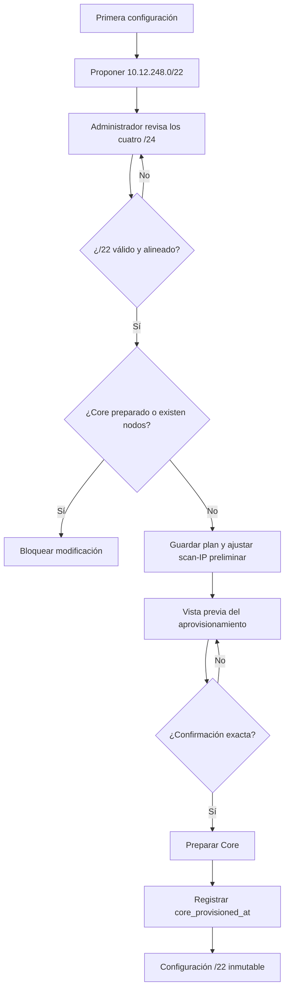

# Plan de implementación — supernet de gestión `/22` en primera instalación

**Fecha:** 2026-08-15
**Producto:** Joinpoint NOC / GestionVPN
**Rama:** `vps_prod`
**Estado:** implementación local avanzada; pendiente de endurecimiento final y despliegue.
**Supuesto de despliegue:** antes de activar esta arquitectura se eliminarán todos
los sitios y sus dependencias. La aplicación se tratará como una instalación sin
datos operativos, conservando únicamente la cuenta del Administrador de
plataforma y toda la información/configuración perteneciente a Administración.
El borrado real requiere respaldo, preview y autorización explícita aparte.

## 1. Objetivo

Permitir que el Administrador de plataforma seleccione una única red privada
`/22` durante la preparación inicial del MikroTik Core. El sistema divide esa
red en cuatro `/24` funcionales y, después del primer aprovisionamiento, la
configuración queda inmutable.

El resultado esperado es reducir las cuatro rutas de retorno instaladas en cada
MikroTik remoto a una sola ruta resumida `/22`, sin perder la separación interna
de WireGuard en el Core.

## 2. Alcance

Incluye:

- Selección y validación del `/22` durante el primer inicio.
- Derivación automática de cuatro `/24`.
- Persistencia global de la decisión.
- Bloqueo posterior desde interfaz y API.
- Uso dinámico de los segmentos en Core, usuarios, VPS y escaneo.
- Una sola ruta `/22` y un solo `allowed-address` resumido en sitios WireGuard.
- Compatibilidad con instalaciones históricas.
- Pruebas, documentación, despliegue y reversión.

No incluye:

- Migrar sitios o datos operativos históricos: se eliminarán antes del arranque limpio.
- Cambiar nodos `10.11.250.0/24` o `10.11.251.0/24`.
- Convertir en una sola interfaz las interfaces WireGuard del Core.
- Aplicar el cambio en caliente después de crear sitios.

## 2.1 Supuesto de reinicio operativo y conservación de datos

Para este plan se asume el siguiente estado inicial:

- Cero sitios/nodos registrados.
- Cero AP, CPE, inventario, métricas, snapshots, torres o relaciones de sitio.
- Cero sesiones de túnel, asignaciones operativas, reglas mangle o VRF asociadas
  a sitios anteriores.
- Cero miembros/moderadores, invitaciones o workspaces de clientes que dependan
  de los sitios eliminados, salvo que el Administrador autorice expresamente su
  conservación antes del borrado.
- Se conserva el usuario Administrador de plataforma y su acceso.
- Se conserva toda la información del área Administración: ajustes globales,
  identidad/branding, SMTP y notificaciones, configuración de seguridad,
  parámetros del sistema y demás datos administrativos no dependientes de sitios.

### Matriz de conservación

| Conservar | Eliminar como dependencia operativa |
| --- | --- |
| Cuenta e identidad del Administrador de plataforma | Sitios y nodos SSTP/WireGuard |
| Credenciales y configuración administrativa vigentes | AP, CPE, torres, inventario y relaciones RF |
| `app_settings` administrativos, salvo claves de red que deban reinicializarse | Métricas, snapshots, monitoring y diagnósticos ligados a sitios |
| Branding, SMTP, reportes, seguridad y preferencias de Administración | Sesiones, asignaciones, invitaciones y membresías ligadas a clientes eliminados |
| Auditoría administrativa que no contenga secretos | Objetos RouterOS de sitios: peers, PPP, VRF, rutas y mangle |

Antes de ejecutar el borrado se elaborará un inventario real de tablas y objetos
RouterOS. La frase “toda la información de Administración” prevalece: ante una
duda de pertenencia, el dato se conserva y se clasifica antes de eliminarlo.

## 3. Diseño de red aprobado

Bloque recomendado: `10.12.248.0/22`.

| Orden | Función | Red derivada | Gateway/uso esperado |
| --- | --- | --- | --- |
| 0 | Escaneo por workspace | `10.12.248.0/24` | IP virtual por workspace, transportada por `VPN-WG-VPS` |
| 1 | Moderadores y miembros | `10.12.249.0/24` | Core `.1`, peers desde `.20` |
| 2 | VPS | `10.12.250.0/24` | Core `.1`, VPS `.60` |
| 3 | Administración | `10.12.251.0/24` | Core `.1`, peers desde `.20` |

La supernet comprende exactamente `10.12.248.0–10.12.251.255`.

### Regla de enrutamiento

- En el **Core**, los `/24` continúan como rutas y redes separadas porque usan
  interfaces WireGuard diferentes.
- En el **sitio remoto**, los cuatro retornos usan `WG-CORE-ISP`; por eso se
  genera únicamente `10.12.248.0/22 → WG-CORE-ISP`.

## 4. Proceso funcional

### Inicio

El Administrador entra a **Ajustes → Servidor VPN → Preparar servidor desde
cero**, antes de crear nodos operativos.

### Flujo principal

1. El sistema propone `10.12.248.0/22`.
2. El Administrador puede reemplazarlo por otro `10.x.x.0/22` alineado.
3. La interfaz muestra los cuatro `/24` derivados.
4. El Administrador guarda la preparación.
5. El backend valida formato, alineación, rango, permisos y estado inicial.
6. Si existe una scan-IP preliminar del workspace administrador, conserva su
   último octeto y la traslada al nuevo `/24` de escaneo.
7. La vista previa del Core incluye el plan de red.
8. El Administrador confirma `PREPARAR DESDE CERO`.
9. El Core crea interfaces, gateways, peer del VPS, listas y reglas usando el
   plan derivado.
10. Se registra `core_provisioned_at`; desde ese momento el `/22` queda fijado.

## 5. Reglas de negocio y seguridad

| ID | Regla |
| --- | --- |
| RN-01 | Sólo `platform_admin` puede crear o consultar la configuración sensible. |
| RN-02 | Sólo se acepta IPv4 privada dentro de `10.0.0.0/8`, máscara exacta `/22`. |
| RN-03 | El tercer octeto debe ser múltiplo de cuatro y no superar 252. |
| RN-04 | El valor se normaliza a `10.X.Y.0/22`; no se admiten IP host ni otras máscaras. |
| RN-05 | Si existe `core_provisioned_at` o al menos un nodo, cambiar la red devuelve `409 MGMT_SUPERNET_LOCKED`. |
| RN-06 | Reenviar el mismo valor es idempotente. |
| RN-07 | Tras el borrado controlado, el sistema debe confirmar cero sitios y dependencias antes de habilitar el `/22`. |
| RN-08 | El Administrador y toda la configuración de Administración se conservan; ningún borrado ambiguo se ejecuta automáticamente. |
| RN-09 | El Core conserva tres interfaces WireGuard y los `/24` funcionales separados. |
| RN-10 | Sólo los scripts de sitios remotos resumen el retorno en `/22`. |

## 6. Modelo de datos

Primera versión: reutilizar `app_settings`.

| Clave | Propósito | Mutabilidad |
| --- | --- | --- |
| `management_supernet` | Supernet seleccionada y normalizada | Sólo antes del primer Core/nodo |
| `core_provisioned_at` | Sello de activación y bloqueo | Escritura al completar el Core |

No se guardan los cuatro `/24` por separado: se derivan siempre desde la
supernet para evitar divergencias.

### Persistencia implementada

El guardado de `management_supernet`, la reasignación preliminar de
`workspace_scan_ip` y la auditoría se ejecutan en una sola transacción. La
configuración en memoria sólo se activa después del `COMMIT`; si alguna scan-IP
falla, toda la operación conserva el estado anterior.

## 7. Impacto por módulo

| Módulo | Cambio requerido | Estado local |
| --- | --- | --- |
| `server/lib/mgmtNet.js` | Validar, derivar y activar el `/22`; exponer retorno remoto resumido | Implementado |
| `server/db/repos/scanIpRepo.js` | Obtener dinámicamente el `/24` de escaneo | Implementado |
| `server/lib/managementNetworkService.js` | Preview autoritativo, solapamientos, transacción, auditoría e idempotencia | Implementado |
| `server/routes/settings.routes.js` | Autorizar y exponer preview/guardado inicial | Implementado |
| `server/index.js` | Restaurar la configuración al arrancar | Implementado |
| `server/lib/coreServerService.js` | Incluir la red en preview/aprovisionamiento y detectar direcciones Core solapadas | Implementado |
| Rutas de nodos | Mantener `/24` en VRF del Core y entregar `/22` al CPE remoto | Implementado |
| Administración frontend | Campo inicial, desglose y estado bloqueado | Implementado |
| Contratos | Tipar plan, bloqueo, errores y preview autoritativo | Implementado |
| Documentación | Runbook para instalación nueva y compatibilidad histórica | Pendiente de completar en despliegue |

## 8. Fases de implementación

### Fase 0 — Congelar decisiones

- Confirmar orden fijo: escaneo, clientes, VPS y administración.
- Confirmar hosts reservados: `.1` Core, `.60` VPS, `.20+` usuarios, `.2+` scan.
- Confirmar que el cambio aplica solamente a instalaciones nuevas.

**Salida:** arquitectura aprobada y sin decisiones abiertas.

### Fase 1 — Dominio y validación

- Centralizar parseo y derivación en backend.
- Rechazar `/22` no alineados, rangos públicos, host bits y máscaras distintas.
- Añadir pruebas de límites: `10.0.0.0/22`, `10.255.252.0/22`, tercer octeto
  no múltiplo de cuatro y valores malformados.
- Evitar lógica duplicada frontend/backend como fuente de verdad: el frontend
  puede previsualizar, pero la respuesta del backend debe ser autoritativa.

**Criterio de aceptación:** ninguna configuración inválida llega a persistencia.

### Fase 2 — Persistencia inicial atómica

- Guardar `management_supernet` dentro de una transacción.
- Bloquear si existe `core_provisioned_at` o cualquier nodo.
- Reubicar scan-IP preliminares dentro de la misma transacción.
- Verificar colisiones por `uq_wsi_ip` antes del `COMMIT`.
- Registrar auditoría del actor, valor elegido y fecha.

**Criterio de aceptación:** ante cualquier error, supernet y scan-IP permanecen
en el estado anterior.

### Fase 3 — Aprovisionamiento del Core

- Leer exclusivamente el plan persistido.
- Crear:
  - `VPN-WG-VPS` sobre el `/24` VPS.
  - `VPN-WG-CLIENTES` sobre el `/24` clientes.
  - `VPN-WG-ADMIN` sobre el `/24` administración.
  - Peer VPS con IP `.60/32` y `/24` de escaneo.
- Ajustar `LIST-MGMT-TRUSTED`, `vpn-activa`, API/API-SSL/Winbox y firewall.
- Registrar `core_provisioned_at` sólo después de completar y verificar el Core.

**Criterio de aceptación:** health confirma tres interfaces, gateways correctos,
peer VPS y listas sin duplicados.

### Fase 4 — VPS y escaneo

- Generar/validar `wg0.conf` con la IP VPS derivada y el `/24` de scan.
- Mantener el autosync de LAN de sitios en `AllowedIPs`.
- Asignar una scan-IP única por workspace desde el `/24` derivado.
- Verificar que mangle, monitor y escaneo usan la fuente dinámica.

**Criterio de aceptación:** dos workspaces pueden escanear en paralelo sin fuga
de VRF y el tráfico retorna por `VPN-WG-VPS`.

### Fase 5 — Sitios remotos

- Generar un único `allowed-address=<supernet>/22` en el peer del Core.
- Generar una única ruta `dst-address=<supernet>/22 gateway=WG-CORE-ISP`.
- No resumir las LAN de los sitios ni las redes de nodos.
- Mantener distancia, comentario e idempotencia actuales.

**Criterio de aceptación:** un CPE nuevo contiene una ruta de retorno, no cuatro,
y alcanza clientes, administrador, VPS y origen de escaneo.

### Fase 6 — Interfaz de primera instalación

- Mostrar valor recomendado y cuatro tarjetas derivadas.
- Mostrar errores antes de guardar.
- Deshabilitar edición cuando el backend indique estado bloqueado.
- Incluir la supernet y las subredes en la vista previa de preparación.
- Exigir confirmación exacta para ejecutar el Core.

**Criterio de aceptación:** el usuario conoce el resultado antes de cualquier
cambio en RouterOS y no puede editar después.

### Fase 7 — Reinicio operativo controlado

- Crear respaldo verificable de MySQL, RouterOS y configuración del VPS.
- Ejecutar preview de impacto antes de borrar cualquier sitio.
- Eliminar sitios y dependencias mediante la cascada segura.
- Limpiar exclusivamente objetos RouterOS pertenecientes a esos sitios.
- Preservar Administrador y configuración administrativa.
- Verificar conteos cero de nodos, AP, CPE, sesiones y objetos operativos.
- Limpiar o reinicializar sólo las claves de red necesarias para el nuevo `/22`.

**Criterio de aceptación:** el inventario posterior muestra cero datos de sitios,
el Administrador puede iniciar sesión y toda Administración conserva su información.

### Fase 8 — Pruebas

Ejecutar:

- Unitarias de derivación `/22 → 4 × /24`.
- Integración de permisos, validación, idempotencia y bloqueo.
- Transacción y rollback de scan-IP.
- Provisionamiento Core con RouterOS simulado.
- Generación de script CPE con una sola ruta.
- Regresión del escenario limpio con datos administrativos preservados.
- Suite backend y frontend completas.
- `check:all`, build, lint, inventario de rutas y análisis de seguridad.

**Estado actual:** backend `113/664`, frontend `73/263`, pruebas transaccionales,
`check:all`, build, inventario de seguridad, Semgrep `514/0` y
`git diff --check` correctos. Falta el canary de instalación nueva en RouterOS
7.x y la validación operativa integral de reinicio/rollback.

### Fase 9 — Despliegue controlado

1. Validar primero todo el flujo en un RouterOS 7.x de laboratorio limpio.
2. Respaldar y restaurar de prueba MySQL, RouterOS y `wg0.conf`.
3. En el entorno objetivo, generar preview de eliminación y matriz conservar/eliminar.
4. Obtener autorización explícita para el borrado material.
5. Eliminar sitios y dependencias; verificar que Administración permanezca intacta.
6. Desplegar backend/frontend con la nueva arquitectura.
7. Elegir `10.12.248.0/22` y ejecutar preview del Core.
8. Preparar el Core desde cero.
9. Crear un workspace, un usuario y un sitio canary WireGuard.
10. Validar administración, acceso del cliente, API desde VPS y escaneo.
11. Reiniciar backend, VPS y Core para comprobar persistencia.

## 9. Matriz de pruebas de aceptación

| Escenario | Resultado esperado |
| --- | --- |
| Guardar `10.12.248.0/22` en instalación limpia | 200; muestra cuatro `/24` correctos |
| Guardar `10.12.249.0/22` | 422 `MGMT_SUPERNET_INVALID` |
| Guardar `192.168.0.0/22` | 422 |
| OWNER no administrador intenta guardar | 403 |
| Repetir el mismo `/22` antes/después del Core | Idempotente, sin cambios |
| Cambiar el `/22` después del Core | 409 `MGMT_SUPERNET_LOCKED` |
| Cambiar el `/22` con nodos existentes | 409 |
| Scan-IP preliminar `.7` | Se convierte a `10.12.248.7` |
| Falla una reasignación de scan-IP | Rollback completo |
| Reiniciar backend | Recupera el mismo plan persistido |
| Generar sitio WG | Un `allowed-address /22` y una ruta `/22` |
| Revisar VRF del Core | Tres rutas MGMT `/24` + ruta scan `/24` con gateways correctos |
| Inventario tras el borrado | Cero sitios/dependencias; Administrador y Administración intactos |

## 10. Riesgos y mitigaciones

| Riesgo | Impacto | Mitigación |
| --- | --- | --- |
| Borrar información administrativa por una relación ambigua | Pérdida de configuración crítica | Matriz conservar/eliminar, preview, respaldo restaurado y bloqueo ante ambigüedad |
| Guardado parcial de setting/scan-IP | Escaneo inconsistente | Transacción única y rollback |
| Resumir rutas dentro del Core | Gateway incorrecto | Resumir sólo en CPE remoto |
| Colisión con LAN del operador | Rutas ambiguas | Preview de solapamientos antes del aprovisionamiento |
| Configuración UI distinta del backend | Plan engañoso | Backend autoritativo y contrato tipado |
| Marcar Core preparado antes de terminar | Ajuste bloqueado en fallo parcial | Escribir `core_provisioned_at` al final, después de verificar |
| Reinicio pierde configuración | Cambio de redes efectivo | Cargar `management_supernet` durante bootstrap y probar restart |

## 11. Rollback

Antes de `core_provisioned_at`, el rollback restaura setting y scan-IP mediante
la transacción.

Si falla el aprovisionamiento del Core:

1. No registrar `core_provisioned_at`.
2. Retirar sólo objetos con comentario `GVPN:` creados por la operación.
3. Restaurar backup RouterOS si la limpieza selectiva no es concluyente.
4. Restaurar `wg0.conf` del VPS y recargar con `wg syncconf`.
5. Verificar acceso administrativo por una segunda sesión antes de cerrar la
   sesión de mantenimiento.

Si ya se creó el sitio canary, cambiar el `/22` deja de ser un rollback y pasa a
ser una migración de red separada. Ante fallo se restaura el respaldo previo al
reinicio operativo, incluyendo la información administrativa conservada.

## 12. Definition of Done

- El Administrador puede elegir un `/22` válido sólo en primera instalación.
- Backend y frontend muestran la misma derivación.
- El guardado y la reasignación inicial de scan-IP son atómicos.
- El Core conserva separación por `/24` e interfaz.
- El sitio remoto recibe una sola ruta `/22`.
- El ajuste es inmutable después del primer Core o nodo.
- El estado inicial confirma cero sitios y dependencias operativas.
- El Administrador y toda la información de Administración permanecen intactos.
- Suite completa, build, lint, seguridad y canary de laboratorio en verde.
- Documentación de instalación, verificación y rollback actualizada.
- Producción no se modifica sin una autorización posterior y explícita.

## 13. Pendientes antes de autorizar despliegue

1. Probar un Core RouterOS 7.x limpio y un CPE real o de laboratorio.
2. Validar reinicio completo y rollback.
3. Actualizar `DESPLIEGUE_VPS.md`, ejemplos de entorno y manual de instalación.
4. Aprobar el inventario de conservación/eliminación antes de borrar. Borrador técnico: `docs/implementation/INVENTARIO_REINICIO_OPERATIVO_2026-08-15.md`.
