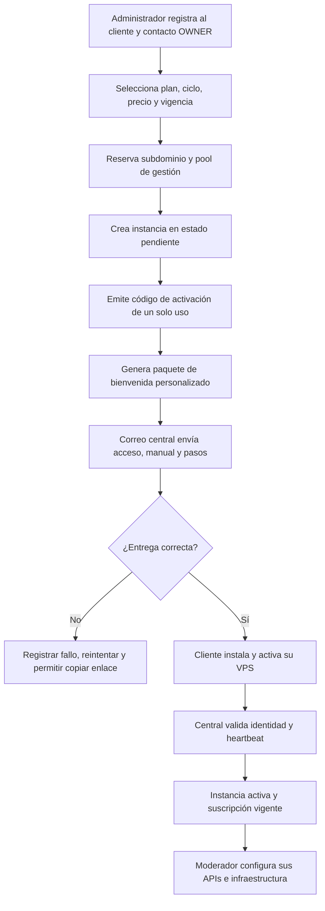

# Estudio de implementación — Administración comercial y configuración de Joinpoint Central

Fecha: 2026-08-16  
Estado: propuesta funcional y técnica previa a implementación

## 1. Resultado de la evaluación

El administrador desplegado actualmente es un **MVP técnico del control plane**. Permite autenticar al administrador, crear un cliente básico, crear un plan con nombre/código/descripción, registrar una instancia y emitir códigos/licencias mediante API. No constituye todavía el administrador comercial completo acordado.

Brechas confirmadas:

- El formulario de planes descarta las capacidades que el backend ya acepta: siempre envía `entitlements: []`.
- No existen precios mensuales/anuales, moneda, límites configurables, versión comercial ni vista de detalle del plan.
- El cliente solo conserva razón social, nombre visible y RUC/identificación; faltan contactos, propietario, dirección, teléfonos y datos de facturación.
- No hay una ficha unificada Cliente → Instancia → Suscripción → Facturas → Pagos → Activaciones → Historial.
- Solo se puede crear una suscripción inicial por API; no hay bandeja ni acciones para renovar, cambiar de plan, conceder gracia, suspender, reactivar o cancelar.
- No existen facturas internas, pagos parciales, comprobantes, verificación humana ni canales de cobro.
- No existe configuración administrativa de correo, plantillas, Telegram, dominio, branding o políticas comerciales.
- No hay envío automático del paquete de bienvenida/manual al dar de alta al cliente.
- No hay cola de notificaciones, reintentos, trazabilidad de entrega ni prueba de configuración.
- No hay métricas comerciales ni alertas de vencimiento, instancias sin activar o comunicaciones fallidas.

## 2. Separación obligatoria de configuraciones

### 2.1 Integraciones de Joinpoint Central — propiedad del Administrador

Central requiere credenciales propias para operar el negocio:

- **Correo transaccional central:** alta del cliente, invitación, código o enlace de activación, manual de instalación/configuración, recuperación administrativa, emisión y vencimiento de facturas, pagos confirmados/rechazados, renovación, suspensión y reactivación.
- **Telegram central (opcional):** alertas privadas al administrador sobre altas, activaciones, VPS sin heartbeat, vencimientos, pagos pendientes y fallos de entrega. En una fase posterior puede usarse como canal del cliente, únicamente con consentimiento y vinculación explícita.
- **Dominio y marca:** `joinpoint.cloud`, remitente, nombre comercial, logo, soporte y enlaces públicos.
- **Facturación:** moneda, anticipación de facturas, numeración, identidad comercial y medios de pago.

Estas credenciales pertenecen a Joinpoint y se guardan cifradas en el VPS administrador.

### 2.2 Integraciones de la instancia del cliente — propiedad del Moderador

Cada moderador configura en su propio VPS:

- Telegram Bot API para sus alertas operativas.
- Google Gemini API para las funciones de IA contratadas.
- SMTP o proveedor de correo para sus usuarios y reportes operativos.
- MikroTik Core/local, IP pública del VPS y parámetros técnicos permitidos.

Central debe conocer solamente el **estado** de esas integraciones (configurada, saludable, error, última comprobación), nunca recuperar ni copiar sus secretos. La licencia define si la capacidad está incluida en el plan.

## 3. Proceso objetivo de alta

El código de activación debe mostrarse una sola vez y enviarse preferentemente dentro de un enlace de activación con expiración. El correo no debe contener contraseñas permanentes. El administrador debe poder revocar el código, emitir otro y reenviar el paquete.

## 4. Módulos requeridos en el Administrador

| Módulo | Alcance mínimo |
| --- | --- |
| Dashboard | Clientes, MRR/ARR estimado, suscripciones por estado, vencimientos 7/15/30 días, pagos pendientes, instancias sin activar/sin heartbeat y entregas fallidas. |
| Clientes | CRUD no destructivo, contacto OWNER, datos legales/comerciales, estado, notas y ficha 360°. |
| Planes | Nombre/código, descripción, mensual/anual, moneda, impuestos configurables, límites, capacidades, vigencia de precios, activar/desactivar y duplicar. |
| Suscripciones | Plan, ciclo, vigencia, trial, gracia, estado efectivo, cambio de plan, renovación, suspensión, reactivación y cancelación con motivo. |
| Facturación y pagos | Factura interna, vencimiento, pagos completos/parciales, comprobante, verificación, aplicación e historial. No representa comprobante SUNAT en la primera versión. |
| Instancias | VPS, IP, subdominio, versión, heartbeat, pool `/22`, identidad, código de activación, licencia, estado y acciones seguras. |
| Comunicaciones | Plantillas, destinatarios, adjuntos/manuales, cola, estado de entrega, reintento y vista previa. |
| Configuración | Correo central, Telegram central, dominio/marca, identidad comercial, canales de pago, políticas y seguridad. |
| Auditoría | Actor, fecha, IP, acción, motivo, valores anteriores/nuevos y resultado. Sin eliminación desde UI. |

## 5. Diseño completo del plan

El formulario de plan debe ser una pantalla o asistente, no tres campos en línea.

### Identidad

- Código estable: `BASIC`, `INTERMEDIATE`, `ADVANCED` u otro.
- Nombre comercial, descripción corta y descripción para venta.
- Estado: borrador, activo, archivado.
- Orden de presentación y marca como recomendado.

### Precios

- Moneda, inicialmente PEN.
- Precio mensual y anual.
- Descuento anual explícito o precio final.
- Impuesto configurable y fecha desde la que rige el precio.
- Precio personalizado por cliente sin alterar el catálogo.

### Límites y capacidades canónicas

- `sites.manage`, `sites.max`.
- `members.manage`, `members.max`.
- `devices.scan`, `devices.persist`, `devices.inventory`.
- `ap_monitor.use`, `diagnostics.use`, `exports.advanced`.
- `notifications.email`, `notifications.telegram`.
- `ai_air_os.use`; los días de piloto se administran como concesión separada.
- Límites técnicos de concurrencia y uso razonable, incluso cuando comercialmente figure “ilimitado”.

Las capacidades se validan siempre en el backend. La interfaz solo explica el resultado. Un downgrade nunca elimina datos; bloquea nuevas altas o muestra módulos en solo lectura según la capacidad.

## 6. Modelo de datos recomendado

| Entidad | Propósito |
| --- | --- |
| `customers` + `customer_contacts` | Identidad legal, comercial y contactos; un contacto principal OWNER. |
| `subscription_plans` | Catálogo y presentación del plan. |
| `subscription_plan_prices` | Precio histórico por ciclo, moneda y vigencia. |
| `plan_entitlements` | Capacidades y límites canónicos. |
| `subscriptions` | Suscripción comercial vigente asociada a la instalación contratada. |
| `subscription_events` | Historial append-only de cambios comerciales. |
| `billing_invoices` | Obligación y periodo a activar, con snapshots de precio/empresa. |
| `subscription_payments` | Pago y comprobante con verificación humana. |
| `invoice_payments` | Aplicación parcial o total de pagos. |
| `product_instances` | Instalación/VPS del cliente e identidad operativa. |
| `activation_codes` | Código de un solo uso, hash, vencimiento, consumo y revocación. |
| `notification_providers` | Configuración cifrada y versionada de correo/Telegram central. |
| `notification_templates` | Asunto/cuerpo/versiones por evento e idioma. |
| `notification_deliveries` | Cola, intentos, proveedor, destinatario, estado y error seguro. |
| `welcome_packages` | Versión del manual, enlaces, instancia y entrega asociada. |
| `platform_settings` | Dominio, branding, zona horaria y políticas no secretas. |
| `control_plane_audit_events` | Auditoría transversal. |

### Decisión de pertenencia

En el nuevo modelo un cliente puede tener una o más instancias en el futuro. Por ello, la suscripción debe relacionarse con el **contrato/instalación facturable**, no directamente con un usuario. Para el lanzamiento, una instancia principal por cliente y una suscripción vigente por instancia es suficiente, manteniendo el esquema preparado para múltiples instalaciones. Dentro del VPS cliente, esa licencia se aplica al workspace completo (OWNER y MEMBER).

## 7. Estados y reglas

Estados efectivos: `TRIAL`, `ACTIVE`, `GRACE`, `PAST_DUE`, `SUSPENDED`, `CANCELED`.

- `SUSPENDED` y `CANCELED` prevalecen sobre las fechas.
- La gracia exige fecha final, motivo y administrador responsable.
- Confirmar un pago completo puede activar o extender una vigencia de manera idempotente.
- Un pago parcial no renueva hasta cubrir el total de la factura.
- Suspender no borra usuarios, sitios, equipos, WireGuard, históricos ni configuración.
- El cliente suspendido puede iniciar sesión únicamente para conocer su estado y renovar.
- La continuidad base de WireGuard no depende de que Central esté disponible; la licencia firmada conserva una gracia offline controlada.
- Reactivar no levanta túneles temporales automáticamente.
- Todo cambio sensible exige motivo, confirmación y auditoría.

## 8. Correo de bienvenida y manual

### Contenido mínimo

- Nombre del cliente y contacto.
- URL asignada: `<cliente>.joinpoint.cloud`.
- Estado del VPS e IP pública esperada.
- Enlace/código de activación con caducidad.
- Manual versionado para instalar o validar Joinpoint.
- Pasos para enlazar el MikroTik local con la IP pública del VPS.
- Pool `/22` recomendado y aclaración de que se define en la primera inicialización.
- Pasos para configurar en el VPS cliente sus propias APIs de correo, Telegram y Gemini.
- Canal de soporte y advertencias de seguridad.

El manual debe generarse desde una plantilla versionada y publicarse mediante URL firmada con caducidad; puede adjuntarse un PDF pequeño, pero el enlace versionado evita enviar instrucciones obsoletas. Cada entrega guarda versión, destinatario, fecha y resultado.

### Configuración del correo central

- Proveedor SMTP o API transaccional.
- Host, puerto, TLS, usuario y secreto cifrado.
- Remitente y `reply-to`.
- Botón **Probar configuración** con destinatario elegido.
- Estado, latencia, último éxito/error y rotación de credenciales.
- Cola persistente con reintentos exponenciales y prevención de duplicados.

Se recomienda soportar SMTP genérico y un proveedor por API. Gmail puede servir para piloto, pero para producción conviene un proveedor transaccional con reputación, métricas y gestión de rebotes. La configuración DNS de correo debe contemplar SPF, DKIM y DMARC.

## 9. Telegram central

- Token cifrado; nunca se vuelve a mostrar tras guardarlo.
- Detección del bot mediante `getMe` y botón de prueba.
- Vinculación del chat del administrador mediante código temporal.
- Preferencias por evento y severidad.
- Alertas: cliente creado, activación consumida/fallida, heartbeat perdido, suscripción próxima a vencer, pago pendiente y correo fallido.
- La operación comercial no debe depender exclusivamente de Telegram; es canal complementario.

## 10. APIs y seguridad

- CRUD versionado para clientes, contactos, planes, precios y capacidades.
- Acciones explícitas para suscripción: `assign`, `renew`, `change-plan`, `grant-grace`, `suspend`, `reactivate`, `cancel`.
- Acciones explícitas para factura/pago; no editar silenciosamente registros pagados.
- Endpoints de configuración devuelven secretos enmascarados y estado, nunca el valor guardado.
- Cifrado autenticado para secretos con clave fuera de la base de datos y rotación versionada.
- CSRF, reautenticación MFA para secretos/suspensiones, rate limiting e idempotency keys.
- Jobs con outbox transaccional para que crear un cliente y programar su bienvenida no se pierdan entre transacciones.
- Webhooks firmados y allowlist únicamente cuando se integren pagos automáticos.

## 11. Fases de implementación

### Fase 0 — decisiones y contrato funcional

- Confirmar precios/capacidades iniciales y reglas de impuestos.
- Confirmar si una empresa podrá comprar varias instancias desde el lanzamiento.
- Aprobar eventos y contenido del paquete de bienvenida.
- Elegir proveedor de correo inicial y alcance de Telegram.

### Fase 1 — fundación de datos y servicios

- Migraciones aditivas para contactos, precios, eventos, configuración segura y cola.
- Servicios de estado efectivo, entitlements y auditoría.
- Compatibilidad con datos actuales sin borrarlos.
- Pruebas de transacciones, concurrencia, cifrado y aislamiento.

### Fase 2 — Clientes y Planes completos

- Ficha 360° del cliente.
- Editor completo de planes, precios y capacidades.
- Versionado/archivado; impedir romper suscripciones históricas.
- Vista previa del plan tal como lo verá el cliente.

### Fase 3 — Suscripciones, facturación y pagos

- Bandeja, ficha, estados y acciones comerciales.
- Facturas internas, pagos parciales y comprobantes.
- Renovación idempotente y métricas comerciales.

### Fase 4 — Configuración y comunicaciones

- Correo central, prueba, plantillas, cola y entregas.
- Manual versionado y paquete de bienvenida automático.
- Telegram central y preferencias.
- SPF/DKIM/DMARC y observabilidad de rebotes/fallos.

### Fase 5 — Instancias, activación y licencias integradas

- Asistente de alta extremo a extremo.
- Reserva de subdominio/pool, código de un uso y reenvío seguro.
- Heartbeat, versión, licencia, gracia offline y suspensión no destructiva.

### Fase 6 — Aplicación en el VPS cliente

- Sincronizar entitlements firmados.
- Pantalla de suscripción vencida y bloqueos backend.
- Pantalla del moderador para sus propias APIs y estado del VPS/MikroTik.

### Fase 7 — validación y despliegue gradual

- Datos sintéticos en staging, no clientes reales.
- Pruebas de alta, entrega, activación, renovación, downgrade y suspensión.
- Canary con un único cliente piloto y rollback de aplicación/migración compatible.
- Monitoreo de errores, auditoría y recuperación antes de ampliar.

## 12. Criterios de aceptación del primer incremento útil

1. El administrador crea un plan con precios mensual/anual y todas las capacidades acordadas.
2. Registra un cliente y contacto principal con correo válido.
3. Asigna plan, vigencia, subdominio, IP y pool `/22`.
4. Central genera un código de activación de un solo uso.
5. Central envía automáticamente un correo de bienvenida con manual versionado y registra la entrega.
6. Si el correo falla, se reintenta y el administrador puede copiar/regenerar el enlace sin perder el alta.
7. La ficha muestra cliente, instancia, suscripción, activación, comunicación e historial.
8. Cada acción queda auditada y ningún secreto se expone en respuestas o logs.

## 13. Riesgos que deben evitarse

- Implementar solo formularios visuales sin enforcement en backend.
- Guardar tokens SMTP/Telegram/Gemini en texto claro o devolverlos a la UI.
- Enviar contraseñas permanentes por correo.
- Confundir las APIs del Administrador con las APIs privadas del cliente.
- Atar la conectividad WireGuard permanente a una llamada en línea a Central.
- Cambiar un plan histórico y alterar licencias/facturas ya emitidas.
- Suspender eliminando infraestructura o datos.
- Enviar el manual antes de confirmar que el subdominio, instancia y activación pertenecen al mismo cliente.
- Automatizar pagos antes de estabilizar el flujo manual y la idempotencia.

## 14. Orden recomendado inmediato

El primer bloque a implementar debe ser **Planes completos + Contactos del cliente + Configuración de correo central + paquete de bienvenida**, porque corrige la limitación visible actual y habilita un alta real. Después deben incorporarse Suscripciones/Facturación y, finalmente, unir ese flujo con activaciones, heartbeat y enforcement en el VPS cliente.
