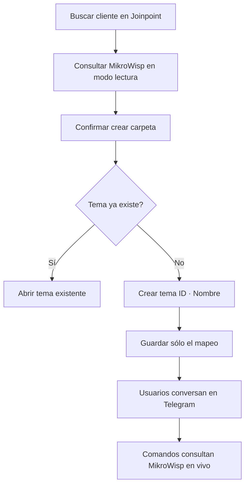

# Plan acotado: MikroWisp + control de temas Telegram

Fecha: 2026-08-28  
Estado: definición funcional; sin implementación ni despliegue

## Objetivo

Crear en Joinpoint un módulo sencillo para administrar un supergrupo privado de Telegram con foro, sus temas por cliente y sus participantes. MikroWisp se usará únicamente para consultar datos actuales del cliente.

## Reglas confirmadas

1. **MikroWisp es estrictamente de solo lectura.** Joinpoint nunca creará, editará, activará, suspenderá, facturará ni modificará información en MikroWisp.
2. El ID de cliente MikroWisp es su identificador externo único dentro del workspace.
3. Los catálogos externos son extensibles; no se limitan a planes y nodos.
4. La actualización de catálogos será manual y bajo demanda.
5. Si falta un nombre de catálogo, la consulta no falla: muestra el ID recibido y `Pendiente de sincronizar`.
6. Nunca se muestran ni almacenan credenciales PPP/Hotspot, contraseñas, token MikroWisp ni comunidad SNMP.
7. Joinpoint **no guarda mensajes, archivos ni conversaciones** del grupo. Todo ese contenido permanece sólo en Telegram.
8. Joinpoint conserva únicamente los metadatos necesarios para controlar grupos, temas y participantes.

## Módulo propuesto: Clientes en Telegram

### Grupo

- Vincular un supergrupo privado ya creado en Telegram.
- Validar que tenga modo foro habilitado.
- Mostrar nombre, estado del grupo y permisos del bot.
- Un workspace puede iniciar con un solo grupo `Historial de clientes`.

### Carpetas de clientes

En Telegram son **temas del foro**.

- Buscar un cliente en MikroWisp por ID, documento o teléfono.
- Crear manualmente un tema con nombre `ID · Nombre del cliente`.
- Evitar dos temas activos del mismo cliente.
- Listar y monitorear desde Joinpoint: cliente, ID, nombre del tema, identificador Telegram, estado, fecha y creador.
- Estados: activo, cerrado, eliminado o requiere reparación.
- Abrir el tema directamente en Telegram.
- Cerrar, reabrir o recrear el tema con confirmación.

Joinpoint no lee ni replica lo escrito dentro del tema.

### Participantes

- Listar usuarios Joinpoint autorizados y su vinculación Telegram.
- Mostrar estado: invitación pendiente, miembro activo, retirado o no verificado.
- **Agregar:** desde Joinpoint se ordena al bot generar una invitación individual o aprobar una solicitud de ingreso. Telegram no permite forzar el alta silenciosa de una persona.
- **Retirar:** desde Joinpoint se ordena al bot retirar o bloquear al usuario del supergrupo.
- **Reintegrar:** levantar el bloqueo si corresponde y emitir una invitación nueva.
- Auditar quién invitó, aprobó, retiró o reintegró a una persona.

La membresía es para todo el grupo: Telegram no permite dar acceso a un tema y ocultar los demás a ese mismo miembro.

### Consulta dentro del tema

- `/informacion`: datos permitidos del cliente.
- `/servicios`: servicios, plan/perfil y nodo con nombres resueltos.
- `/facturacion`: cantidad y total de facturas pendientes.
- `/ayuda`: comandos disponibles.

El bot identifica al cliente por el tema; el usuario no vuelve a escribir su ID. Cada comando consulta MikroWisp en ese momento y descarta la respuesta después de mostrarla.

## Datos mínimos en Joinpoint

| Registro | Datos permitidos |
| --- | --- |
| Integración MikroWisp | URL, token cifrado, estado y fecha de validación. |
| Catálogo externo | Tipo, ID externo, nombre visible y última sincronización. |
| Grupo Telegram | Workspace, chat ID, nombre y estado. |
| Tema Telegram | Grupo, ID externo del cliente, nombre visible, thread ID y estado. |
| Participante | Usuario Joinpoint, Telegram user ID, estado de membresía y fechas. |
| Auditoría | Actor, acción administrativa, resultado y fecha. |

No se crean tablas para mensajes, adjuntos ni historial de conversación.

## Flujo principal

## Fases de implementación

1. **MikroWisp read-only:** integración cifrada, adaptador allowlist y filtrado de secretos.
2. **Catálogos extensibles:** tabla genérica, sincronización manual y fallback al ID.
3. **Grupo y temas:** validar foro/permisos, crear/listar/cerrar/reparar temas y evitar duplicados.
4. **Participantes:** invitación/aprobación, retiro, reintegro y auditoría.
5. **Comandos de consulta:** respuestas filtradas dentro del tema correspondiente.
6. **Canary:** probar primero en un grupo de laboratorio y luego desplegar con backup/rollback.

## Criterios de aceptación

- Ninguna operación de escritura MikroWisp es invocable.
- Ningún mensaje contiene credenciales o secretos.
- Un catálogo faltante no rompe la consulta.
- No existen temas duplicados para el mismo cliente.
- Joinpoint refleja temas eliminados o desincronizados.
- Un usuario retirado pierde acceso al grupo completo.
- Una invitación no equivale a miembro activo hasta que Telegram confirme el ingreso.
- MySQL no almacena conversaciones ni adjuntos de Telegram.

## Decisiones pendientes

1. Confirmar si habrá un solo grupo `Historial de clientes` por workspace.
2. Definir quiénes pueden crear/cerrar temas y agregar/retirar participantes.
3. Confirmar los endpoints de MikroWisp que listan los catálogos externos.
4. Definir los campos exactos visibles en cada comando.

