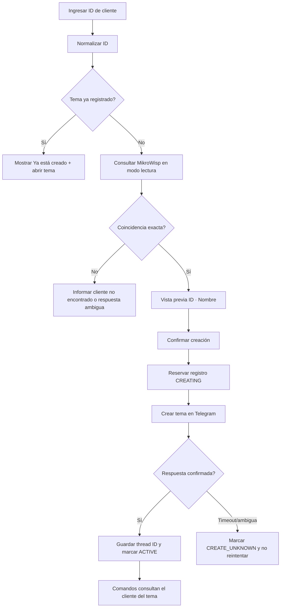

# Plan acotado: MikroWisp + control de temas Telegram

Fecha: 2026-08-28  
Estado: definición funcional; sin implementación ni despliegue

Referencia técnica: [Telegram Bot API](https://core.telegram.org/bots/api).

## Objetivo

Crear en Joinpoint un módulo sencillo para administrar un supergrupo privado de Telegram con foro, sus temas por cliente y sus participantes. MikroWisp se usará únicamente para consultar datos actuales del cliente.

## Reglas confirmadas

1. **MikroWisp es estrictamente de solo lectura.** Joinpoint nunca creará, editará, activará, suspenderá, facturará ni modificará información en MikroWisp.
2. El ID de cliente MikroWisp es su identificador externo único dentro del workspace.
3. Los catálogos externos son extensibles; no se limitan a planes y nodos.
4. La actualización de catálogos será manual y bajo demanda.
5. Si falta un nombre de catálogo, la consulta no falla: muestra el ID recibido y `Pendiente de sincronizar`.
6. Nunca se muestran ni almacenan credenciales PPP/Hotspot, contraseñas, token MikroWisp ni comunidad SNMP.
7. Joinpoint **no guarda mensajes, archivos ni conversaciones** del grupo. Todo ese contenido permanece sólo en Telegram.
8. Joinpoint conserva únicamente los metadatos necesarios para controlar grupos, temas y participantes.
9. El backend no tendrá un método genérico `request(ruta)`: el adaptador MikroWisp expondrá sólo consultas concretas incluidas en una allowlist.

## Módulo propuesto: Clientes en Telegram

### Grupo

- Joinpoint muestra una guía: crear manualmente el grupo en Telegram, convertirlo en supergrupo con foro, agregar el bot como administrador y pegar/enviar el código de vinculación.
- La guía breve permanece visible junto al formulario de vinculación y puede complementarse con un botón `Ver guía PDF`.
- Joinpoint no promete crear el grupo: el Bot API oficial no ofrece esa operación.
- Validar que tenga modo foro habilitado.
- Validar que el bot pueda administrar temas, invitaciones y retiros antes de activar el módulo.
- Mostrar nombre, estado del grupo y permisos faltantes.
- Un workspace puede iniciar con un solo grupo `Historial de clientes`.

### Guía PDF administrada

- El administrador de plataforma puede subir, reemplazar o desactivar un PDF de ayuda para esta integración.
- El usuario ve únicamente la versión activa junto al asistente de vinculación; si no hay PDF, conserva los pasos breves en pantalla y el flujo no se bloquea.
- En el MVP se guarda el archivo activo y sus metadatos mínimos: título, versión, fecha y administrador responsable; no se necesita una biblioteca documental completa.
- La carga acepta sólo PDF real validado por contenido y tipo, con límite de tamaño, nombre interno aleatorio y descarga autenticada. La ruta de almacenamiento no se expone públicamente.
- Cambiar la guía no modifica ni desconecta grupos ya vinculados.

### Carpetas de clientes

En Telegram son **temas del foro**.

- El dato mínimo para crear una carpeta es el ID del cliente.
- Normalizar el ID para que `0014` y `14` no creen carpetas distintas.
- Consultar MikroWisp por ese ID y exigir que la respuesta contenga exactamente al mismo cliente.
- Mostrar el nombre devuelto por MikroWisp en una vista previa; el operador confirma antes de crear.
- Crear el tema con formato obligatorio `ID · Nombre del cliente`.
- El ID debe ser el entero positivo confirmado por MikroWisp; el nombre final usa `${ID canónico} · ${nombre}`.
- Limpiar caracteres de control, espacios repetidos y ajustar el título al máximo de 128 caracteres de Telegram sin perder el ID.
- Evitar dos temas activos del mismo cliente.
- Listar y monitorear desde Joinpoint: cliente, ID, nombre del tema, identificador Telegram, estado, fecha y creador.
- Estados: activo, cerrado, eliminado o requiere reparación.
- Abrir el tema directamente en Telegram.
- Cerrar, reabrir o recrear el tema con confirmación.
- Registrar un tema preexistente mediante un comando administrativo ejecutado dentro de ese tema, porque el Bot API no ofrece una operación para listar todos los temas históricos del foro.

Joinpoint no lee ni replica lo escrito dentro del tema.

Estados internos de creación: `VALIDATING`, `READY`, `CREATING`, `ACTIVE`, `CREATE_UNKNOWN`, `REPAIR_REQUIRED`, `CLOSED`.

### Participantes

- Listar usuarios Joinpoint autorizados y su vinculación Telegram.
- Mostrar estado: invitación pendiente, miembro activo, retirado o no verificado.
- **Agregar:** desde Joinpoint se ordena al bot generar una invitación individual o aprobar una solicitud de ingreso. Telegram no permite forzar el alta silenciosa de una persona.
- **Retirar:** desde Joinpoint se ordena al bot retirar o bloquear al usuario del supergrupo.
- **Reintegrar:** levantar el bloqueo si corresponde y emitir una invitación nueva.
- Auditar quién invitó, aprobó, retiró o reintegró a una persona.

La membresía es para todo el grupo: Telegram no permite dar acceso a un tema y ocultar los demás a ese mismo miembro.

Joinpoint controlará participantes conocidos: usuarios vinculados, invitados o detectados por eventos recibidos mientras el bot esté activo. El Bot API permite consultar un miembro conocido, administradores y conteos, pero no descargar la lista completa de integrantes. La interfaz no debe presentar el registro local como un censo total de Telegram.

Las invitaciones deben ser individuales, con vencimiento y un solo uso. Si se usa solicitud de ingreso, Joinpoint sólo la aprueba después de relacionar la identidad Telegram con el usuario esperado. Retirar usa la operación administrativa del bot; reintegrar exige desbloquear y emitir una nueva invitación.

### Consulta dentro del tema

- `/informacion`: datos permitidos del cliente.
- `/servicios`: servicios, plan/perfil y nodo con nombres resueltos.
- `/facturacion`: cantidad y total de facturas pendientes.
- `/ayuda`: comandos disponibles.

El bot identifica al cliente por el tema; el usuario no vuelve a escribir su ID. Cada comando consulta MikroWisp en ese momento y descarta la respuesta después de mostrarla.

## Datos mínimos en Joinpoint

| Registro | Datos permitidos |
| --- | --- |
| Integración MikroWisp | URL, token cifrado, estado y fecha de validación. |
| Catálogo externo | Tipo, ID externo, nombre visible y última sincronización. |
| Grupo Telegram | Workspace, chat ID, nombre y estado. |
| Tema Telegram | Grupo, ID externo del cliente, nombre visible, thread ID y estado. |
| Participante | Usuario Joinpoint, Telegram user ID, estado de membresía y fechas. |
| Auditoría | Actor, acción administrativa, resultado y fecha. |
| Guía de integración | Clave de integración, título, versión, archivo protegido, estado activo, autor y fecha. |

No se crean tablas para mensajes, adjuntos ni historial de conversación.

## Barreras de solo lectura MikroWisp

La regla se aplica en profundidad:

1. **UI:** no existen botones ni formularios para modificar MikroWisp.
2. **API Joinpoint:** sólo endpoints internos `GET/consulta` con validación de filtros; ningún proxy de ruta libre.
3. **Adaptador:** métodos nominales como `getClientDetails`; allowlist exacta de URL, método y campos enviados.
4. **Red:** URL base validada y fijada por integración para impedir SSRF o redirecciones a destinos no aprobados.
5. **Datos:** DTO de salida por allowlist; elimina PPP, passwords, token, SNMP y campos futuros no reconocidos.
6. **Pruebas:** contrato que falla si aparece una ruta mutadora o si el adaptador acepta una ruta arbitraria.
7. **Observabilidad:** logs guardan resultado, latencia y código interno, nunca token ni request/response completos.

## Flujo principal

## Validaciones y conflictos

| Escenario | Comportamiento esperado |
| --- | --- |
| ID vacío, negativo o inválido | Bloquear antes de llamar MikroWisp. |
| Usuario escribe `0014` y existe `14` | Normalizar al mismo ID canónico y evitar duplicado. |
| MikroWisp devuelve cero clientes | Mostrar `Cliente no encontrado`; no crear tema. |
| MikroWisp devuelve otro ID o varios resultados | Marcar respuesta ambigua; no crear tema. |
| Cliente válido | Mostrar vista previa con ID y nombre; crear sólo tras confirmación. |
| Tema ya registrado | Mostrar `Ya está creado`, estado y botón para abrirlo; no llamar Telegram. |
| Dos operadores crean simultáneamente | Restricción única y bloqueo transaccional: sólo uno llega a Telegram. |
| Telegram acepta pero la respuesta vence | Estado `CREATE_UNKNOWN`; prohibido reintento automático para no duplicar. |
| Telegram crea y luego falla guardar en BD | Intentar eliminar/cerrar el tema como compensación; si no se confirma, dejar alerta de reparación. |
| Tema creado manualmente fuera de Joinpoint | No puede descubrirse por listado; un administrador lo registra desde ese tema antes de crear otro. |
| Tema fue borrado manualmente | Marcar `REPAIR_REQUIRED` al recibir el evento o al fallar una operación; recrear sólo con confirmación. |
| Nombre del cliente cambió | Mostrar diferencia y ofrecer renombrar el tema manualmente; no hacerlo en cada consulta. |
| Nombre demasiado largo/caracteres extraños | Sanitizar y truncar sólo el nombre, conservando siempre el ID. |
| Cliente tiene varios servicios | Mantener un solo tema por cliente y listar servicios dentro de él. |
| Cliente suspendido o retirado | Advertir el estado, pero no borrar automáticamente su tema. |
| Bot sin permiso o grupo sin foro | Bloquear creación y mostrar el paso exacto de la guía que falta. |
| MikroWisp/Telegram no disponible | Error temporal, sin crear registro `ACTIVE` falso ni repetir llamadas ambiguas. |
| Catálogo no sincronizado | Mostrar ID + `Pendiente de sincronizar`; no bloquear la carpeta ni la consulta. |
| Mismo ID en otro workspace | Permitido y aislado; la unicidad siempre incluye `workspace_id + group_id`. |

## Fases de implementación

1. **MikroWisp read-only:** integración cifrada, adaptador sin ruta genérica, allowlist exacta, filtrado de secretos y pruebas negativas de escritura.
2. **Catálogos extensibles:** tabla genérica, sincronización manual y fallback al ID.
3. **Grupo, guía y temas:** publicar pasos breves y PDF administrable, validar foro/permisos, crear/listar los temas conocidos, cerrar/reparar, registrar temas preexistentes y evitar duplicados.
4. **Participantes:** invitación individual/aprobación, eventos futuros, verificación de usuarios conocidos, retiro, reintegro y auditoría.
5. **Comandos de consulta:** respuestas filtradas dentro del tema correspondiente.
6. **Canary:** probar primero en un grupo de laboratorio y luego desplegar con backup/rollback.

## Criterios de aceptación

- Ninguna operación de escritura MikroWisp es invocable.
- El adaptador no acepta rutas arbitrarias ni puede convertirse en proxy hacia MikroWisp.
- Ningún mensaje contiene credenciales o secretos.
- Un catálogo faltante no rompe la consulta.
- No existen temas duplicados para el mismo cliente.
- El ID se normaliza y la unicidad se aplica antes de llamar a Telegram.
- Un timeout ambiguo nunca dispara un reintento automático.
- Joinpoint refleja temas eliminados o desincronizados.
- El administrador puede reemplazar o desactivar la guía PDF y el usuario sólo puede abrir la versión activa mediante acceso autenticado.
- La ausencia o falla del PDF no impide completar la vinculación con la guía en pantalla.
- La UI diferencia temas/participantes controlados de un inventario completo, que Telegram no proporciona.
- Un usuario retirado pierde acceso al grupo completo.
- Una invitación no equivale a miembro activo hasta que Telegram confirme el ingreso.
- MySQL no almacena conversaciones ni adjuntos de Telegram.

## Decisiones pendientes

1. Confirmar si habrá un solo grupo `Historial de clientes` por workspace.
2. Definir quiénes pueden crear/cerrar temas y agregar/retirar participantes.
3. Confirmar los endpoints de MikroWisp que listan los catálogos externos.
4. Definir los campos exactos visibles en cada comando.
