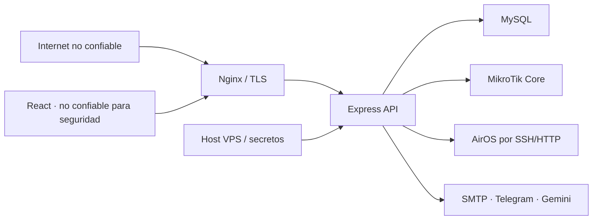

# Modelo de amenazas de autenticación y API

Estado: baseline de Fase 0  
Fecha de revisión inicial: 2026-07-18  
Propietario: equipo mantenedor de GestionVPN

## Propósito

Este documento explica qué protege GestionVPN, de quién debe protegerlo y en qué límites de confianza deben aplicarse controles. Su alcance es la aplicación web, la API Express, la identidad de usuarios y los accesos derivados hacia MySQL, MikroTik y AirOS.

No sustituye una prueba de penetración. Debe actualizarse cuando cambien autenticación, sesiones, exposición de red, proveedores de identidad o capacidades que modifiquen equipos.

## Activos críticos

| Activo | Impacto si se compromete |
| --- | --- |
| Contraseñas y hashes | Secuestro de cuentas; reutilización en otros servicios |
| Cookie `vpn_session` y claves JWT | Suplantación de identidad y persistencia de acceso |
| Roles y membresías | Escalada de `MEMBER` a `OWNER` o administrador |
| Aislamiento por `workspace_id` | Acceso cruzado a clientes, nodos y métricas |
| Credenciales RouterOS/AirOS | Control o lectura de infraestructura remota |
| Configuración del Core VPN | Interrupción del servicio o pérdida de conectividad |
| Datos de clientes | Exposición de nombres, IP, MAC y métricas RF |
| API Gemini y entitlement | Consumo de cuota y exposición de datos no autorizados |
| Logs, backups y reportes | Fuga secundaria de secretos o PII |
| Disponibilidad del backend | Pérdida de administración y monitoreo |

## Actores

### Legítimos

- administrador de plataforma;
- moderador `OWNER` de un workspace;
- miembro `MEMBER` invitado;
- jobs internos del backend;
- Nginx como único proxy público esperado;
- MySQL, RouterOS, AirOS, SMTP, Telegram y Gemini como dependencias.

### Adversarios

- atacante remoto no autenticado;
- bot de fuerza bruta, credential stuffing o password spraying;
- usuario autenticado de un workspace que intenta cruzar a otro;
- `MEMBER` que intenta ejecutar funciones de moderador;
- atacante con XSS que actúa desde el navegador de una víctima;
- atacante con una copia de la base de datos;
- atacante con una cookie o token robado;
- cliente que omite React y llama la API con cURL/Postman;
- dependencia externa comprometida o indisponible;
- operador que configura incorrectamente proxy, secretos o exposición de puertos.

## Límites de confianza

Reglas del límite:

1. Todo dato que cruza desde navegador o Internet es hostil, aunque lo haya generado nuestra UI.
2. CORS no autentica y no bloquea clientes no navegador.
3. Nginx puede afirmar la IP remota sólo si el puerto del backend no es accesible directamente.
4. Una sesión válida prueba identidad, no autorización sobre un workspace/recurso.
5. MySQL no convierte una cadena en segura para RouterOS, SSH, HTML o shell; cada sink requiere su propio control.
6. Un proveedor BaaS prueba identidad, pero no decide permisos de negocio locales.

## Flujos críticos

### Login

1. El cliente envía identificador y contraseña.
2. El rate limiter decide antes de ejecutar un hash costoso.
3. El servidor valida forma y tamaño.
4. El verificador realiza trabajo equivalente exista o no la cuenta.
5. La respuesta pública es genérica en cualquier fallo.
6. En éxito se emite una cookie HttpOnly y se registra un evento sin secretos.
7. Cada request posterior vuelve a comprobar firma, expiración, revocación y estado de cuenta.

### Registro, OTP y recuperación

- no deben confirmar si un email ya existe;
- OTP/tokens tienen expiración, límite de intentos y un único uso;
- sólo hashes de tokens se persisten;
- el envío de correo ocurre con límites por IP e identidad;
- cambio/reset de contraseña revoca sesiones existentes.

### Operación autenticada

1. Validar cookie y revocación.
2. Comprobar CSRF/Origin para mutaciones.
3. Resolver `workspace_id` y rol en servidor.
4. Validar `body`, `params` y `query`.
5. Verificar pertenencia del recurso.
6. Ejecutar servicio con consultas parametrizadas y allowlists por sink.
7. Auditar el resultado sin secretos.

## Amenazas y controles

| ID | Amenaza | Escenario | Control objetivo | Estado inicial |
| --- | --- | --- | --- | --- |
| T01 | Bypass de frontend | cURL envía campos o valores que React no permite | Zod server-side en todas las entradas | Parcial |
| T02 | SQL injection | Dato externo entra en SQL concatenado | placeholders + regla Semgrep | Predominante, no gate específico |
| T03 | XSS reflejado/almacenado | Nombre/tag malicioso llega a HTML | React text, encoding contextual, prohibir HTML crudo | Buena base |
| T04 | Command injection | IP/nombre llega a shell/SSH/RouterOS | schemas y allowlists por argumento | Parcial |
| T05 | Fuerza bruta | Muchas claves para una cuenta | buckets atómicos por identidad e IP | Parcial |
| T06 | Credential stuffing | Pares filtrados distribuidos | límite por identidad, alertas y MFA opcional | Pendiente |
| T07 | Enumeración | Distintos mensajes/status/tiempos | respuesta y trabajo equivalentes | Incompleto |
| T08 | Robo de BD | Crack offline de hashes | Argon2id + migración bcrypt | bcrypt coste 10 |
| T09 | Truncamiento bcrypt | Password >72 bytes comparte prefijo | Argon2id; reset controlado de legado largo | Pendiente |
| T10 | Session fixation/theft | Cookie robada sigue válida | rotación, `jti`/versión y revocación | Parcial |
| T11 | CSRF | Sitio hostil dispara mutación con cookie | Origin + token CSRF | Pendiente |
| T12 | IDOR/tenant escape | ID válido de otro workspace | scope obligatorio en cada repo/servicio | Invariante existente; vigilar |
| T13 | Escalada de rol | MEMBER invoca ruta OWNER | RBAC server-side y tests negativos | Implementado en rutas principales |
| T14 | Spoof de IP | Cliente controla X-Forwarded-For | `req.ip`, proxy exacto, puerto interno | Pendiente |
| T15 | Carrera del limitador | Requests paralelos pasan el umbral | contador/transacción atómica | Pendiente |
| T16 | Fail-open de estado | MySQL cae y suspendido sigue entrando | middleware único fail-closed | Brecha detectada |
| T17 | Clave JWT comprometida | Una clave firma todas las sesiones | keyring, `kid`, rotación y revocación | Pendiente |
| T18 | DoS por hash | Ataque fuerza Argon2/bcrypt masivo | edge limit antes del hash y benchmark | Parcial |
| T19 | Fuga por logs | Password/cookie aparece en errores | redacción central y tests | Buena base |
| T20 | BaaS mal integrado | Token válido obtiene permisos obsoletos | verificación server-side + RBAC MySQL | No adoptado |
| T21 | Dependencia indisponible | proveedor identidad/BD falla | fail-closed para seguridad + respuesta 503 | Inconsistente |
| T22 | Setup expuesto | carrera crea bootstrap débil | límite, transacción y secreto fuerte | Parcial |

## Riesgos prioritarios

### P0 — cerrar antes de ampliar autenticación

- login heredado sin rate limit;
- sesión que permite continuar si falla la comprobación de estado;
- confianza directa en `X-Forwarded-For`;
- rutas de red/dispositivos con lectura cruda de `req.body`;
- enumeración explícita de cuenta.

### P1 — siguiente hito

- rate buckets atómicos por IP e identidad;
- migración bcrypt→Argon2id;
- defensa CSRF y revocación inmediata;
- reglas estáticas específicas de queries y command sinks.

### P2 — decisión arquitectónica

- MFA/adaptive auth;
- Firebase Auth/Identity Platform;
- rotación avanzada de claves y proveedor externo de secretos.

## Supuestos que deben verificarse en despliegue

- Nginx es el único cliente directo del puerto 3001 en producción.
- `trust proxy = 1` coincide con exactamente un salto confiable.
- `.jwt_secret` y claves de cifrado persisten fuera de la imagen y tienen permisos mínimos.
- MySQL usa un usuario con permisos mínimos y no está expuesto públicamente.
- backups están cifrados, tienen retención y restauración probada.
- TLS termina en Nginx y HTTP público redirige a HTTPS.
- SMTP, Telegram y Gemini no reciben secretos o PII fuera de sus contratos.

## Evidencia requerida por release

- inventario de rutas actualizado;
- tests negativos de validación, RBAC y tenant scope;
- tests de rate limit secuencial/concurrente/proxy;
- tests de equivalencia de respuestas de identidad;
- Semgrep sin findings no aceptados;
- auditoría de dependencias conforme a política;
- `check:all`, suites backend/frontend y `git diff --check`;
- runbook de deploy/rollback probado en staging.

## Mantenimiento

Actualizar este modelo cuando ocurra cualquiera de estos eventos:

- nuevo endpoint público o nueva mutación;
- nueva fuente de credenciales;
- cambio de cookie/JWT/proveedor de identidad;
- nuevo sink SQL, shell, RouterOS, AirOS o HTML;
- soporte de múltiples instancias backend;
- nueva integración externa;
- incidente, vulnerabilidad o hallazgo de pentest.

Cada amenaza nueva recibe ID, propietario, prioridad, control, prueba y estado. No marcar “mitigada” sólo porque una herramienta estática no produjo findings.
